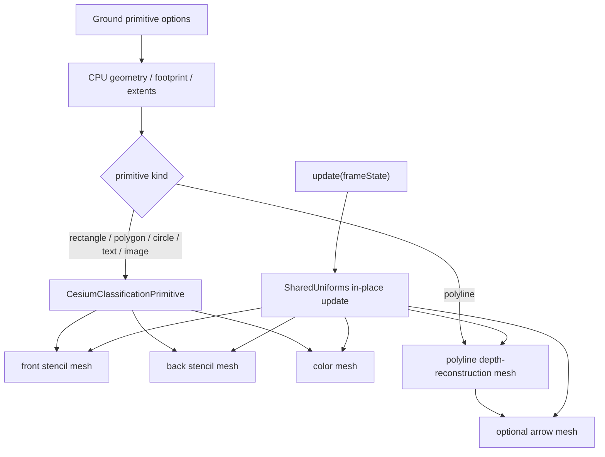

# 02 · 当前 Ground 渲染管线

> 状态：**Current Analysis**；本文只描述提交 `32a6b244b7c0cb731ca35165c46e8fe31248c718` 已经存在的行为。  
> 项目根目录：`D:\my\code\cesium-to-three`。下文源码位置均为“仓库相对路径:关键行号”，可与该绝对根目录拼接。  
> 导航：[上一篇：01 · Three / Cesium 源码调研](./01-three-cesium-reference.md) · [下一篇：03 · 目标架构](./03-target-architecture.md)

## 目标

1. 还原 rectangle、polygon、circle、point、polyline、arrow、text、image 从 CPU 几何到 Three draw call 的真实路径。
2. 找出材质扩展必须插入的位置，并区分“表面着色”与“贴地正确性”代码。
3. 把迁移期间不得改变的 RTE、packed depth、log depth、stencil、混合、天空保护、顺序和资源所有权列为明确不变量。
4. 记录 Current 与目标 Material / Appearance 体系之间的差距，避免把 Proposed API 误写成已有能力。

## 前置阅读

- [README：文档集范围与术语](./README.md)
- [01 · Three / Cesium 源码调研](./01-three-cesium-reference.md)
- 当前核心实现：`src/lib/ground/classification.ts`、`src/lib/ground/materials.ts`、`src/lib/ground/primitives.ts`
- 当前 Shader 快照：`src/lib/ground/shaders/shadow-volume-glsl.ts`

## 非目标

- 本文不定义新 API；所有新接口从 [04 · 公共 API 设计](./04-public-api-design.md) 开始均标为 **Proposed API**。
- 本文不评价 plot 数据模型是否应公开；只说明它当前如何消费 Ground 图元。
- 本文不设计 timeline、tween、关键帧、内部时钟或内部 `requestAnimationFrame`。
- 本文不修改当前代码，也不把已知差距描述成已经修复。

## 1. 基线与源码地图

### 1.1 版本事实

| 项目 | Current 事实 | 证据 |
| --- | --- | --- |
| npm 包 | `cesium-to-three@0.1.9` | `package.json:2-5` |
| Three 依赖 | `three ^0.183.0` | `package.json:39-45` |
| Ground 公共入口 | 根入口与 `cesium-to-three/ground`；没有 plot 子路径 | `package.json:9-22`、`src/cesium-three-ground.ts:1-9` |
| 库构建入口 | 仅 `index`、`ground`、`arrow`；注释明确排除 `src/lib/plot` | `vite.lib.config.ts:1-5,21-26` |
| Current frame state | depth、viewport、camera、pixelRatio、分类深度纹理；尚无时间字段 | `src/lib/ground/types.ts:404-428` |

### 1.2 关键符号

| 子系统 | Current 符号 | 关键位置 |
| --- | --- | --- |
| classification 三 pass | `CesiumClassificationPrimitive` | `src/lib/ground/classification.ts:478-833` |
| 每帧系统 uniform | `updateFrameStateUniforms` | `src/lib/ground/classification.ts:389-461` |
| 分类深度选择 | `resolveClassificationDepthTexture` | `src/lib/ground/classification.ts:46-81` |
| surface 材质 | `createStencilMaterial` / `createColorMaterial` | `src/lib/ground/materials.ts:839-927` |
| decal 注入 | `ClassificationColorInjection` | `src/lib/ground/classification.ts:463-473` |
| decal 材质 | `createTexturedDecalColorMaterial` | `src/lib/ground/materials.ts:1022-1071` |
| polyline / arrow 材质 | `createPolylineMaterial` / `createArrowHeadMaterial` | `src/lib/ground/materials.ts:1421-1458,1704-1737` |
| surface / point / line 顶层图元 | `CesiumGround*Primitive` | `src/lib/ground/primitives.ts:199-1311` |
| text / image | `CesiumGroundTextPrimitive` / `CesiumGroundImagePrimitive` | `src/lib/ground/text/text-primitive.ts:41-275`、`src/lib/ground/image/image-primitive.ts:26-139` |
| plot 桥接 | `PlotPrimitiveBridge` | `src/lib/plot/PlotPrimitiveBridge.ts:202-678` |

## 2. 总体数据流

**Current：**当前不存在公开 Appearance 或逻辑 Material 层。Primitive 在构造期直接创建 `RawShaderMaterial`，运行期持有一个宽泛的 `SharedUniforms` map。



这张图揭示了扩展的真实边界：surface/decal 的最终着色只发生在 color mesh，front/back mesh 的职责是建立 Z-fail stencil；polyline/arrow 没有 stencil，而是在自己的 FS 中采样 packed depth 并重建地表点。

## 3. Surface classification：rectangle / polygon / circle

### 3.1 Primitive 先构造 shadow volume 与平面参数

**Current：**三种面图元虽有不同的几何与样式解析，但最后都创建 `CesiumClassificationPrimitive`。

- rectangle 将用户填充矩形按描边米宽向外扩成 render rectangle，构造 shadow volume 和 planar extents，再传入 fill color、alpha、renderOrder 与 `fragmentCull`：`src/lib/ground/primitives.ts:204-277`。
- polygon 生成 fill hierarchy 与保守 render hierarchy；额外计算局部米制 style points，供 color FS 做 point-in-polygon 与边距分类：`src/lib/ground/primitives.ts:386-471,488-509`。
- circle 的 render radius 包含外描边；圆环、间隙、扇区参数最终写入 classification uniforms：`src/lib/ground/primitives.ts:577-670`。

几何位置不是普通 Three `position`，而是 RTE high/low attributes。共享 Cesium Shader 在顶点阶段用 `czm_computePosition()` 与相机 high/low 做 relative-to-eye 计算，然后进行挤出、投影和 depth clamp；原始 Shader 快照见 `src/lib/ground/shaders/shadow-volume-glsl.ts:31-131`。

### 3.2 一个 classification 实例就是三个连续 Mesh

`CesiumClassificationPrimitive` 在一个 `Group` 内为同一份 geometry 创建三个 Mesh：

1. `CesiumClassificationFrontStencilDepthCommand`
2. `CesiumClassificationBackStencilDepthCommand`
3. `CesiumClassificationColorCommand`

构造位置是 `src/lib/ground/classification.ts:497-635`。三者共享同一个 `SharedUniforms` map；front/back 使用固定 stencil 工厂，color 默认使用 `createColorMaterial`，文字/图片才会通过内部 injection 改写 color 工厂。

### 3.3 三 pass 状态契约

| pass | Current Shader / 面 | 深度状态 | stencil 状态 | 颜色与排序 |
| --- | --- | --- | --- | --- |
| front stencil | `ShadowVolumeAppearanceVS` + `ShadowVolumeFS`；`FrontSide` | `depthTest=true`、`LessEqualDepth`、`depthWrite=false` | `Always`；depth fail=`DecrementWrap`；其它=`Keep`；mask=`0x0f` | `colorWrite=false`；`renderOrder=base` |
| back stencil | 同上；`BackSide` | 同 front | `Always`；depth fail=`IncrementWrap`；其它=`Keep` | `colorWrite=false`；`renderOrder=base+1` |
| color | surface color FS；`DoubleSide` | `depthTest=false`、`depthWrite=false`；FS 采样 packed depth | `NotEqual 0`；fail/zfail/zpass 全部=`ZeroStencilOp` | 预乘混合；`transparent=false`；`renderOrder=base+2` |

证据：

- front/back 创建与 Z-fail op：`src/lib/ground/classification.ts:586-610`。
- stencil 的 `LessEqualDepth`、mask 与 op：`src/lib/ground/materials.ts:839-873`。
- color 的 `NotEqualStencilFunc`、三处 `ZeroStencilOp`、`transparent:false` 和 `ONE / ONE_MINUS_SRC_ALPHA`：`src/lib/ground/materials.ts:883-927`。
- 连续 `renderOrder`：`src/lib/ground/classification.ts:646-650`。

`transparent:false` 不是“不混合”。材质仍显式启用 `CustomBlending`；该标志只是让 Three 把 color mesh 留在 opaque render list，使每个图元的 front/back/color 命令不会被透明列表的全局排序拆开。

### 3.4 color FS 当前同时承担 shape 与着色

**Current：**`createColorFragmentBody()` 以 Cesium Shader 中固定字符串
`vec4 color = czm_gammaCorrect(v_color);` 为锚点插入 rectangle、polygon、circle 的分支，见 `src/lib/ground/materials.ts:643-759`。

其流程是：

1. 从 `czm_globeDepthTexture` 解包当前像素深度并重建 `eyeCoordinate`；原始路径在 `src/lib/ground/shaders/shadow-volume-glsl.ts:178-213`。
2. CPU 每帧以 Float64 算出 west/south eye-space planes，FS 用它们得到局部米坐标；CPU 算法在 `src/lib/ground/classification.ts:309-376`。
3. circle 分支计算圆盘、环带、扇区和边框；polygon 分支执行 point-in-polygon 与到边距离；rectangle 分支使用 `u_innerMetersRect`。
4. 颜色最终在 Cesium Shader 内预乘 alpha：`src/lib/ground/shaders/shadow-volume-glsl.ts:230-248`。

当前透明/裁切策略并不统一：circle 的若干透明区域写零 alpha 后 `return`，但 polygon/rectangle 的若干形状外片元直接 `discard`（`src/lib/ground/materials.ts:713-745`），Cesium 的 `CULL_FRAGMENTS` 分支也直接 `discard`（`src/lib/ground/shaders/shadow-volume-glsl.ts:206-213`）。这正是 Proposed assembler 必须收口的差距：classification color pass 只要提前 discard，就不会执行 `ZeroStencilOp`，可能留下模板值。

### 3.5 log depth 的 Current 处理

`RawShaderMaterial` 不会获得 Cesium `ShaderSource` 的派生包装，因此当前代码手动：

- 注入 `LOG_DEPTH`；
- 在 VS 的最终 `gl_Position` 后调用 `czm_vertexLogDepth()`；
- 在 FS 主体后调用 `czm_writeLogDepth()`。

包装函数和原因见 `src/lib/ground/materials.ts:64-157`，surface builder 见 `src/lib/ground/materials.ts:789-827`。特别重要的是 stencil FS 的视锥外片元必须采用 Cesium 的 discard 语义，不能把越界深度 clamp 成 0/1，否则会制造虚假的 Z-fail 增减计数；当前注释与实现见 `src/lib/ground/materials.ts:70-131`。

## 4. Polyline：单 pass packed-depth 重建

### 4.1 CPU 几何不是“画一条 Three Line”

**Current：**`buildLineShadowVolumeGeometry()` 依次执行预处理、加密/法线、每段 8 顶点保守 box、RTE high/low 编码，并挂载全线长度与端点标架：`src/lib/ground/line/line-shadow-volume.ts:40-113`。

每段打包五个 `vec4` 描述符：起点 high/low、forward offset、起止斜接平面、right plane 与纹理归一化。累计弧长在 `buildSegmentBoxAttributes()` 中计算；每段的
`texNormX=segmentLength/lineTotal`、`texNormY=lengthSoFar/lineTotal` 位于 `src/lib/ground/line/line-segment-attributes.ts:200-219,261-315`。每段高度窗口优先来自 `ApproximateTerrainHeights`，见同文件 `:318-355`。

装配后的 attributes 是：

```text
position3DHigh
position3DLow
startHiAndForwardOffsetX
startLoAndForwardOffsetY
startNormalAndForwardOffsetZ
endNormalAndTextureCoordinateNormalizationX
rightNormalAndTextureCoordinateNormalizationY
batchId
index
```

证据：`src/lib/ground/line/line-shadow-volume.ts:67-112`。geometry 没有普通 `position`，所以 mesh 必须 `frustumCulled=false`。

### 4.2 Polyline VS

当前 `POLYLINE_VS` 位于 `src/lib/ground/materials.ts:1088-1204`，按以下顺序工作：

1. 从段起点 high/low 与 camera high/low 重建 `ecStart`，并用 forward offset 得到 `ecEnd`。
2. 把 start/end/right 三个平面旋到 EC。
3. 选择较近的斜接平面，求屏宽挤出的 `normalEC`。
4. 根据 `widthMode` 使用世界米，或用 `czm_metersPerPixel(positionEC)` 把 CSS 像素换成米。
5. 保守地把 box 横向做成约两倍实际线宽，再用 FS 精确裁切。
6. 使用纯投影矩阵 `czm_projection`，最后执行 depth clamp 与 log-depth 顶点逻辑。

### 4.3 Polyline FS：系统裁切与表面颜色混在一起

当前 `POLYLINE_FS` 位于 `src/lib/ground/materials.ts:1210-1405`。其真实流程是：

1. 用物理像素 viewport 把 `gl_FragCoord` 归一化，使用 `texelFetch` 读取 packed depth。
2. 拒绝屏幕外、空深度、接近远平面的伪深度、射线不与 WGS84 椭球相交和超出可见地平线的重建点。辅助函数见 `src/lib/ground/materials.ts:452-539`；这组 **sky guard** 是低仰角不染天空的关键。
3. `czm_windowToEyeCoordinates` 重建真实地形/模型点 `eyeCoordinate`。
4. 以 right plane 算横向米距离，以 start/end planes 算段内成员关系；超宽或越过端面时 discard。
5. 把斜接平面校正成 aligned plane，计算全线归一弧长 `s`，同时计算横向 `t`：`src/lib/ground/materials.ts:1300-1322`。
6. 根据全局 `s * u_lineTotalMeters` 对线端做 arrow 收口，避免线体与箭头半透明叠加：同文件 `:1324-1381`。
7. 在主 FS 内硬编码虚线 `mod(along, period)`，gap 直接 discard：同文件 `:1383-1395`。
8. 将 `u_color.rgb *= u_color.a` 后输出：同文件 `:1397-1404`。

因此 Current 已经算出了目标 ABI 所需的大部分数据，但它们只是局部变量：`s`、`t`、`widthwiseDistance`、`halfMaxWidth`、全长尚未通过稳定 Material input 对外。

### 4.4 Polyline Mesh、update 与渲染状态

`CesiumGroundPolylinePrimitive` 在构造期创建自己的 uniform map、material 与 mesh；不经过 classification：`src/lib/ground/primitives.ts:901-970`。

- 材质状态是 `DoubleSide`、`depthTest=false`、`depthWrite=false`、`stencilWrite=false`、`transparent=true`，并使用预乘混合：`src/lib/ground/materials.ts:1421-1458`。
- `update(frameState)` 先编码相机 high/low，再复用 `updateFrameStateUniforms`，最后按 `classificationType` 选择 packed depth：`src/lib/ground/primitives.ts:1042-1055`。
- 颜色、线宽、顺序、可见性和箭头尺寸大多只原地更新 uniforms；相关 setters 位于 `src/lib/ground/primitives.ts:1070-1155,1242-1298`。

## 5. Arrow：polyline 的独立附加 pass

**Current：**线端箭头不是 polyline FS 内的一段颜色，而是同一 `Group` 内的第二个 Mesh。

### 5.1 几何与标架

`computeEndpointFrames()` 从加密线的首末点、几何法线和 terrain height table 构造 tip/back/right/up 标架；箭头 geometry 为每端一个 8 顶点薄盒，并提供：

```text
arrowTipHigh / arrowTipLow
arrowBackDir / arrowRightDir / arrowUpDir
arrowCorner
arrowTerrainHeights
arrowStyleId
```

装配位置：`src/lib/ground/line/line-arrowhead.ts:198-319,331-406`。

### 5.2 箭头 pass

`ARROWHEAD_VS/FS` 位于 `src/lib/ground/materials.ts:1474-1691`：

- VS 以 RTE 重建 tip EC，用端点地形高度窗口把薄盒竖向覆盖地表，并支持 screen/world 两种尺寸。
- FS 复用 polyline 的 packed-depth、椭球射线和地平线保护，再把地表点投影为端点局部 `(a,b)`；按 `arrowStyleId` 判定 solid triangle 或 open chevron。
- 最终读取 `u_arrowColor` 并预乘 alpha。

箭头材质渲染状态与线体相同；`renderOrder=line+1`，见 `src/lib/ground/primitives.ts:978-1018` 和 `src/lib/ground/materials.ts:1704-1737`。线体与箭头共享同一 uniform map，但持有两个独立 `RawShaderMaterial`。

`setArrowMode()` 会因端点数量改变而销毁并重建 arrow geometry/material；样式 id 烘焙在 attribute 中，`setArrowStyles()` 也重建箭头几何，见 `src/lib/ground/primitives.ts:1157-1239`。颜色和尺寸只改 uniform。

## 6. Text / Image：内部 `ClassificationColorInjection`

### 6.1 注入点的范围

**Current：**`ClassificationColorInjection` 不是 Ground 公共出口中的 Appearance。它只有两个内部字段：

```ts
interface ClassificationColorInjection {
  colorMaterialFactory?: (
    uniforms: SharedUniforms,
    fragmentCull: boolean,
  ) => RawShaderMaterial;
  extraUniforms?: Record<string, { value: unknown }>;
}
```

源码：`src/lib/ground/classification.ts:463-473`。构造器先把 `extraUniforms` 的条目引用合并进共享 map，再保存 color factory，以便 `setFragmentCulling()` 重建 color material 时仍用相同 factory：`src/lib/ground/classification.ts:570-598`。

它只替换 color pass；front/back stencil 始终固定。这一点与 Proposed safe Appearance 的安全边界相似，但 Current 没有公开类型、Material ABI、保留名校验或通用 Shader 组装器。

### 6.2 共同的 textured-decal FS

`createTextColorMaterial()` 只是转发到 `createTexturedDecalColorMaterial()`；后者复制 surface color pass 的 stencil/混合状态，并增加 `CESIUM_THREE_TEXTURED_DECAL`：`src/lib/ground/materials.ts:1004-1071`。

纹理分支仍通过固定字符串锚点插入 Cesium FS：`src/lib/ground/materials.ts:941-985`。它从 CPU planar meters 得到 footprint UV，翻转 V 后采样 `u_decalTexture`，乘 `u_decalOpacity`。足迹外或透明纹素不 discard，而是写 `vec4(0)` 后返回，因此仍可触发 color pass 的 stencil 清理：同文件 `:947-976`。

### 6.3 Text

`CesiumGroundTextPrimitive` 的构造链是：resolve options → canvas → `CanvasTexture` → footprint → shadow volume/extents → classification，见 `src/lib/ground/text/text-primitive.ts:61-79,189-219`。注入的 uniforms 是纹理和 opacity，color factory 是 `createTextColorMaterial`。

`setText()` 当前会：

1. 复用原 canvas 与同一个 `CanvasTexture`，置 `texture.needsUpdate=true`；
2. 重算 footprint；
3. 先 dispose 旧 classification，再创建新 classification 与新 group；
4. 将新 group 接回旧 parent。

证据：`src/lib/ground/text/text-primitive.ts:92-132`。Current 文档明确警告外部不要缓存 `classification` 引用（`:45-50`）。纹理由 text primitive 创建并在自身 dispose，classification 不拥有它（`:171-180`）。

这是 **Current 能力**，不是目标契约。Proposed 将 rectangle/shadow-volume 的固定 topology 预先保留，`setText()` 在离屏完成排版后原位改写既有 attribute 数组、extents/system uniform value 和同一 CanvasTexture；不再替换 `BufferGeometry`、classification/group、Appearance 或 user uniform wrapper。详见 [06](./06-render-pipeline-integration.md#73-text-settext-两阶段原位提交)。

### 6.4 Image

`CesiumGroundImagePrimitive` 以显式米制宽高计算 footprint，并注入同一 decal color factory：`src/lib/ground/image/image-primitive.ts:38-94`。透明度 setter 只修改既有 `opacityUniform.value`（`:120-124`）。

图片 Texture 按 URL 引用计数缓存；最后一个租约释放后延迟到 microtask dispose，以便同步重建同 URL 时复用：`src/lib/ground/image/image-texture-cache.ts:22-79`。加载失败时保持原 Texture 引用，向其中安装透明 1×1 fallback（`:99-109`）。这套所有权语义在 Material 改造后必须保留。

## 7. Point 是 delegate，不是第五套管线

**Current：**`CesiumGroundPointPrimitive` 只负责把统一点选项路由到底层图元：

| `shape` | delegate | 实际渲染管线 |
| --- | --- | --- |
| `circle` | `CesiumGroundCirclePrimitive`，`radius=size/2` | surface 三 pass |
| `square` | `CesiumGroundRectanglePrimitive`，中心 ENU 米偏移反算四角 | surface 三 pass |
| `image` | `CesiumGroundImagePrimitive` | decal 三 pass（仅 color 不同） |

构造与完整字段透传见 `src/lib/ground/primitives.ts:709-836`。`update`、`setRenderOrder`、`setClassificationType`、图片透明度与 `dispose` 都转发给 delegate：同文件 `:838-874`。

因此 Proposed `appearance?` 和 `setAppearance()` 不能只加在 point 外壳；必须按实际 kind 完整传到 delegate，否则 circle/square/image point 会绕过扩展或在重建时丢失它。

## 8. `SharedUniforms` 与逐帧更新

### 8.1 Current map 的性质

`SharedUniforms` 是带索引签名的大接口，混合了：

- RTE / camera / projection / normal；
- shadow-volume extents 与 shape style；
- packed depth、viewport 与 log-depth 参数；
- decal Texture；
- 可选 polyline / arrow 字段。

完整 Current 定义在 `src/lib/ground/types.ts:468-551`。`materials.ts` 将它强制 cast 成 Three uniform map，原因是可选字段允许 `undefined`，见 `src/lib/ground/materials.ts:52-62`。

这不是稳定用户 ABI：内部字段、可选字段、surface 与 line 占位字段耦合在一起。当前却从 Ground 入口导出了该类型（`src/lib/ground/index.ts:31-63`），所以迁移只能保留兼容并标记 deprecated，不能立即删除。

### 8.2 `updateFrameStateUniforms()` 原地写入

每帧路径位于 `src/lib/ground/classification.ts:389-461`：

1. 从 camera quaternion 在 Float64 scratch 中构造仅旋转的 view matrix；相机平移通过 RTE high/low 单独处理。
2. 在 Float64 中构造 projection 与 MVP，最后写入 Three `Matrix4` / `Matrix3` uniform 对象。
3. 更新 CPU planar eye-space planes。
4. 写 depth texture、viewport、inverse projection、viewport transform、frustum planes。
5. 计算 Cesium log-depth 三个标量与 geometric tolerance。
6. 若 map 中存在 `czm_projection` / `czm_pixelRatio`，再刷新 polyline 专用值。

各 primitive 另行调用 `encodeCesiumVector3(camera.position, high, low)`，classification 路径见 `src/lib/ground/classification.ts:817-819`，polyline 路径见 `src/lib/ground/primitives.ts:1042-1055`。

`resolveClassificationDepthTexture()` 按 `TERRAIN` / `CESIUM_3D_TILE` / `BOTH` 选择纹理，缺字段时回退 `frameState.depthTexture`：`src/lib/ground/classification.ts:46-81`。这是单深度纹理旧宿主的兼容保证。

## 9. `setFragmentCulling()` 与 Current 重建边界

`CesiumClassificationPrimitive.setFragmentCulling()` 当前只重建 color material：

```text
same boolean -> no-op
changed -> colorMaterialFactory(sharedUniforms, enabled)
        -> replace colorMesh.material
        -> dispose old material
```

源码：`src/lib/ground/classification.ts:785-798`。geometry、front/back materials、uniform map 与 uniform entry 引用都不变；保存 factory 的做法也确保 text/image 不会切回纯色材质。

这是 Proposed 重编译边界的重要基线，但 Current 只有 classification 对象暴露该方法，各公开 surface primitive 没有同名转发 setter；搜索结果只在 `classification.ts` 中存在实现。

## 10. `PlotPrimitiveBridge`：消费层，不是首期发布层

### 10.1 当前行为

`PlotPrimitiveBridge` 维护 `Map<id, PlotEntry>`，以 geometry signature 判断重建，以 style signature 与图元能力判断热更新：`src/lib/plot/PlotPrimitiveBridge.ts:74-85,275-340`。

- 每帧把同一个 `CesiumGroundFrameState` 转发给全部图元：`:342-354`。
- polyline 支持颜色、线宽、箭头尺寸、可见性热更新；text 调用 `setText()`；image point 只改 opacity：`:371-457`。
- clampToGround 为 false 时走普通 Three primitive，默认/true 才走 Ground：`:468-478`。
- category 到 Ground 图元的映射位于 `:487-672`；polygon/plot-arrow 走 surface polygon，line 走 polyline+arrow，text 走 decal。

### 10.2 发布边界

`src/lib/plot/index.ts:35-37` 虽导出桥接器供源码内业务使用，但 npm 的 `exports` 没有 `./plot`，构建配置也明确不打包 plot（`package.json:9-22`、`vite.lib.config.ts:1-5,21-26`）。

**结论：**plot 是 Current 仓库内消费层，不是 `0.1.9` 的公开 npm Ground API。首期 Material / Appearance 应落在 Ground primitives；只需保证桥接器原有构造、热更新与重建不被破坏，不在本期给 plot 设计动画快照或新的公开序列化格式。

## 11. 必须保护的渲染不变量

以下是迁移门禁，不是可选优化。

| Invariant | 为什么不能变 | Current 证据 / 验证点 |
| --- | --- | --- |
| RTE high/low + camera high/low | ECEF 数百万米坐标直接进 Float32 会在高 zoom 抖动或漂移 | `shadow-volume-glsl.ts:31-68`；`classification.ts:393-413`；`primitives.ts:945-951` |
| Float64 CPU matrix 与 CPU planar planes | 防止小 footprint、圆环和边框在远视角出现轴向抖动 | `classification.ts:103-110,309-376` |
| packed depth 与 `classificationType` 选择 | surface/line/arrow 都依赖相同地形/模型表面重建 | `classification.ts:46-81,817-826` |
| stencil 命令连续性 | 任一其它 opaque draw 插入三 pass 中间都可能消费或污染模板 | `classification.ts:646-650`；`materials.ts:914-923` |
| front=`DECR_WRAP`、back=`INCR_WRAP`、`LessEqual` | Z-fail 计数方向或深度函数改变会翻转/漏掉 classification | `classification.ts:586-597`；`materials.ts:855-868` |
| color 的三处 `ZeroStencilOp` | color pass 必须消费并清掉模板，不能影响后续图元 | `materials.ts:906-913`、decal 对应 `:1052-1059` |
| classification color 留在 opaque list | `transparent:false` 保持命令块排序；混合仍是显式预乘混合 | `materials.ts:914-923` |
| straight 输入、统一预乘输出 | `blendSrc=ONE` 要求 RGB 在输出前只乘一次 alpha | `shadow-volume-glsl.ts:246-248`；`materials.ts:1397-1399,1682-1685` |
| stencil pass 的 log-depth 视锥外 discard | clamp 会产生虚假 Z-fail ±1 计数 | `materials.ts:70-131` |
| polyline/arrow sky guard | `depthTest=false` 的透明盒若不主动拒绝无效深度，会整片染天空 | `materials.ts:452-539,1217-1262,1585-1628` |
| non-pickable layer | shadow volume 是挤出盒，不能被相机控制器 raycast 当成地表 | `constants.ts:94-104`；`classification.ts:633-635`；`primitives.ts:957-963` |
| `frustumCulled=false` | RTE geometry 没有普通 `position`/bounding sphere | `classification.ts:604-614`；`line-shadow-volume.ts:67-72` |
| renderOrder 关系 | surface 为 `base/base+1/base+2`；箭头为 line+1 | `classification.ts:646-650`；`primitives.ts:1139-1145` |
| borrowed depth/Texture 所有权 | primitive 不得 dispose 宿主 depth texture；image cache/text 各有自己的 owner | `primitives.ts:1300-1309`；`image-primitive.ts:126-132`；`text-primitive.ts:171-180` |

### 11.1 透明 classification 的额外迁移规则

Current 同时存在“零 alpha 后返回”和“直接 discard”两种 shape 处理。目标实现必须收敛为：

- front/back stencil 继续保留其精度所需的 discard；
- classification color pass 中，shape 外、纹理透明、用户 Material alpha=0 都输出预乘零色，并让 draw 到达 stencil test/op；
- safe Material 源码不得以 `discard` 绕过该清理；Raw Appearance 若这么做，责任由用户承担。

这是 **Proposed correction**，不是对 Current 行为的虚构。完整协议见 [05 · Shader ABI](./05-shader-abi.md) 与 [06 · 渲染管线集成](./06-render-pipeline-integration.md)。

## 12. Current 差距清单

| 差距 | Current 表现 | 目标落点 |
| --- | --- | --- |
| 无公开 surface material 入口 | rectangle/polygon/circle 构造器直接创建固定 color material | `CesiumGroundMaterialAppearance` |
| 无完整 Raw pass 入口 | 只有内部 color factory，不能接管 vertex/front/back | `CesiumGroundRawShaderAppearance` |
| Shader 组装脆弱 | `String.replace` 依赖 Cesium 固定锚点，找不到才抛错 | 显式 assembler，分段生成 |
| shape 与着色耦合 | border/ring/sector、纯色、虚线都硬编码在主 FS | 系统 coverage/baseColor 与 Material 调用分层 |
| polyline 数据未公开 | `s/t` 与米距离只在局部变量存在 | 稳定 `c23_materialInput` |
| decal 是特例 | text/image 依赖 `ClassificationColorInjection` | 内置 `TexturedDecalMaterial` 走统一接口 |
| uniform 无命名隔离 | `extraUniforms` 可直接覆盖共享 map 的任何 key | `czm_`/`c23_`/`C23_` 保留名与冲突校验 |
| 无逻辑 Material 版本 | 只有 Three material；无法区分 uniform 值与 schema/source 变化 | `needsUpdate/version` 与 pass 级 compiled material |
| 共享语义未定义 | 每 primitive 自建 map，只有 line/arrow 实例内部共享 | 逻辑 Material 可跨 primitive 共享，compiled material 每实例独立 |
| rebuild 不能保持用户对象 | text 会替换 classification/group；尚无 appearance 可保持 | 两阶段原位提交固定 topology，保持 geometry/classification/group、appearance 与 user `IUniform` 引用 |
| 无时间 ABI | frame state 没有 time/delta/frame | 宿主提供，缺省静态零值 |
| `SharedUniforms` 被误作扩展面 | 类型公开且混合全部管线细节 | 保留兼容并 deprecated；新扩展只走 Appearance |

## 13. 设计过程与关键决策

1. **先按 pass 找扩展点，而不是按效果建动画类。** Flow、pulse、scale 都只改变 color；它们不应碰 RTE、depth 或 stencil。
2. **surface 与 polyline 必须分别组装。** 两者共同需要 Material input，但前者依赖三命令 classification，后者依赖单 pass packed-depth reconstruction，不能假装成同一 draw topology。
3. **text/image 归类为 decal，而不是新的 Primitive 管线。** 它们与 surface 共用三 pass，只在 color 的表面采样不同。
4. **point 保留 delegate 模式。** 新 appearance 由 point 透传，不能复制 circle/rectangle/image 的渲染代码。
5. **plot 只做兼容适配。** Ground API 是首期发布边界，避免让未打包的 plot 数据模型反向定义公共 Material ABI。

## 14. 边界条件

- surface color 的零 alpha不等于“跳过 draw”：仍要清 stencil。
- polyline/arrow 没有 stencil，其系统 membership/sky guard 可以继续 discard；用户 Material 的“透明”仍统一用 alpha=0，便于共享同一逻辑 Material。
- `classificationType` 只改变所采样的 packed depth，不应触发几何或 Shader 重编译。
- 线 `widthMode`、箭头尺寸与 style 的 Current 热更新/几何重建边界必须保持；Material 接入不应让单纯颜色/速度变化重建 geometry。
- text rectangle/shadow-volume 的 topology 固定；文字尺寸变化只改写既有 attribute 数组与 extents/system uniform value，不替换 `BufferGeometry`。若未来布局要求不同 topology 或超过预声明容量，首期 `setText()` 应在提交前拒绝并要求显式创建新图元，不能静默几何重建。
- 当前图元使用非拾取 layer `1`；宿主 camera 必须启用该 layer 才能渲染，这不是 Appearance 能修正的事情。

## 15. Current 示例伪代码

> **Current 伪代码：**省略 depth manager 与导入，只展示现有更新边界；不是 Proposed Appearance 示例。

```ts
const line = new CesiumGroundPolylinePrimitive({
  points,
  strokeColor: '#00e5ff',
  strokeOpacity: 80,
  visible: true,
  dashLengthMeters: 60,
  gapLengthMeters: 40,
  arrowMode: 'right',
});

scene.add(line.group);

function render(frameState: CesiumGroundFrameState) {
  // Current 只刷新 camera/depth/viewport/pixelRatio；没有 time fields。
  line.update(frameState);
  renderer.render(scene, camera);
}
```

Current 虚线、箭头颜色和预乘都来自固定 FS；用户无法提供 `c23_getMaterial`，也无法按 pass 创建自己的 `RawShaderMaterial`。

## 16. 验收清单

- [ ] 能从本文定位 rectangle、polygon、circle 创建 classification 的具体行号。
- [ ] 明确 surface 是 front stencil、back stencil、color 三个连续命令，而不是一个透明 Mesh。
- [ ] 明确 color pass 的 `transparent:false` 与“仍启用预乘混合”并不矛盾。
- [ ] 明确 polyline 的 packed-depth 重建、sky guard、`s/t`、虚线与箭头收口发生位置。
- [ ] 明确 arrow 是共享 uniform 的独立 material/mesh/pass。
- [ ] 明确 text/image 只通过内部 `ClassificationColorInjection` 替换 color material。
- [ ] 明确 point 对 circle/rectangle/image 的 delegate 关系。
- [ ] 明确 `SharedUniforms`、`updateFrameStateUniforms` 与 `classificationType` 的 Current 行为。
- [ ] 明确 `PlotPrimitiveBridge` 在源码内存在，但没有进入当前 npm 导出与库构建。
- [ ] 不变量表覆盖 RTE、packed/log depth、stencil Zero、预乘、sky guard、renderOrder 和 layer。
- [ ] 差距表没有把任何 Proposed API 描述为 Current。

---

上一篇：[01 · Three / Cesium 源码调研](./01-three-cesium-reference.md)  
下一篇：[03 · 目标架构](./03-target-architecture.md)
