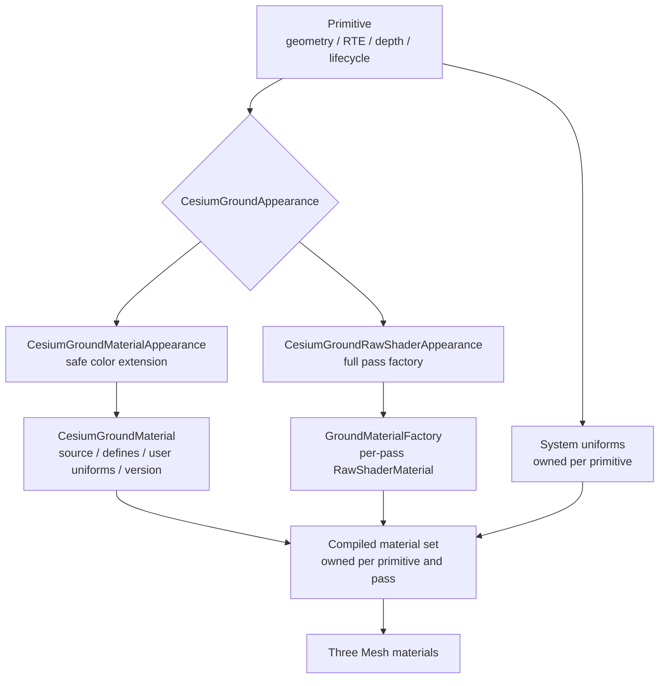
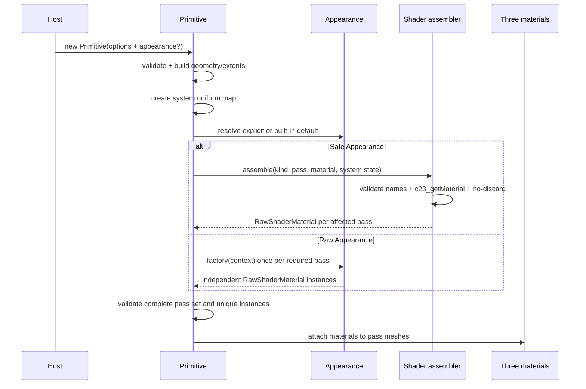
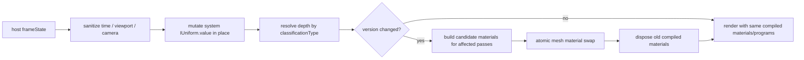

# 03 · 目标架构：Primitive / Appearance / Material / Compiled Material

> 状态：**Proposed Design**（尚未实现）。  
> Current 基线：`D:\my\code\cesium-to-three`，提交 `32a6b244b7c0cb731ca35165c46e8fe31248c718`。  
> 导航：[上一篇：02 · 当前渲染管线](./02-current-rendering-pipeline.md) · [下一篇：04 · 公共 API 设计](./04-public-api-design.md)

## 目标

1. 将当前 Primitive 直接创建 `RawShaderMaterial` 的结构拆成四层，同时保留现有贴地算法与 draw topology。
2. 定义两套同级公开入口：安全的 `CesiumGroundMaterialAppearance` 与专家级的 `CesiumGroundRawShaderAppearance`。
3. 决定逻辑 Material、user uniforms、system uniforms、每 pass compiled material 的共享和所有权关系。
4. 把构造、每帧更新、版本变化、appearance 切换、失败回退的数据流定到可直接实现的程度。

## 前置阅读

- [01 · Three / Cesium 源码调研](./01-three-cesium-reference.md)
- [02 · 当前 Ground 渲染管线](./02-current-rendering-pipeline.md)
- 完整类型签名以 [04 · 公共 API 设计](./04-public-api-design.md) 为事实源。
- GLSL 字段和 pass 约束以 [05 · Shader ABI](./05-shader-abi.md) 为事实源。

## 非目标

- 不新增 timeline、tween、关键帧树、动画 mixer、内部时钟或内部 RAF。
- 不改变 shadow-volume、RTE、packed depth、classificationType 或 polyline depth reconstruction 算法。
- 不以 `onBeforeCompile` 作为 Ground 的主扩展方式，也不引入 TSL / NodeMaterial。
- 不让安全 Material 替换完整系统 vertex shader、stencil 状态或系统 shape coverage；只允许统一的 clip-space vertex Hook。
- 不自动修复 Raw Appearance 的错误 pass、一致性或渲染状态。
- 不把 `src/lib/plot` 提升为首期 npm API。

## 设计过程

1. 从 [02](./02-current-rendering-pipeline.md) 提取必须保持的渲染不变量：Primitive 拥有几何与帧状态，surface/decal 保持三 pass classification，polyline/arrow 保持 packed-depth 与 RTE 数学。
2. 对照 Three 的 `Material`/`RawShaderMaterial` 与 Cesium 的 `Appearance`/`Material` 分工，把扩展自由度拆成 safe Material 和 Raw Appearance 两条同级路径。
3. 先定义 Primitive、Appearance、Material、Compiled Material 四层所有权，再反推 uniform 合并、pass 编译、缓存键、切换与销毁边界。
4. 用默认纯色、虚线、文字/图片和共享动画材质逐项回放该分层；凡是仍需要特殊 Shader 注入的默认效果，都视为架构未闭合。
5. 最后用 `setAppearance()`、`setFragmentCulling()`、text/image rebuild 与 dispose 失败路径校验引用稳定性和事务性。

## 1. 架构结论



锁定的联合类型是：

```ts
// Proposed API；完整声明见 04。
type CesiumGroundAppearance =
  | CesiumGroundMaterialAppearance
  | CesiumGroundRawShaderAppearance;

type GroundPrimitiveKind = 'surface' | 'polyline' | 'decal' | 'arrow';

type GroundRenderPass =
  | 'frontStencil'
  | 'backStencil'
  | 'color'
  | 'polyline'
  | 'arrow';
```

两种 Appearance 是同级策略，不互相包装：safe Appearance 持有逻辑 `CesiumGroundMaterial`；Raw Appearance 持有 user uniforms 与按 pass 调用的工厂。

## 2. 四层职责

### 2.1 Primitive

Primitive 继续是贴地正确性的拥有者。

**负责：**

- 校验用户几何选项，构建 rectangle/polygon/circle shadow volume、polyline box、arrow box、decal footprint；
- RTE high/low attributes 与相机 high/low；
- 按 `classificationType` 选择 packed depth；
- 保存并原地更新 per-primitive system uniforms；
- 创建 pass Mesh，维持 `renderOrder`、non-pickable layer、`frustumCulled=false`；
- 根据 Appearance / Material version 创建、替换、dispose compiled materials；
- 保持逻辑 Appearance 与 user `IUniform`/Texture 的引用；
- 提供 `setAppearance()`，polyline 另管理 `arrowAppearance`。

**不负责：**

- 启动动画循环；
- 每帧改用户 Material 的 Shader 源码；
- dispose 用户逻辑 Material、Appearance、user Texture；
- 猜测 Raw 工厂的意图或修正它返回的 Shader。

Current 对应物是各 `CesiumGround*Primitive` 与 `CesiumClassificationPrimitive`。例如 classification 当前已经拥有 geometry、三 Mesh、system uniform、帧更新和销毁职责（`src/lib/ground/classification.ts:479-650,817-836`），目标改造是在此职责内增加 Appearance 编译，而不是把贴地状态搬进 Material。

### 2.2 Appearance

Appearance 决定“一个逻辑外观如何变成当前 primitive 的各 pass 材质”。

#### `CesiumGroundMaterialAppearance`

```ts
// Proposed API（摘要）
new CesiumGroundMaterialAppearance({ material: CesiumGroundMaterial });
```

- fragment 必须实现 `c23_getMaterial(c23_materialInput)`，vertex 可选实现受控 `c23_vertexMain`；
- 没有 vertex Hook 时 surface/decal 只重编译 color；存在 Hook 时 front/back/color 原子重编译并使用同一源码；
- polyline/arrow 在各自单 pass 的系统 membership 之后调用 Material；
- 库拥有最终 shape coverage、stencil 清理、log-depth 处理和预乘输出；
- 同一个 safe Appearance 可以用于多个图元；最终仍为每 primitive/pass 创建独立 `RawShaderMaterial`，因为 system uniforms 不同。

#### `CesiumGroundRawShaderAppearance`

```ts
// Proposed API（摘要）
new CesiumGroundRawShaderAppearance({
  uniforms?: Record<string, IUniform>,
  factory: GroundMaterialFactory,
});
```

- 每个所需 pass 都调用一次 factory；
- context 严格含 `primitiveKind`、`pass`、`systemUniforms`、`userUniforms`、`createDefaultMaterial()`；
- 可在 factory 中调用且只调用一次 `createDefaultMaterial()`、修改后返回该同一实例；也可完全不调用它而完整替换 vertex/fragment source 与 render state；
- 每次调用必须返回新的、未在别的 pass/primitive 使用的 `RawShaderMaterial`；
- Raw Appearance 有只读 `version`，设置 `needsUpdate=true` 时递增；所有消费它的 primitive 在下一次同步点重建相关 compiled set。

### 2.3 Material

`CesiumGroundMaterial` 是 pass 无关的逻辑表面着色对象，包含：

- `uniforms: Record<string, IUniform>`：由用户拥有，可跨图元共享；
- `defines`：编译期常量；
- `vertexShader?`：只提供可选 `c23_vertexMain`，读取系统 `positionEC` 并修改 `positionClip`；
- `fragmentShader`：只提供 helpers、用户 uniform 声明和 `c23_getMaterial`，不提供 `main()`；
- `version` / `needsUpdate`：标记源码、defines 或 uniform schema 的编译期变化；
- `setUniform()`、`clone()`、`dispose()` 的公共语义。

Material 不知道 geometry、camera、depth texture 或 render pass。它通过 [05](./05-shader-abi.md) 的稳定 input 获取已重建的数据。

Material 的 `dispose()` 采用通知式语义：只发出 `dispose` 事件，消费者据此释放自己的 compiled `RawShaderMaterial`；逻辑 Material 本体、监听关系和当前 source/defines/uniforms 保持可复用，也不 dispose uniform 中的 `Texture`。具体生命周期见 [08](./08-lifecycle-cache-resources.md)。

### 2.4 Compiled Material

Compiled Material 是实际挂到 Three Mesh 的 `RawShaderMaterial`，不新增同名公共类；内部可用以下记录表达：

```ts
// Implementation sketch：内部类型，不是公共 API。
interface GroundCompiledMaterialRecord {
  primitiveKind: GroundPrimitiveKind;
  pass: GroundRenderPass;
  material: RawShaderMaterial;
  appearance: CesiumGroundAppearance;
  appearanceVersion: number;
  materialVersion?: number;
  compileKey: string;
}
```

每个 primitive、每个 pass 必须有独立实例。它的 source/program 可能被 Three program cache 复用，但 JS `RawShaderMaterial`、system uniform map 和 dispose 生命周期不能跨 primitive 共用。

Compiled material 由 primitive 创建并负责 dispose；其中引用的 user uniforms 与 Texture 都是 borrowed。

## 3. pass 编译矩阵

| primitive kind | 必需 pass | Safe Appearance | Raw Appearance |
| --- | --- | --- | --- |
| `surface` | `frontStencil`、`backStencil`、`color` | front/back 固定；只把 Material 注入 color | factory 对三个 pass 各调用一次 |
| `decal` | `frontStencil`、`backStencil`、`color` | front/back 固定；texture/default/custom Material 进入 color | factory 对三个 pass 各调用一次，`primitiveKind='decal'` |
| `polyline` | `polyline` | depth/sky/membership 固定；Material 只决定成员片元颜色 | factory 调用一次，可完全替换 |
| `arrow` | `arrow` | depth/sky/arrow membership 固定；Material 决定箭头像素颜色 | factory 调用一次，可完全替换 |

polyline option 的 `appearance` 只管理线体，`arrowAppearance` 只管理箭头。若未传 `arrowAppearance`，箭头使用当前行为等价的内置默认 appearance，**不隐式复用线体 appearance**；这样 `C23_POLYLINE` 与 `C23_ARROW` 的输入语义不会混淆。

## 4. system uniforms 与 user uniforms

### 4.1 所有权模型

```text
Primitive A system map ─┐
                       ├─ merged view -> Compiled RawShaderMaterial A/color
Shared user map ────────┤
Primitive B system map ─┤
                       └─ merged view -> Compiled RawShaderMaterial B/color
```

- system `IUniform` 容器由每个 primitive 拥有，`update(frameState)` 只改其 `.value` 或对象内容；
- safe Material 的 user uniform 容器由 `CesiumGroundMaterial` 拥有；Raw 的 user uniform 容器由 `CesiumGroundRawShaderAppearance` 持有；
- 编译时可以创建新的“键到 IUniform 的 map”，但 map 中每个 user `IUniform` 必须保持原对象引用；
- 新 `GroundSystemUniforms` 的公开键只使用 `czm_*`/`c23_*`；Current `SharedUniforms` 的 `u_*` 系统键由 adapter 以 canonical key 指向同一 wrapper，legacy key 不进入 user merge，也不暴露给 Raw context；
- system key 与 user key 冲突时立即抛错，不能以 merge 顺序决定胜负；
- 用户 uniform、define 和 helper/function 名禁止使用 `czm_`、`c23_`、`C23_` 保留前缀；唯一必须出现的保留函数是 `c23_getMaterial`。

Current 的 `ClassificationColorInjection.extraUniforms` 可无校验覆盖 map（`src/lib/ground/classification.ts:570-578`），目标实现必须移除这条公开扩展方式。`SharedUniforms` 为兼容保留并标记 deprecated，不再推荐用户直接扩展。

### 4.2 时间属于 system uniforms

Primitive 将同一帧状态中的：

```text
timeSeconds  -> c23_time
deltaSeconds -> c23_deltaTime
frameNumber  -> c23_frameNumber
```

原地写入每个 system map。缺省/非法值按 [05](./05-shader-abi.md) 归零。Material 模块不创建 Clock、Timer 或 RAF；宿主必须保证同一逻辑帧给所有 primitive 传同一组值。

## 5. 构造流程



构造必须遵循“候选先完成、再发布”的原则：如果 safe source 校验、assembler 或 Raw factory 在任何 pass 抛错，dispose 已创建的候选 compiled materials，随后构造器整体抛错；不能把半套 pass 留在 scene graph 中。

## 6. 每帧更新流程



顺序固定为：

1. 检查 primitive 未 dispose；隐藏图元可跳过相机/depth更新，但恢复可见时必须在 draw 前补齐。
2. 原地写 camera RTE、Float64-derived matrices、depth、viewport、log-depth、pixel ratio 与时间。
3. 比较当前 Appearance version 与 compiled snapshot；safe Appearance 还比较其 Material version。
4. version 未变时不得创建 Material、uniform map 或 Shader 字符串。
5. version 变化时只重建编译矩阵中受影响的 pass；成功后原子替换并 dispose 旧 compiled material。

单纯执行：

```ts
material.uniforms.u_speed.value = 0.5;
material.setUniform('u_speed', 0.5); // 已存在的 key
```

不得改变 version，也不得进入第 5 步。Three program 数量应保持稳定。

## 7. 版本与重编译边界

| 变化 | 递增谁的 version | 重建范围 |
| --- | --- | --- |
| 已有 user uniform 的 `.value` | 无 | 无 |
| time/camera/depth/viewport | 无 | 无 |
| Material `fragmentShader` | Material | safe Appearance 对应 pass |
| Material `defines` | Material | safe Appearance 对应 pass |
| user uniform key 增删（schema） | Material / Raw Appearance | 对应 Appearance 的 pass |
| Raw factory 逻辑或 raw source | Raw Appearance，由调用方设 `needsUpdate=true` | 该 primitive 的全部必需 Raw pass |
| `fragmentCull` define | primitive compile state | surface/decal color；Raw 模式重新调用相关 factory |
| `setAppearance(new)` | 不依赖 version | 见第 8 节的差分矩阵 |
| 一般 geometry/topology 变化 | 不属于 Material version | 显式重建图元或 geometry；Appearance 逻辑对象与 user uniforms 保留 |
| text 内容/尺寸 | 无 | 固定拓扑 attribute/extents 与 CanvasTexture 原位更新；不替换 `BufferGeometry`，不重编译 Shader |

编译 key 与 program cache 的完整规则归 [08](./08-lifecycle-cache-resources.md) 管理；本层只要求不把 uniform value 放进 key。

## 8. `setAppearance()` 的原子切换

### 8.1 差分矩阵

| 旧模式 → 新模式 | surface/decal | polyline/arrow |
| --- | --- | --- |
| safe → safe | 只候选编译并替换 color | 替换本 kind 的单 pass |
| safe → raw | factory 构造 front/back/color，三者一起替换 | 替换单 pass |
| raw → safe | 恢复库固定 front/back，并编译 safe color，三者一起替换 | 替换单 pass |
| raw → raw | factory 构造完整必需 pass set 后一起替换 | 替换单 pass |

### 8.2 实现算法

```ts
// Implementation sketch；省略类型细节。
setAppearance(next) {
  ensureNotDisposed();
  validateAppearance(next);

  const candidate = compileCompleteAffectedSet(next); // 可能抛错
  validateUniqueRawMaterialInstances(candidate);

  const previous = captureCurrentlyAffectedMaterials();
  attachCandidateToExistingMeshes(candidate);          // geometry/group/order/layer 不变
  this.appearance = next;
  this.compiled = mergeCompiledRecords(candidate);
  disposeMaterials(previous);
}
```

必须保证：

- factory/assembler 同步抛错时，现有 appearance、materials 和画面保持不变；
- 候选中已经创建的 materials 被 dispose；
- appearance 切换不重建 geometry，不替换公开 group，不改变 visibility/renderOrder/layer；
- next 中所有 user `IUniform` 对象保持原引用；
- 切换不会 dispose previous/next 逻辑 Appearance 或其中 Texture。

WebGL Shader 的真正编译通常延迟到 renderer draw/compile 阶段。库可在同步阶段验证函数签名、保留名、pass 完整性和材质实例唯一性，但没有 renderer/context 时无法保证 GLSL 可编译。GPU 编译错误沿用 Three 的诊断行为；首期不提供 renderer-aware 异步 `setAppearance`，也不承诺晚发 GPU 错误自动回滚。safe 模式的库模板可保证系统部分，Raw 完全替换由用户负责；宿主/测试可在外部用 `renderer.compileAsync()` 预检候选场景。

## 9. 默认行为也必须走同一层

“未传 appearance 保持视觉不变”不能通过长期保留旧硬编码旁路实现。目标默认映射为：

| Current 行为 | Proposed 内置逻辑 Material / Appearance |
| --- | --- |
| rectangle/polygon/circle/solid point fill + border/ring/sector | `CesiumGroundMaterialAppearance` + `createColorGroundMaterial()`；shape 先产生 `baseColor/isStroke` |
| solid polyline | `CesiumGroundMaterialAppearance` + color material |
| dashed polyline | `CesiumGroundMaterialAppearance` + `createPolylineDashMaterial()` |
| text/image | `CesiumGroundMaterialAppearance` + `createTexturedDecalMaterial()` |
| solid/open arrow color | 独立默认 arrow appearance；membership 仍由系统处理 |

这样默认与自定义 Material 经过同一个 assembler、输入 struct、最终预乘和资源路径；回归测试才能证明扩展入口本身不会与默认行为分叉。

样式 setters 更新 system `baseColor` 或内置 Material 的已有 uniform value，不替换 user map、不重建 geometry、不递增 version。虚线开关若通过换内置 Material 实现，应走一次 appearance/material compile 变更，而每帧相位只读 `c23_time`。

## 10. safe 与 Raw 的能力边界

| 能力 / 风险 | `CesiumGroundMaterialAppearance` | `CesiumGroundRawShaderAppearance` |
| --- | --- | --- |
| 自定义颜色、纹理、噪声、流动、呼吸 | 支持 | 支持 |
| 使用稳定 `st` / local meters / line distance | 支持 | 可自行使用系统数据 |
| 修改 vertex transform | 支持受控 clip-space Hook | 支持完整替换 |
| 修改 front/back stencil Shader | 不支持 | 支持 |
| 修改 Three depth/stencil/blend state | 不支持 | 支持 |
| classification 零 alpha仍清 stencil | 库保证 | 用户负责 |
| RTE、packed depth、sky guard | 库保证 | `createDefaultMaterial()` 保证；完全替换后用户负责 |
| pass 间 vertex 一致性 | assembler 自动保持三 pass 同源 | 用户负责 |
| program/cache key | 库生成 | Raw version + Three 参数；用户需正确置 `needsUpdate` |
| 推荐程度 | 默认选择 | 仅需完整接管时使用 |

Raw surface/decal 若改顶点位置，必须在 `frontStencil`、`backStencil`、`color` 三个 pass 做同一变换。仅改 color vertex 会导致 color footprint 与 stencil 计数错位；仅改 stencil 会让 color 在错误模板区域绘制。开发模式只能检测缺 pass、同一 material 实例复用和明显 uniform 冲突，不能证明三个任意 GLSL 变换数学等价。

## 11. 资源所有权

| 资源 | owner | primitive dispose 时 |
| --- | --- | --- |
| CPU geometry / `BufferGeometry` | Primitive | dispose |
| pass `RawShaderMaterial`（safe assembler 或 Raw factory 返回） | Primitive | dispose |
| per-primitive system uniform entries | Primitive | 随对象释放，不 dispose其 borrowed Texture |
| `CesiumGroundMaterial` / Appearance | 用户或调用方 | 不 dispose |
| user `IUniform` 容器 | Material / Raw Appearance | 不替换、不 dispose |
| user Texture | 用户 / 现有 text/image texture owner | 不因 compiled material dispose而 dispose |
| packed depth Texture | depth manager / 宿主 | borrowed，绝不 dispose |
| text CanvasTexture | `CesiumGroundTextPrimitive` | 保持 Current：text dispose 时释放 |
| cached image Texture | image texture cache | 保持引用计数租约 |

Current 的 image cache 与 text ownership 证据分别是 `src/lib/ground/image/image-texture-cache.ts:22-79`、`src/lib/ground/text/text-primitive.ts:171-180`。完整 clone/share/dispose 规则见 [08](./08-lifecycle-cache-resources.md)。

## 12. rebuild 与引用稳定性

### 12.1 `setFragmentCulling`

- safe surface/decal：只重建 color compiled material；固定 stencil、geometry、Appearance 与 user uniform entries 不变。
- Raw surface/decal：只重新调用受影响的 `color` pass factory；`createDefaultMaterial()` 捕获新 culling 状态，front/back 不重建。完全自定义 factory 是否体现该开关由用户决定。
- 若候选构造失败，保留旧 material 与旧开关的有效状态；不能先 dispose 旧 material。

Current 已做到“只换 color material 并复用同一 uniform map”（`src/lib/ground/classification.ts:785-798`），目标在此基础上加入原子候选和 Appearance 版本。

### 12.2 text 原位更新与 image rebuild

Current text 是先 dispose 旧 classification 再 build 新对象（`src/lib/ground/text/text-primitive.ts:121-131`）；这是本次需要消除的行为。Proposed 为文字图元预先建立固定 rectangle/shadow-volume 拓扑，`setText()` 只做两阶段数据更新：

- 在离屏 canvas 排版并计算候选 footprint；提交时复制到同一个在线 canvas，保持 `CanvasTexture` identity，只设置 `texture.needsUpdate=true`；
- 校验候选顶点/索引数量与固定 topology 一致，把新的 RTE position、extrude/extents 数据复制进既有 `BufferAttribute.array`，设置 attribute `needsUpdate` 并刷新已有 bounds；
- 原地更新既有 system uniform wrapper 的 `.value`；`BufferGeometry`、classification meshes、公开 group、Appearance 与所有 user `IUniform` 对象均保持同一引用；
- 文字内容/尺寸本身不改变 Shader/source/schema，因此不重建 compiled material；如果同一同步点另有 Material version、Appearance 或 fragment-culling 变化，只按各自规则替换相关 color pass；
- 若未来布局需要改变 topology 或超过预声明 attribute 容量，`setText()` 在提交前抛错并要求显式新建图元，不能静默替换 geometry。

image URL/footprint 的未来显式变更仍是独立 Geometry 事务：先 acquire 新 cache lease 和候选 geometry，成功后保留原 Appearance/user wrappers 并交换资源；现有 opacity/Texture value 更新不重建 geometry 或 material。

### 12.3 point delegate

point 外壳保存用户传入的 Appearance，并在创建 circle/rectangle/image delegate 时原样透传；`setAppearance()` 转发到当前 delegate。point 自身不编译额外 material，也不复制 Material。更换 shape 属于几何/delegate 重建，但 Appearance 引用继续保留。

## 13. 失败分类与处理

| 失败 | 检测时机 | 行为 |
| --- | --- | --- |
| user uniform 使用保留前缀或与 system key 冲突 | assembler/factory 前 | 抛 `TypeError`；不创建/不切换 |
| safe source 缺少唯一 `c23_getMaterial` | assembler 前 | 抛 shader contract error |
| safe vertex source 缺少/错误 `c23_vertexMain` 或按 pass 分支 | assembler 前 | 抛 shader contract error |
| safe source 含禁止的 `main` / `#version` / `discard` | assembler 前 | 抛 shader contract error |
| Raw factory 未返回 `RawShaderMaterial` | 每 pass factory 后 | dispose 当前候选集，抛错 |
| Raw 对两个 pass 返回同一实例 | 完整候选校验 | dispose一次并抛错；不接管旧 set |
| 中途某 pass factory 抛错 | 候选构造期 | dispose之前候选，旧 set不变 |
| GLSL GPU 编译错误 | renderer compile/draw | 沿用 Three 诊断；附 kind/pass；v1 不自动回滚，Raw 用户修复并置 `needsUpdate` |
| dispose 后调用 setter/update | API 入口 | 与 Current text/image 一致抛 use-after-free error |

Raw factory 返回的 candidate 若与当前正在使用的 material 身份相同，也必须拒绝，避免“候选失败清理”误 dispose 在线资源。

## 14. 示例伪代码：共享逻辑 Material，独立 compiled material

> **Proposed API 示例伪代码：**精确 import 和构造签名见 [04](./04-public-api-design.md)。

```ts
const shared = new CesiumGroundMaterial({
  uniforms: {
    u_color: { value: new THREE.Color('#00e5ff') },
    u_phase: { value: 0 },
  },
  fragmentShader: `
    uniform vec3 u_color;
    uniform float u_phase;

    c23_material c23_getMaterial(c23_materialInput input) {
      float wave = 0.5 + 0.5 * sin(
        6.28318530718 * (c23_time + u_phase) // 1 cycle/second；phase 单位为 cycles
      );
      c23_material result;
      result.diffuse = u_color;
      result.emission = vec3(0.0);
      result.alpha = input.baseColor.a * wave;
      return result;
    }
  `,
});

const appearance = new CesiumGroundMaterialAppearance({ material: shared });
const a = new CesiumGroundCirclePrimitive({ ...circleA, appearance });
const b = new CesiumGroundCirclePrimitive({ ...circleB, appearance });

// a 与 b 共享 shared.uniforms；但各自有 system uniforms 和 color RawShaderMaterial。
shared.setUniform('u_phase', 0.25); // cycles；两者一起变化，不重编译

// 独立相位需要 clone，而不是让 Primitive 偷偷复制 shared。
const independent = shared.clone();
independent.setUniform('u_phase', 0.5); // cycles
b.setAppearance(new CesiumGroundMaterialAppearance({ material: independent }));
```

## 15. 关键决策

1. **Compiled material 不作为公共抽象。** 用户操作逻辑 Material/Appearance；Three material 生命周期留在 Primitive 内，避免所有权混乱。
2. **safe 与 Raw 同级。** Raw 不是 safe 的隐藏 callback，也不通过修改 assembled source 的字符串锚点实现。
3. **system uniforms 每 primitive 独立，user uniforms 可共享。** 既保留 camera/depth正确性，又允许共享动画相位/颜色。
4. **版本拉取而非内部 RAF/事件驱动渲染。** Primitive 在现有 update 同步点比较 version；不会因为 Material 存在而自行请求帧。
5. **默认行为先迁入统一接口。** 自定义和默认走同一 assembler，才能以截图与 program count 验收无分叉。
6. **同步结构变更先候选、后提交。** `setAppearance`、fragmentCull 与 image Geometry rebuild 遵守事务边界；text 先在离屏数据上验证，再原位提交到既有 geometry/texture。GPU 惰性编译错误不在首期自动回滚承诺内。

## 16. 边界条件

- 一个 Appearance 可同时绑定多个 primitive；设置其 `needsUpdate` 会让每个 primitive 在各自下一次 update 重建 compiled material。
- Material 的 `dispose()` 采用 Three-style 通知语义：消费者在下一同步点释放旧 compiled materials；逻辑 Material 不永久失效，若仍绑定则用当前 source/defines/uniform schema 重新编译后继续使用。调用方无需先解绑，dispose 也不直接遍历并销毁 primitive。
- safe source 可以用 kind defines 编译不同逻辑，但同一编译实例只会定义一个 `C23_*` kind。
- Raw 的每次 factory 调用要么不调用 `createDefaultMaterial()` 并完全替换，要么恰好调用一次并返回该实例；不得二次调用、改返其他实例、缓存或跨 pass/图元/rebuild 复用。
- appearance 切换不改变 footprint。视觉放大超出 footprint 会被系统 coverage 截断；真实范围变化仍重建 geometry。
- request-render 场景中的动态 uniform 只有在宿主持持续请求渲染时才会显示连续变化；库不接管调度。

## 17. 验收清单

- [ ] 四层各自的负责/不负责范围无交叉矛盾。
- [ ] `CesiumGroundMaterialAppearance` 与 `CesiumGroundRawShaderAppearance` 是同级联合成员。
- [ ] primitive kind 与 render pass 联合值和 [04](./04-public-api-design.md)、[05](./05-shader-abi.md) 完全一致。
- [ ] pass 编译矩阵明确 surface/decal 三 pass 与 polyline/arrow 单 pass。
- [ ] safe surface/decal 只让 Material 进入 color，front/back 固定。
- [ ] Raw factory context 五项固定，且每 pass 必须返回独立 `RawShaderMaterial`。
- [ ] system/user uniform 的引用、冲突与所有权语义完整。
- [ ] uniform value、源码/defines/schema、fragmentCull、geometry 的重建边界明确。
- [ ] `setAppearance`、fragmentCull 与 image rebuild 对同步失败使用候选后提交；`setText` 原位更新固定 topology，不替换 geometry/Appearance/user wrappers。
- [ ] point appearance 透传 delegate，polyline 的 arrowAppearance 独立且无隐式 fallback。
- [ ] 资源表明确 primitive 只销毁 compiled materials，不销毁逻辑 Material 或用户 Texture。
- [ ] 全文没有 timeline、tween 或内部 RAF 设计。

---

上一篇：[02 · 当前 Ground 渲染管线](./02-current-rendering-pipeline.md)  
下一篇：[04 · 公共 API 设计](./04-public-api-design.md)
