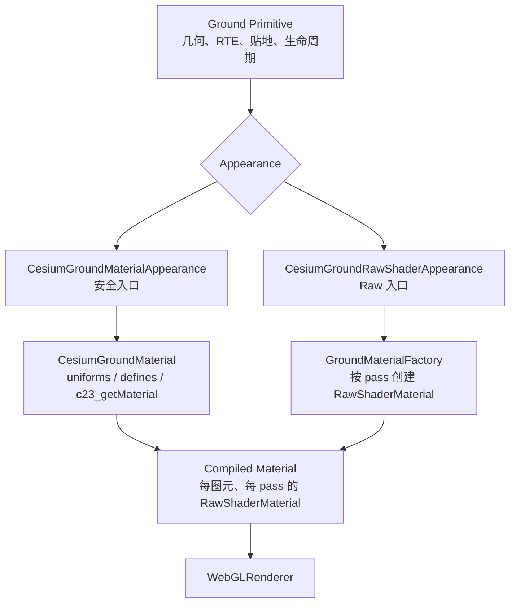

# Ground Material / Shader 扩展体系：实现与设计文档集

> 状态：**Implemented**（Stage 14 legacy cleanup 已完成）
> 适用项目：`cesium-to-three` `0.1.9`，分支 `edit-shape`
> 技术基线：Three `0.183.x`、`WebGLRenderer`、WebGL2、GLSL ES 3.00  
> 本文档集位置：`docs/animation-material/`

## 目标

本套文档为贴地矩形、多边形、圆、点、折线、箭头、文字和图片设计一套可实施的 Material / Shader 扩展体系，覆盖以下需求：

- 流动线、呼吸点、局部视觉缩放等连续效果；
- 用户自行编写 GLSL，并以稳定的 Shader ABI 接入现有贴地管线；
- 在需要时接管完整 Three `RawShaderMaterial` 和多个 Ground 渲染 pass；
- 保持当前 RTE、packed depth、log depth、stencil、分类目标和资源生命周期不变；
- uniform 每帧变化不触发 Shader 重编译，不导致 program 数量持续增长。

## 已实现范围

当前 Ground 公共入口已经提供：

- `CesiumGroundMaterial`：安全的逻辑 Material、可选 vertex Hook、稳定 user uniform wrapper、`setUniform()`、`clone()` 和显式 `dispose()`；
- `CesiumGroundMaterialAppearance`：推荐的 `c23_getMaterial` 接入方式；
- `CesiumGroundRawShaderAppearance`：按物理 pass 完整接管 `RawShaderMaterial` 的专家入口；
- `createFlowLineMaterial`、`createPulsePointMaterial`、`createScalePulseMaterial` 等内置效果；
- rectangle、polygon、circle、polyline、arrow、text/image decal 与 point delegate 的统一 Material ABI；
- 由宿主帧状态驱动的 `c23_time`、`c23_deltaTime`、`c23_frameNumber`。

旧 `SharedUniforms` 仍从原入口导出，但已标记 `@deprecated`，只用于已有内部扩展的源码兼容。新扩展应使用上述 Material / Appearance API。

## 前置阅读

- 项目总览：`../../README.md`
- 当前 Ground 公共入口：`../../src/lib/ground/index.ts`
- 当前 Ground 适配器：`../../src/lib/ground/cesium-ground-adapter.ts`
- 当前材质实现：`../../src/lib/ground/materials.ts`
- 当前 classification 实现：`../../src/lib/ground/classification.ts`

## 非目标

本设计明确不包含：

- timeline、tween、关键帧编排、动画混合器；
- 模块内部的 `requestAnimationFrame` 或独立时钟；
- 动画快照、动画 JSON 或序列化协议；
- TSL、NodeMaterial 或 `WebGPURenderer`；
- 把 `src/lib/plot` 提升为首期公开 npm API；
- 自动扩大几何、包围盒或拾取范围的真实几何缩放；
- 自动修复 Raw Appearance 中不一致的 stencil/color 顶点变换。

## 设计与实现过程

本文档集按“先证据、再约束、后接口”的顺序形成：先固定项目、Three 与 Cesium 的源码事实，再还原 surface、polyline、decal、arrow 的真实 pass 与资源所有权，随后锁定分层、公共 API 和 Shader ABI，最后按 14 个阶段完成实现与验收。编号文档保留实施前的 **Current** / **Proposed** 标记作为设计记录；本 README 的“已实现范围”和示例描述当前可用能力。

## 核心结论

动画不作为独立编排系统存在。首期统一采用：

```text
动画效果 = 稳定 Shader 程序 + 每帧原地更新的 uniform.value
```

宿主继续拥有唯一渲染循环，并通过 `CesiumGroundFrameState` 提供 `timeSeconds`、`deltaSeconds` 和 `frameNumber`。库只把这些值映射到稳定系统 uniforms：

```glsl
uniform float c23_time;
uniform float c23_deltaTime;
uniform float c23_frameNumber;
```

Shader 源码、defines 或 uniform schema 变化属于编译期变化；只有这类变化才递增版本并重建受影响的 Three `RawShaderMaterial`。单纯修改现有 uniform 的 `.value` 永远不得触发重编译。

## 目标分层



四层职责严格分离：

| 层 | 负责 | 不负责 |
| --- | --- | --- |
| Primitive | 几何、RTE、深度纹理选择、renderOrder、layer、更新与释放 compiled material | 用户表面着色逻辑 |
| Appearance | 选择安全 Material 管线或完整 Raw 管线；决定如何为 pass 编译材质 | 自行启动动画循环 |
| Material | 用户 uniforms、defines、稳定 `c23_getMaterial` 源码与版本 | Ground stencil/depth 渲染状态 |
| Compiled Material | 实际提交给 Three 的 `RawShaderMaterial`，每个 pass 独立 | 逻辑 Material 或用户 Texture 的所有权 |

## 两套同级公开入口

### `CesiumGroundMaterialAppearance`

这是默认推荐入口，借鉴 Cesium `Material` / `Appearance` 的分层：

- 用户只实现 `c23_getMaterial(c23_materialInput)`；
- 库构造 `st`、局部米制坐标、沿线距离等稳定输入；
- 库保护 shape 裁切、packed depth、RTE、log depth、stencil 清理和预乘 alpha；
- 面图元只在 color pass 调用用户 Material，front/back stencil 固定不变；
- 适合绝大多数流动、呼吸、渐变、纹理、扫描和高亮效果。

### `CesiumGroundRawShaderAppearance`

这是专家入口，借鉴 Three `RawShaderMaterial`：

- 工厂按 `frontStencil`、`backStencil`、`color`、`polyline`、`arrow` pass 被调用；
- 单次 factory 要么不调用 `createDefaultMaterial()` 并完整替换，要么恰好调用一次、原地修改并返回该同一实例；
- 每次调用必须返回独立的 `RawShaderMaterial`；
- 用户负责多个 classification pass 的顶点变换一致性；
- 开发模式只检查缺失 pass、材质实例复用和 uniform 冲突，不修复自定义 Shader。

两套入口是同级能力，不互相嵌套，也不把 Raw 模式隐藏在安全 Material 的私有回调中。

## 关键决策（已锁定）

| 主题 | 决策 | 事实源 |
| --- | --- | --- |
| 动画模型 | 稳定 Shader + 动态 uniform；无 timeline/tween/内部 RAF | 本文、[07](./07-built-in-effects.md) |
| 安全扩展 | `CesiumGroundMaterialAppearance`；fragment 实现 `c23_getMaterial`，可选 vertex 实现 `c23_vertexMain` | [04](./04-public-api-design.md)、[05](./05-shader-abi.md) |
| 完整扩展 | `CesiumGroundRawShaderAppearance`，按 pass 返回独立 `RawShaderMaterial` | [04](./04-public-api-design.md)、[05](./05-shader-abi.md) |
| Shader ABI | `C23_GROUND_SHADER_ABI_VERSION = 1`；不适用字段初始化为零 | [05](./05-shader-abi.md) |
| 保留前缀 | 用户 uniform、define、函数不得使用 `czm_`、`c23_` 或 `C23_`；例外是精确入口 `c23_getMaterial` / `c23_vertexMain` | [04](./04-public-api-design.md)、[05](./05-shader-abi.md) |
| 系统 uniform | Raw context 只公开 canonical `czm_*`/`c23_*`；legacy `u_*` 仅作同 wrapper 迁移别名，不进入 user merge | [05](./05-shader-abi.md)、[08](./08-lifecycle-cache-resources.md) |
| 透明 classification | Material alpha 为零时仍运行 color pass 并清 stencil；不得提前 `discard` | [05](./05-shader-abi.md)、[06](./06-render-pipeline-integration.md) |
| 时间 | 宿主传秒；缺省为零；示例按要求使用 `THREE.Clock` | [04](./04-public-api-design.md)、[07](./07-built-in-effects.md) |
| program 缓存 | uniform `.value` 不进入 key；源码、defines、ABI、pass、布局进入 key | [08](./08-lifecycle-cache-resources.md) |
| 共享 | 共享一个 Material 即共享 uniform 容器；独立相位必须 `clone()` | [08](./08-lifecycle-cache-resources.md) |
| Texture 所有权 | 用户 Texture 始终 borrowed；图元不 dispose；系统 depth texture 也 borrowed | [08](./08-lifecycle-cache-resources.md) |
| 缩放 | 仅在预分配 footprint 内做视觉缩放；真实几何缩放重建图元 | [07](./07-built-in-effects.md) |
| 发布边界 | 首期只修改公开 Ground 层；`plot` 只记录兼容影响 | [02](./02-current-rendering-pipeline.md)、[09](./09-implementation-roadmap.md) |

## 边界条件

- 首期仅支持 Three `0.183.x`、`WebGLRenderer`、WebGL2 与 GLSL3；不把 r185 调研源码中的新 API 当作运行依赖。
- safe Material 只接管表面着色；Raw Appearance 一旦完整替换 pass，就自行承担 RTE、depth、stencil、混合、预乘和多 pass 顶点一致性。
- `setText()` 只在固定 rectangle/shadow-volume topology 内原位更新；超出既有 topology/容量必须显式创建新图元，不能静默换 geometry。
- 视觉 Pulse/Scale 不能越过预分配 footprint；会改变包围盒、classification 或拾取范围的真实缩放不属于 Material。
- 同步校验/assembler/factory 失败可以保留旧 pass set；renderer 阶段的惰性 GPU compile/link 错误在 v1 不承诺自动回滚。
- 用户 Texture、逻辑 Material 与 Appearance 由调用方拥有；Ground 图元只销毁自己的 geometry、内部纹理/lease 和 compiled `RawShaderMaterial`。

## 文档地图与阅读顺序

建议严格按编号阅读。每篇的结论会链接到下一篇，所有设计事实仅在指定事实源中定义，其它文章引用而不重新发明。

1. [Three / Cesium 源码调研](./01-three-cesium-reference.md)  
   分析两套引擎的材质、Appearance、program cache、动态 uniform 与 Ground 管线，说明采用和不采用的机制。
2. [当前渲染管线](./02-current-rendering-pipeline.md)  
   还原 surface、polyline、decal、arrow、point delegate 和 plot 的当前路径，列出必须保护的不变量和差距。
3. [目标架构](./03-target-architecture.md)  
   定义 Primitive、Appearance、Material、Compiled Material 四层及构造、更新、重编译数据流。
4. [公共 API 设计](./04-public-api-design.md)  
   给出完整 Proposed TypeScript API、错误规则、图元接入和使用示例。
5. [Shader ABI](./05-shader-abi.md)  
   定义 GLSL structs、系统 uniforms、defines、坐标空间、输出协议和 Raw pass 契约。
6. [渲染管线集成](./06-render-pipeline-integration.md)  
   描述 surface、polyline、decal、arrow 迁移到显式 Shader assembler 的具体过程。
7. [内置效果](./07-built-in-effects.md)  
   定义默认 Color/Decal/Dash Material 和 Flow/Pulse/Scale 三个预设的公式、Shader 与限制。
8. [生命周期、缓存与资源](./08-lifecycle-cache-resources.md)  
   定义 version、program key、共享、clone、dispose、Texture 所有权和性能边界。
9. [实施路线](./09-implementation-roadmap.md)  
   将实现拆成 14 个可单独验证、可回退的阶段。
10. [测试与验收](./10-test-and-acceptance.md)  
    给出单元、集成、视觉、性能、兼容性矩阵和构建门禁。
11. [当前实现交接](./11-current-implementation-handoff.md)
    汇总最终落地能力、Stage 14 清理结果和最近验证状态。

## 术语

| 术语 | 本文含义 |
| --- | --- |
| Current | 当前提交 `32a6b24` 中已经存在的能力 |
| Proposed | 本文档设计、尚未实现的 API 或行为 |
| 示例伪代码 | 用于解释数据流，可能省略 import 或内部辅助函数，不得描述为当前可运行代码 |
| Ground Primitive | `CesiumGround*Primitive` 公开贴地图元，不含普通 Three `Object3D` 动画系统 |
| Surface | rectangle、polygon、circle，以及委托到这些图元的 circle/square point |
| Decal | text 与 image 使用的透明纹理贴花 color 分支 |
| Appearance | 把逻辑 Material 或 Raw 工厂编译成各渲染 pass 材质的策略对象 |
| Material | 与 pass 无关的表面着色逻辑；安全模式下实现 `c23_getMaterial` |
| Compiled Material | 由图元持有并负责 `dispose()` 的 Three `RawShaderMaterial` |
| System uniform | 由库维护的 `czm_*` / `c23_*` uniform，不允许用户覆盖 |
| User uniform | 由用户 Material/Raw Appearance 提供并拥有值语义的 uniform |
| Shader ABI | 库与用户 GLSL 之间稳定的 struct、uniform、define、函数和输出约定 |
| Footprint | Ground 几何预先覆盖的地表区域；视觉缩放不能越出它 |

## 当前事实与 Proposed 内容的标记规则

每篇文档统一使用以下标签：

- **Current**：可直接在当前源码中找到，并附本地路径、提交和行号；
- **Proposed API**：拟新增的公开类型或行为；
- **Implementation sketch**：实现级伪代码，约束实现顺序但不是当前代码；
- **Invariant**：迁移期间不得改变的已有渲染语义。

文档中的 `new CesiumGroundMaterial(...)` 等代码只有在标题或段落明确标为 Proposed 后才出现。未标记为 Current 的 API 不得被误认为已经发布。

## 版本与源码快照

| 仓库 | 路径 | 提交 / 版本 | 用途 |
| --- | --- | --- | --- |
| 当前项目 | `D:\my\code\cesium-to-three` | `32a6b24` / `0.1.9` | 实际集成目标 |
| Three | `D:\my\explore\three.js` | `2a005fdbad` / r185 源码 | 材质、program cache、uniform 与生命周期参考 |
| Cesium | `D:\my\explore\cesium` | `effe290c08` / `@cesium/engine 26.1.0` | Appearance、Material、Property 与 Ground 管线参考 |

当前项目的 `package.json:44` 固定依赖 `three ^0.183.0`，因此 r185 源码结论必须经过兼容判断。首期不依赖只在 r185 才存在的接口。`THREE.Clock` 自 r183 起被标记弃用；本套 API 只接收宿主产生的秒值，按需求保留 `Clock` 示例，并在 [源码调研](./01-three-cesium-reference.md) 中说明 `Timer` 等价接线。

## 示例：只写动画逻辑的 vertex + fragment

```ts
import {
  CesiumGroundMaterial,
  createGroundFragmentShader,
  createGroundVertexShader,
} from 'cesium-to-three/ground';

const material = new CesiumGroundMaterial({
  uniforms: { u_speed: { value: 2 } },
  vertexShader: createGroundVertexShader('uniform float u_speed;', /* glsl */ `
    float wave = sin(vertexInput.positionEC.x * 0.01 + c23_time * u_speed);
    vertexOutput.positionClip.y += wave * vertexOutput.positionClip.w * 0.01;
  `),
  fragmentShader: createGroundFragmentShader('uniform float u_speed;', /* glsl */ `
    material.alpha *= 0.5 + 0.5 * sin(c23_time * u_speed);
  `),
});
```

不需要复制默认系统 Shader。`C23_GROUND_VERTEX_SHADER_TEMPLATE` 与 `C23_GROUND_FRAGMENT_SHADER_TEMPLATE` 也可直接作为编辑起点；surface/decal 的 vertex Hook 自动同步到 front/back/color 三个 pass。

`vertexShader` 与 `fragmentShader` 都是可选的。只实现顶点动画时可以省略 `fragmentShader`；编译器会保留图元当前的默认片元材质及其 uniforms，例如 polygon 的默认颜色/边框、polyline 的默认实线或虚线效果。

## 示例：共享 Material 与热更新 uniform

同一个 Appearance 可以绑定到多个图元；它们共享同一个逻辑 Material 及其 uniform wrapper。`setUniform()` 只修改现有 wrapper 的 `.value`，不会改变 Material version 或 program 身份：

```ts
import * as THREE from 'three';
import {
  CesiumGroundMaterialAppearance,
  CesiumGroundPolylinePrimitive,
  createFlowLineMaterial,
} from 'cesium-to-three/ground';

const flowMaterial = createFlowLineMaterial({
  color: new THREE.Color('#00e5ff'),
  speed: 0.35,
  repeat: 6,
  trailFraction: 0.3,
});

const lineA = new CesiumGroundPolylinePrimitive({
	points,
  strokeColor: '#00e5ff',
  strokeOpacity: 100,
  visible: true,
});
const lineB = new CesiumGroundPolylinePrimitive({
	points: otherPoints,
  strokeColor: '#00e5ff',
  strokeOpacity: 100,
  visible: true,
});
const sharedFlowAppearance = new CesiumGroundMaterialAppearance({ material: flowMaterial });

lineA.setAppearance(sharedFlowAppearance);
lineB.setAppearance(sharedFlowAppearance);
flowMaterial.setUniform('u_speed', 0.8); // 两条线立即共享新速度，不重编译

scene.add(lineA.group, lineB.group);

const clock = new THREE.Clock();
let frameNumber = 0;

function renderFrame() {
  const deltaSeconds = clock.getDelta(); // 每个逻辑帧只调用一次

	const frameState = {
		...groundFrameState,
		timeSeconds: clock.elapsedTime,
		deltaSeconds,
		frameNumber: frameNumber++,
	};
	lineA.update(frameState);
	lineB.update(frameState);

  renderer.render(scene, camera);
  requestAnimationFrame(renderFrame); // 归宿主所有，不由 Material 模块创建
}
```

独立相位应通过 `clone()` 建立明确的值边界：

```ts
const pulseA = createPulsePointMaterial({ phase: 0.0 });
const pulseB = pulseA.clone().setUniform('u_phase', 0.5);

pointA.setAppearance(new CesiumGroundMaterialAppearance({ material: pulseA }));
pointB.setAppearance(new CesiumGroundMaterialAppearance({ material: pulseB }));
```

## 资源所有权与释放

| 资源 | 所有者 | 释放规则 |
| --- | --- | --- |
| Ground geometry、内部纹理/lease、compiled `RawShaderMaterial` | primitive | `primitive.dispose()` 自动释放 |
| `CesiumGroundMaterial`、Appearance | 调用方 | primitive 只借用；需要时由调用方显式释放 Material |
| 用户传入的 `Texture` | 调用方 | 始终 borrowed；Material 和 primitive 都不会自动 `dispose()` |
| depth texture / render target texture | 宿主深度管线 | Ground primitive 只采样，不取得所有权 |

卸载 Appearance 后再释放逻辑 Material；用户 Texture 必须在最后一个消费者脱离后由调用方释放：

```ts
const scale = createScalePulseMaterial({ texture, minScale: 0.75, maxScale: 1.0 });
texturedPoint.setAppearance(new CesiumGroundMaterialAppearance({ material: scale }));

// cleanup
texturedPoint.setAppearance(undefined);
scale.dispose();
texture.dispose(); // borrowed Texture 始终由调用方负责
```

## 全局验收清单

- [x] 本目录包含 `README.md` 与 `01` 至 `11` 共 12 个 Markdown 文件。
- [x] README 能通过相对链接到达全部文档。
- [x] 两套同级入口在 API、ABI、集成、生命周期和测试文档中的命名完全一致。
- [x] `c23_materialInput`、`c23_material`、时间 uniforms、defines 与 pass 名称只有一套定义。
- [x] Current、Proposed 历史设计记录与本页已实现 API 无混淆。
- [x] 流动、呼吸和缩放效果只依赖 `c23_time` 与用户 uniforms，不创建 RAF/tween/timeline。
- [x] 明确解释视觉缩放、footprint 和真实几何缩放的边界。
- [x] [09-implementation-roadmap.md](./09-implementation-roadmap.md) 的 14 个阶段均已落地。

---

下一篇：[01 · Three / Cesium 源码调研](./01-three-cesium-reference.md)
