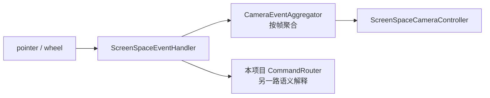
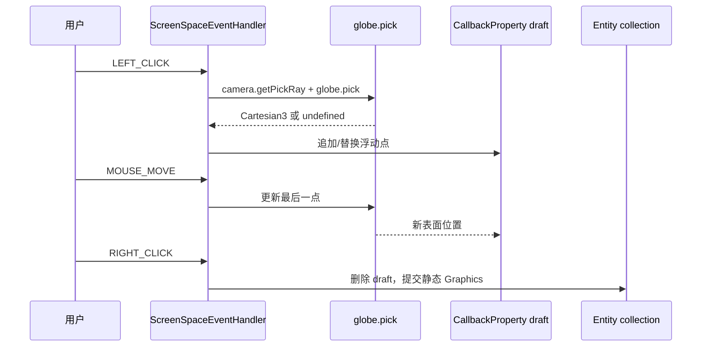

# 01 · Cesium 源码依据与采用边界

> 状态：**Cesium Source + Proposed 结论**
> 参考仓库：`D:\my\explore\cesium`
> 参考提交：`effe290c08dc340a7a6bd4435367a7d092c6b2b9`
> 参考版本：CesiumJS `1.143.0` / `@cesium/engine 26.1.0`

## 目标

本篇只回答两个问题：

1. Cesium 源码中哪些底层机制值得用于本项目的 GIS 图形编辑框架；
2. 哪些能力根本不存在，或者明确不应被误解为“模型编辑”。

结论必须能够由固定源码路径复核。本文不把 Cesium Viewer、Entity、Graphics、Primitive、相机控制器拼成一个不存在的通用编辑器；编辑器是本项目新增的领域和交互层，Cesium 只提供可借鉴的输入、拾取、高度和渲染生命周期事实。

## 证据范围

| 主题 | Cesium 源码事实源 | 可核验符号/结论 |
| --- | --- | --- |
| 屏幕输入 | `D:\my\explore\cesium\packages\engine\Source\Core\ScreenSpaceEventHandler.js` | 统一 pointer/mouse/touch/wheel/dblclick；`setInputAction`、修饰键查找、销毁 |
| 修饰键 | `D:\my\explore\cesium\packages\engine\Source\Core\KeyboardEventModifier.js` | 只有 `SHIFT`、`CTRL`、`ALT` 三个枚举值 |
| 相机事件聚合 | `D:\my\explore\cesium\packages\engine\Source\Scene\CameraEventAggregator.js` | 一帧内记录按钮、开始位置、移动量、修饰键并在 `reset()` 清理 |
| 相机消费 | `D:\my\explore\cesium\packages\engine\Source\Scene\ScreenSpaceCameraController.js` | 聚合器被相机控制器消费，不是图形编辑命令分发器 |
| 高度语义 | `D:\my\explore\cesium\packages\engine\Source\Scene\HeightReference.js` | `NONE`、三种 `CLAMP`、三种 `RELATIVE`，以及 clamp/relative 判定函数 |
| Entity/Graphics 集合 | `D:\my\explore\cesium\packages\engine\Source\DataSources\Entity.js` | Entity 的 Graphics 属性描述符和位置/姿态属性 |
| 面与线 Graphics | `...\DataSources\PolygonGraphics.js`、`PolylineGraphics.js`、`RectangleGraphics.js`、`EllipseGraphics.js` | hierarchy/positions、height、extrusion、半轴、clamp 等数据属性 |
| 体与墙 Graphics | `...\WallGraphics.js`、`CorridorGraphics.js`、`PolylineVolumeGraphics.js`、`BoxGraphics.js`、`CylinderGraphics.js`、`EllipsoidGraphics.js`、`PlaneGraphics.js` | 参数化 GIS 几何属性，不提供控制点编辑器 |
| 模型 Graphics | `...\DataSources\ModelGraphics.js` | URI、scale、节点变换、动画、材质混合等显示属性；无网格拓扑编辑 API |
| 数据到 Primitive | `...\DataSources\GeometryVisualizer.js`、`GeometryUpdater.js`、`DynamicGeometryBatch.js` | Entity 变化如何进入 Primitive；是可视化同步，不是用户交互编辑器 |
| 地表拾取 | `...\Scene\Globe.js`、`Scene.js` | `Globe.prototype.pick`、`Scene.prototype.pickPosition`、`pickFromRay` 等 |
| terrain 绘制示例 | `D:\my\explore\cesium\packages\sandcastle\gallery\drawing-on-terrain\main.js` | `ScreenSpaceEventHandler -> globe.pick -> CallbackProperty draft -> static Entity` |

源码路径中的 `...` 仅为表格排版省略；实际路径都是 `D:\my\explore\cesium\packages\engine\Source\DataSources\` 下的文件。

## 1. Cesium 没有通用 GIS 图形编辑器

### 1.1 Entity 是聚合数据容器

`Entity.js` 的 `Entity.ConstructorOptions` 文档列出 `billboard`、`box`、`corridor`、`cylinder`、`ellipse`、`ellipsoid`、`label`、`model`、`tileset`、`path`、`plane`、`point`、`polygon`、`polyline`、`polylineVolume`、`rectangle` 和 `wall` 等属性。每个属性通过 `createPropertyTypeDescriptor` 转换为对应的 `*Graphics` 实例，Entity 另外持有 `id`、`position`、`orientation`、`show`、父子关系和 `definitionChanged` 事件。

这说明 Cesium 的 Entity 层解决的是：

- 把一个稳定身份和若干可视化 Graphics 组合起来；
- 观察属性变化并让可视化器重算；
- 将位置和姿态传给 Geometry/Model visualizer。

它没有解决：

- 鼠标命中后如何进入“编辑顶点”状态；
- 一个点按、双击、右键和键盘 Enter 如何组成图形绘制事务；
- 多选、控制点、中点插入、旋转手柄或三轴 Gizmo；
- Ctrl/Cmd-Z 的命令历史和跨对象组变换；
- 编辑器焦点与相机控制冲突。

因此本项目可以借鉴 **Entity/Graphics 的数据分层**，但必须实现自己的 `PlotEditor`、`PlotDocument`、`CommandRouter` 和图形适配器。相关目标架构见 [03](./03-target-architecture.md)，当前差距见 [02](./02-current-project-audit.md)。

### 1.2 Graphics 是描述，不是编辑工具

以 `PolygonGraphics.js` 为例，它暴露 `hierarchy`、`height`、`heightReference`、`extrudedHeight`、`extrudedHeightReference`、`perPositionHeight`、material、outline 和 zIndex 等属性；`PolylineGraphics.js` 暴露 `positions`、宽度、材质、`clampToGround` 和 `arcType`；`WallGraphics.js` 暴露 `positions`、`minimumHeights` 和 `maximumHeights`。这些属性形成了稳定的图形描述契约，但文件中没有屏幕坐标事件、控制点对象、拖拽回调或键位映射。

`GeometryVisualizer.js` 与 `GeometryUpdater.js` 监听 Entity/Graphics 的变化，并把静态或动态几何加入 `StaticGeometryPerMaterialBatch`、`DynamicGeometryBatch` 等批次。它们的职责是**数据变化后的渲染同步和 Primitive 生命周期**，不是把用户的每次鼠标动作解释成数据变化。

### 1.3 “ModelGraphics”明确不是模型编辑

`ModelGraphics.js` 的构造选项包含 `uri`、`scale`、`minimumPixelSize`、`maximumScale`、`runAnimations`、`heightReference`、颜色混合、光照、裁剪、`nodeTransformations`、`articulations` 和 `customShader` 等。源码注释说明它是“基于 glTF 的 3D model”，位置和姿态由包含它的 Entity 决定。

这些属性最多允许：

- 更换或显示/隐藏一个 glTF 资源；
- 改变实体级位置、姿态、缩放和显示样式；
- 对已存在的节点变换或 articulation 阶段设置值。

它们不提供：

- glTF mesh 顶点/索引增删改；
- primitive、材质槽、骨骼拓扑或节点层级重组；
- 模型局部面的 GIS 顶点控制点；
- 将模型内部面转换成可编辑的 polygon/line Entity。

**锁定边界：** 本项目编辑器拒绝 `model` 图形进入 `PlotDocument`，也不把点击 GLB 或 3D Tiles 结果包装成可编辑模型实体。模型和 3D Tiles 只作为可见参考、表面贡献者或遮挡对象。若宿主需要移动一个模型，应使用独立的模型场景工具，不得复用本 GIS 图形编辑器的 Entity/Graphics adapter。

## 2. 屏幕输入：`ScreenSpaceEventHandler`

### 2.1 真实监听行为

`ScreenSpaceEventHandler.js` 的 `registerListeners` 在支持 Pointer Events 的浏览器上注册：

- `pointerdown`、`pointerup`、`pointermove`、`pointercancel`；
- `dblclick`；
- 浏览器可用的 `wheel`（或旧版 wheel 事件）。

不支持 Pointer Events 时，它退回 `mousedown`、`mouseup`、`mousemove`、`touchstart`、`touchend`、`touchmove` 和 `touchcancel`。鼠标抬起和移动可能注册到 `document`，保证指针离开画布后仍能结束操作；销毁时由 `_removalFunctions` 统一移除监听。

这是本项目 `PointerInput` 的直接参考：统一使用 Pointer Events，保存 `pointerId`、`pointerType`、按钮、修饰键、屏幕坐标和时间，并在 `pointercancel`、`lostpointercapture`、窗口 `blur` 时走同一个取消清理路径。Cesium 的 fallback 代码可以作为兼容策略参考，但不应让业务层同时维护三套事件体系。

### 2.2 修饰键只是输入索引，不是编辑命令

`getModifiers(event)` 只把 `shiftKey`、`ctrlKey`、`altKey` 转换为 `KeyboardEventModifier.SHIFT/CTRL/ALT`。`setInputAction` 用 `ScreenSpaceEventType + modifiers` 作为键，`getInputAction` 和 `removeInputAction` 使用同一键查找/删除回调。`KeyboardEventModifier.js` 只有三个枚举值，没有 `META`、`CMD`、`ENTER`、`DELETE` 或任何图形语义。

所以：

- Cesium 能够区分“Shift + 左键拖拽”和“左键拖拽”；
- Cesium 不会把 Ctrl/Cmd-Z、Enter、Escape 或箭头键变成编辑命令；
- 本项目必须由 `KeyboardInput` 监听 `keydown`/`keyup`，把平台 Meta 键规范化为 `primaryModifier`，再由 [06](./06-keyboard-command-keymap.md) 的 keymap 解释。

### 2.3 点击容差、长按和 pointer cancel

构造函数中的 `_clickPixelTolerance = 5`、`_holdPixelTolerance = 25` 是 Cesium 的内部基线；静态属性 `mouseEmulationIgnoreMilliseconds = 800` 用来忽略触摸后浏览器合成的鼠标事件，`touchHoldDelayMilliseconds = 1500` 定义长按延迟。`pointercancel` 被映射到与 pointer up 相同的清理函数，避免按钮状态永久卡住。

本项目首期建议采用：点击判定默认 `6 CSS px`（与当前 [draw-tool](../../src/demo/draw-tool.ts) 的 `CLICK_MOVE_THRESHOLD_PX = 6` 保持一致），拖拽启动阈值与点击阈值分开配置。这个数值是项目策略，不声称是 Cesium 公共 API；Cesium 的 5px/25px 只作为参考证据。

### 2.4 `setInputAction` 的生命周期启示

Cesium 暴露 `setInputAction`、`getInputAction`、`removeInputAction` 和 `destroy`。本项目不直接复制按事件类型注册回调的 API，而是在输入层先产生不可变事件，再由命令路由器按当前状态决定动作。这样可以避免多个工具同时注册同一个 canvas 事件后互相覆盖，也能让键盘焦点和文本编辑优先级显式化。

## 3. 相机事件：`CameraEventAggregator`

`CameraEventAggregator.js` 在构造时创建一个 `ScreenSpaceEventHandler`，为无修饰键及 Shift/Ctrl/Alt 组合维护事件键。它记录 `isMoving`、`getMovement`、`getLastMovement`、`getStartMousePosition`、按钮按下/释放时间等信息，宿主每帧通过 `reset()` 清空本帧状态。`ScreenSpaceCameraController.js` 消费这个聚合器来实现旋转、平移、缩放和倾斜。



可采用的机制：

- 在一帧内合并高频 `pointermove`，编辑预览最多提交一次；
- 保存开始点、上一次点和累计位移，以区分 click 与 drag；
- 将修饰键组合保留到路由阶段，而不是在 DOM 回调中硬编码业务行为。

不可直接采用的假设：

- 相机聚合器不是图形编辑器的历史或状态机；
- `CameraEventAggregator.reset()` 不能代替编辑事务提交；
- 编辑器不能读取相机内部私有 `_aggregator` 来判断是否选中图形。

本项目用 `NavigationLock` 端口协调两者：未命中控制点时由相机继续消费拖拽；命中编辑手柄并确认进入 dragging 后，编辑器租借相机控制权，结束/取消/失焦立即归还。详细输入仲裁见 [05](./05-pointer-input-and-camera.md) 和状态转移见 [07](./07-editor-state-machine.md)。

## 4. HeightReference：七种高度语义

`D:\my\explore\cesium\packages\engine\Source\Scene\HeightReference.js` 定义以下数值枚举，并提供 `isHeightReferenceClamp` 与 `isHeightReferenceRelative`：

| Cesium 值 | 语义 | 本项目内部对应 |
| --- | --- | --- |
| `NONE = 0` | 相对 WGS84 椭球面的绝对高度 | `NONE` |
| `CLAMP_TO_GROUND = 1` | 贴 terrain 和 3D Tiles 表面 | `CLAMP_TO_GROUND` |
| `RELATIVE_TO_GROUND = 2` | 相对 terrain/3D Tiles 表面的米制偏移 | `RELATIVE_TO_GROUND` |
| `CLAMP_TO_TERRAIN = 3` | 只贴 terrain | `CLAMP_TO_TERRAIN` |
| `RELATIVE_TO_TERRAIN = 4` | 相对 terrain 的米制偏移 | `RELATIVE_TO_TERRAIN` |
| `CLAMP_TO_3D_TILE = 5` | 只贴 3D Tiles | `CLAMP_TO_3D_TILE` |
| `RELATIVE_TO_3D_TILE = 6` | 相对 3D Tiles 的米制偏移 | `RELATIVE_TO_3D_TILE` |

Cesium 的注释还提醒：贴 3D Tiles 时，tileset 的 `enableCollision` 会影响实体是否能正确贴附。这个约束应转化为本项目 `SurfaceHeightResolver` 的可诊断状态，而不是静默切换到其它表面。

本项目的作者数据规则（完整契约在 [04](./04-coordinate-height-schema.md)）：

1. 所有位置字段最终是 `[lon, lat, height]`。
2. `CLAMP_*` 模式的作者 `height` 必须为 `0`。
3. `RELATIVE_*` 的 `height` 是目标表面上方/下方的偏移；`NONE` 的 `height` 是椭球高度。
4. 运行时采样值和 `surfaceRevision` 只存于解析缓存，不进入 deep snapshot 或历史命令。

## 5. Entity/Graphics 目录与编辑映射

`Entity.js` 的属性描述符清楚地给出 Cesium 的 Graphics 分类。以下表格记录“可借鉴的描述语义”和本项目的编辑边界：

| Cesium Graphics | 源码属性证据 | 本项目编辑映射 |
| --- | --- | --- |
| `PointGraphics` | `pixelSize`、`color`、`heightReference` | `point` 锚点/尺寸/样式 |
| `PolylineGraphics` | `positions`、宽度、材质、`clampToGround`、`arcType` | `line` 顶点序列和线样式 |
| `PolygonGraphics` | `hierarchy`、`height`、`heightReference`、`extrudedHeight`、`perPositionHeight` | `polygon` 外环/孔洞/高度；非法环由 adapter 拒绝 |
| `RectangleGraphics` | `coordinates`、高度与挤出高度参考 | `rectangle` 两角/四角约束 |
| `EllipseGraphics` | `semiMajorAxis`、`semiMinorAxis`、`rotation`、高度参考 | 后续参数化 ellipse；首期 `circle` 为等轴特例 |
| `WallGraphics` | `positions`、`minimumHeights`、`maximumHeights` | 后续 wall；不把墙底/顶混成单一 footprint 高度 |
| `CorridorGraphics` | `positions`、`width`、角点与高度属性 | 后续 corridor；控制线与宽度分离 |
| `PolylineVolumeGraphics` | `positions`、`shape`、角点属性 | 后续体积线；编辑路径和截面两个维度 |
| `PlaneGraphics` | `plane`、`dimensions` | 后续 plane；位置/姿态和尺寸分开 |
| `BoxGraphics` | `dimensions`、位置姿态、`heightReference` | 后续 box；三轴尺寸手柄 |
| `CylinderGraphics` | `length`、`topRadius`、`bottomRadius`、高度参考 | 后续 cylinder；半径/长度手柄 |
| `EllipsoidGraphics` | `radii`、位置姿态、高度参考 | 后续 ellipsoid；三轴半径手柄 |
| `LabelGraphics` / `BillboardGraphics` | 文本/图片显示属性 | 映射到 `text` / `point(style='image')`，不引入新的编辑核心 |
| `PathGraphics` | 按时间和位置属性显示轨迹 | 不纳入首期静态编辑对象 |
| `ModelGraphics` | glTF URI、显示/材质/节点属性 | 明确排除，见下一节 |
| `Cesium3DTilesetGraphics` | tileset URI 和显示属性 | 参考图层/表面贡献者，明确不可编辑 |

Cesium 的 `Graphics` 属性是 Property，可能随时间求值；本项目首期只承诺静态、可撤销的作者状态，避免把时间驱动和交互事务混在一起。

## 6. ModelGraphics 与 GIS 编辑边界

### 6.1 源码事实

`ModelGraphics.js` 的构造器把选项复制为 property descriptors，并维护 `definitionChanged`。可见字段包括：

- `uri`、`show`、`scale`、`minimumPixelSize`、`maximumScale`；
- `runAnimations`、`clampAnimations`、`shadows`、`heightReference`；
- `silhouetteColor/Size`、`color`、`colorBlendMode/Amount`、光照和距离显示；
- `nodeTransformations`、`articulations`、`clippingPlanes`、`customShader`。

源码没有 `vertices`、`indices`、`mesh`、`primitiveId` 编辑属性，也没有屏幕控制点、面命中后写回 glTF 的方法。`nodeTransformations` 只是对已存在节点施加运行时变换，不是拓扑编辑。

### 6.2 本项目的硬边界

```text
点击 GLB / ModelGraphics / 3D Tiles
        -> 可选：返回参考对象或表面命中点
        -> 不创建 PlotEntity
        -> 不进入 PlotDocument
        -> 不生成“模型顶点控制点”
```

如果未来需要“移动一个模型实例”，那属于模型实例定位工具，输入和历史可以另建模块；它不能复用 GIS 图形 adapter 来伪装成 polygon/point。`PlotEditor` 对 `model`、`tileset` 输入返回 `UNSUPPORTED_GRAPHICS_KIND` 或 `REFERENCE_ONLY`，并在 [15](./15-test-and-acceptance.md) 中做负面验收。

## 7. 表面拾取 API

Cesium 同时提供几种层次不同的拾取：

| API | 源码 | 语义 | 本项目用途 |
| --- | --- | --- | --- |
| `Globe.prototype.pick(ray, scene)` | `...\Scene\Globe.js` | 沿射线求 terrain/球面可见表面；无命中返回 `undefined` | ground/terrain 表面候选 |
| `Scene.prototype.pick(windowPosition)` | `...\Scene\Scene.js` | GPU 颜色拾取场景对象/feature | 参考对象和 pick proxy，不直接当领域命中 |
| `Scene.prototype.pickPosition(windowPosition)` | `...\Scene\Scene.js` | 从深度缓冲恢复世界坐标，受 `pickPositionSupported` 约束 | elevated/3D Tiles 深度位置候选 |
| `Scene.prototype.pickFromRay(ray, ...)` | `...\Scene\Scene.js` | 沿射线拾取对象 | 需要对象身份的参考层/代理 |

Cesium 的绘制示例优先使用 `camera.getPickRay` + `scene.globe.pick`，因为 `camera.pickEllipsoid` 无法反映 terrain 起伏。对于本项目，`SurfacePicker` 应把这些来源抽象成可配置贡献者：terrain、3D Tiles、ellipsoid fallback，并返回来源、法向和 revision，而不是只返回裸 `Vector3`。

## 8. `drawing-on-terrain` 示例的可借鉴流程

`D:\my\explore\cesium\packages\sandcastle\gallery\drawing-on-terrain\main.js` 是最接近“绘图交互”的官方示例，但它仍是示例脚本而非通用编辑器：

1. 创建 `ScreenSpaceEventHandler(viewer.canvas)`。
2. `LEFT_CLICK` 中调用 `viewer.camera.getPickRay` 和 `viewer.scene.globe.pick`。
3. 第一个有效点创建 `floatingPoint`，并把点加入 `activeShapePoints`。
4. 用 `CallbackProperty` 把 `activeShapePoints` 映射成临时 polyline 或 `PolygonHierarchy`，鼠标移动时替换最后一个浮动点。
5. `RIGHT_CLICK` 调用 `terminateShape()`，移除浮动点和动态 Entity，再创建静态 Entity。
6. 切换 Draw Lines/Draw Polygons 时也调用 `terminateShape()`，避免残留动态状态。



本项目采用“transient draft + 一次性 commit”的思想，但把动态 Entity 换成 editor overlay，把右键、双击、Enter、Escape、失焦和异常统一交给 `PlotEditor` 状态机；详见 [07](./07-editor-state-machine.md) 和 [09](./09-shape-drawing-contracts.md)。

## 9. 采用、不采用与改造矩阵

| Cesium 机制 | 采用方式 | 不直接采用的部分 |
| --- | --- | --- |
| `ScreenSpaceEventHandler` 的事件归一化 | 采用 Pointer Events、按钮、修饰键、点击容差和 cancel 清理的思想 | 不把业务编辑逻辑注册成散落的 `setInputAction` 回调 |
| `CameraEventAggregator` | 采用按帧聚合和 start/previous movement 数据 | 不把相机聚合状态当作编辑事务或选择状态 |
| `HeightReference` | 采用七种明确语义和 clamp/relative 分类 | 不把运行时地形采样结果持久化到作者高度 |
| `Entity` + `*Graphics` | 采用稳定身份 + 图形描述的分层 | 不移植完整 Property、时间求值和 CompositeEntityCollection |
| `GeometryVisualizer` / `GeometryUpdater` | 采用“数据层变化 -> 渲染同步器 -> Primitive”的生命周期边界 | 不让 visualizer 负责鼠标/键盘解释 |
| `Globe.pick` / `Scene.pickPosition` | 通过 `SurfacePicker` 端口组合 terrain/tiles/ellipsoid | 不假设所有 classification mesh 都支持普通 raycast |
| Sandcastle drawing sample | 采用动态草稿、浮动点、完成后静态提交 | 补齐多选、控制点、键盘、历史和异常恢复 |
| `ModelGraphics` | 仅把其作为模型显示属性的证据 | 不将模型 URI、节点变换或网格当作 GIS 图形编辑对象 |

## 10. 对本项目的接口启示

以下是 **Proposed** 端口，不是 Cesium 当前项目 API：

```ts
export interface SurfacePickResult {
  readonly position: [number, number, number];
  readonly source: 'terrain' | '3d-tiles' | 'ellipsoid';
  readonly normal: readonly [number, number, number];
  readonly revision: number;
}

export interface PointerInputEvent {
  readonly kind: 'down' | 'move' | 'up' | 'cancel' | 'wheel' | 'double-click';
  readonly pointerId: number;
  readonly pointerType: 'mouse' | 'pen' | 'touch';
  readonly button: number;
  readonly buttons: number;
  readonly clientX: number;
  readonly clientY: number;
  readonly primaryModifier: boolean;
  readonly shiftKey: boolean;
  readonly altKey: boolean;
}

export interface EditorInputPort {
  readonly pointer: PointerInputEvent;
  readonly keyboard: { code: string; phase: 'down' | 'up'; repeat: boolean };
}
```

`PointerInputEvent` 只表达事实；键盘语义和命令优先级在 [06](./06-keyboard-command-keymap.md) 定义，表面位置解析在 [08](./08-picking-surface-height.md) 定义。

## 不变量

1. 任何引用 Cesium 的结论都必须能定位到本篇“证据范围”的固定文件；示例行为不能替代源码证据。
2. Cesium 的 `ScreenSpaceEventHandler` 统一屏幕输入，但不监听图形编辑键盘；本项目必须拥有独立 `KeyboardInput`。
3. Cesium 的 `Entity`/`Graphics` 是数据描述和可视化同步，不是通用 GIS 编辑器。
4. `ModelGraphics` 和 `Cesium3DTilesetGraphics` 不是本项目可编辑 Graphics。
5. `HeightReference` 的 clamp/relative/absolute 语义不能被 `clampToGround` 一个布尔字段替代。
6. `Globe.pick` 的无命中结果必须保留为失败，不得用上一帧位置或零点伪造命中。
7. drawing sample 的 `CallbackProperty` 只能作为草稿预览参考，不能成为历史或持久化机制。

## 失败路径

- **版本/路径不一致：** 若参考仓库不是表头指定提交，先记录实际 commit 并重新核验，不直接套用结论。
- **terrain 未加载：** `Globe.pick` 可能返回空；编辑器进入 `pickMiss`/`pending`，由高度策略决定是否允许椭球 fallback。
- **GPU 深度不可用：** `Scene.pickPositionSupported` 为 false 时，使用对象/terrain pick 或 CPU 椭球交点，并标记精度来源。
- **Model/tileset 被点击：** 返回参考对象或表面结果，不改变 `PlotDocument`；统一错误码见 [13](./13-public-api-history-persistence.md)。
- **输入重复注册：** 不在多个工具中重复挂 handler；由 `PlotEditor.dispose()` 通过租约撤销全部监听。
- **动态草稿异常：** 清除 transient overlay，保留提交前文档快照，并恢复相机控制。

## 验收项

- [ ] 能从 `ScreenSpaceEventHandler.js` 复核 pointer/mouse/touch fallback、`pointercancel`、修饰键和点击容差事实。
- [ ] 能从 `CameraEventAggregator.js` 与 `ScreenSpaceCameraController.js` 复核“相机聚合器不是编辑命令路由器”。
- [ ] 能从 `HeightReference.js` 复核七种枚举及 clamp/relative 语义。
- [ ] 能从 `Entity.js` 和各 `*Graphics.js` 复核八类图形及扩展 Graphics 的描述属性。
- [ ] 能从 `ModelGraphics.js` 复核其 URI/样式/节点变换边界，并在自动测试中确认模型不可编辑。
- [ ] 能复现 `drawing-on-terrain/main.js` 的草稿到静态提交流程，并验证本项目增加了键盘确认/取消和历史事务。
- [ ] 任何无地形、无深度或天空点击场景都不生成伪坐标。
- [ ] 文档交叉链接能到达 [02](./02-current-project-audit.md)、[03](./03-target-architecture.md)、[04](./04-coordinate-height-schema.md)、[05](./05-pointer-input-and-camera.md) 和 [08](./08-picking-surface-height.md)。
