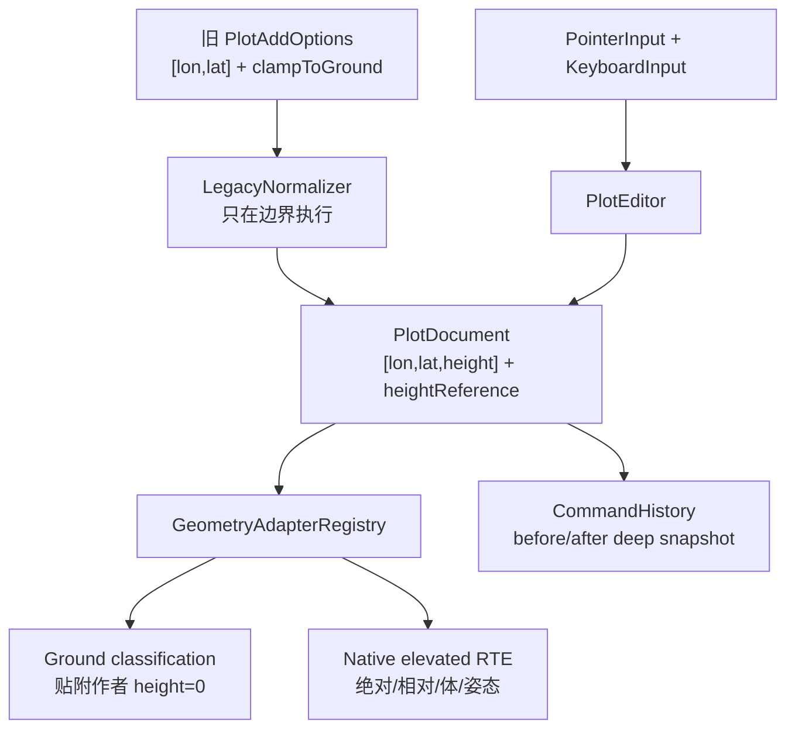

# 02 · 当前项目审计：数据、渲染、输入与发布边界

> 状态：**Current 审计 + Proposed 缺口**
> 项目：`D:\my\code\cesium-to-three`
> 分支：`edit-shape`
> 审计快照：提交 `1e0cd69bd628f23f49b9cb1f749b1118601e3482`

## 目标

本篇只记录当前仓库能够直接验证的事实，并把这些事实转换为编辑器设计需要解决的缺口。它不是对未来 API 的承诺，也不把 demo 中的临时逻辑误写成 SDK 能力。

审计重点是：

- `src/lib/plot` 当前八类数据结构是否适合承载编辑；
- `GroundDecalManager` 和 `PlotPrimitiveBridge` 当前如何更新和重建图元；
- `clampToGround`、`heightMeters`、`classificationType` 的现有语义；
- classification 图元为何不能直接用普通 Three raycaster 选择；
- 当前 `draw-tool.ts` 为什么只能算最小采点 demo；
- 公开构建、类型入口和宿主帧循环会如何影响新编辑器。

## 证据地图

| 层 | Current 文件 | 关键事实 |
| --- | --- | --- |
| 类型 | `src/lib/plot/plugins/types.ts` | `LonLatPoint = [number, number]`；八个 `GisPlotCategory`；样式和旧高度字段 |
| 数据基类 | `src/lib/plot/plugins/base.ts` | 模块级字符串自增 ID；构造时点数组浅层复制；`update`、浅快照和深快照 |
| 八类插件 | `src/lib/plot/plugins/{point,line,polygon,rectangle,sector,arrow,text,circle}.ts` | 每个类别的参数和派生几何；箭头额外 `generatedCoords` |
| 管理器 | `src/lib/plot/GroundDecalManager.ts` | CRUD、顶点操作、平移、样式、分类目标集合、帧更新、RAF 合并、dispose |
| 渲染桥 | `src/lib/plot/PlotPrimitiveBridge.ts` | 按 `clampToGround` 分流；签名决定轻量刷新或释放/重建 |
| 非贴地图元 | `src/lib/plot/PlainPlotPrimitive.ts` | RTE 高度路径；普通 Three Group；目前高度为单一 `heightMeters` |
| 绘制 demo | `src/demo/draw-tool.ts` | PointerEvent 左键单击采点，6px 阈值；箭头/图片点专用；无键盘状态机 |
| plot demo | `src/demo/plot-demo.ts` | 创建 `GlobeControls`、tiles、depth 和 `GroundDecalManager`；宿主每帧更新 |
| classification | `src/lib/ground/classification.ts`、`src/lib/ground/primitives.ts` | shadow volume / stencil / color 多 pass；RTE attributes；非拾取 layer |
| 深度 | `src/lib/ground/depth.ts`、`src/lib/ground/classification-depth.ts` | terrain/tiles/both 深度贡献者和椭球 fallback |
| 包入口 | `vite.lib.config.ts`、`tsconfig.lib.json`、`package.json`、`src/lib/plot/index.ts` | plot 当前排除 npm library build，只有 ground/arrow 公开 |

## 1. 当前数据结构：二元坐标和八类联合

### 1.1 `types.ts` 的真实契约

`src/lib/plot/plugins/types.ts` 明确写着：

```ts
export type LonLatPoint = [number, number];

export type GisPlotCategory =
  | 'point' | 'line' | 'polygon' | 'rectangle'
  | 'sector' | 'arrow' | 'text' | 'circle';
```

`GisPlotBaseOptions` 的共同字段是 `points`、描边/填充颜色和透明度、`visible`，以及以下旧高度/深度字段：

- `clampToGround?: boolean`：未显式为 `false` 时走贴地 classification；显式 `false` 时走普通 Three 路径；
- `heightMeters?: number`：仅在不贴地路径生效，表示相对 WGS84 椭球面的高度；贴地路径忽略它；
- `classificationType?: ClassificationType`：贴 terrain、3D Tiles 或两者，默认行为由 Ground 图元决定。

这套契约可以支持当前 demo，但不能表达：

- 一个位置已经是三元坐标且高度基准是什么；
- 贴地作者高度为 0 与实际 terrain 高度之间的区别；
- 相对 terrain 与相对 3D Tiles 的不同来源；
- polygon 孔洞、每点高度、挤出高度和挤出高度基准；
- 绝对/相对高度切换时如何保留用户意图；
- 经度跨越 `180/-180` 时的连续几何。

迁移契约见 [04](./04-coordinate-height-schema.md)。在新核心中，二元输入只允许出现在兼容边界，不得继续作为领域类型。

### 1.2 八类参数的当前语义

| 类别 | 当前 `points` 解释 | 当前额外字段 | 派生/限制 |
| --- | --- | --- | --- |
| `point` | `points[0]` 为中心 | `pointStyle`、`size` 或图片 URL/宽高/旋转 | 仅一个锚点 |
| `line` | 折线顶点序列 | `strokeStyle`、起止箭头样式 | 至少两个点；宽度主要在渲染层处理 |
| `polygon` | 外环顶点序列 | 仅公共样式 | `GroundDecalManager.removeCoord` 最少保留 3 点；当前类型没有 holes |
| `rectangle` | 四角点序列 | 无独立边界字段 | 桥接器按 polygon 处理，不是 Cesium rectangle 参数化对象 |
| `sector` | `points[0]` 为圆心 | `radius`、`startAngle`、`sectorAngle` | 圆形 primitive 的扇区分支 |
| `arrow` | 原始控制点 | `arrowType`、尺寸和曲线体型参数 | `GisPlotArrow.generateCoords()` 派生闭合轮廓；快照额外包含 `generatedCoords` |
| `text` | `points[0]` 为锚点 | 内容、排版、框、旋转、偏移 | 交给 `CesiumGroundTextPrimitive` 或 Plain 路径 |
| `circle` | `points[0]` 为圆心 | `radius` | 圆周由渲染图元生成 |

当前箭头数据结构已经有“原始控制点和派生轮廓分离”的先例，但 `generatedCoords` 出现在快照中，未来持久化必须改为只保存原始输入；参见 [10](./10-shape-editing-handles.md) 和 [13](./13-public-api-history-persistence.md)。

### 1.3 `GisPlotBase` 的快照与身份

`src/lib/plot/plugins/base.ts` 中：

- 模块级 `_nextId` 从 1 开始递增，ID 是字符串；
- 构造时复制 options，并为 `points` 每个 `[lon, lat]` 创建新数组；
- `update` 用展开替换整个 options 对象，但不会深拷贝 patch 内嵌对象；
- `getSnapshot()` 返回新 options 对象，points 仍可能与内部共享；
- `getSnapshotDeep()` 复制每个点，但当前仍然是二元坐标；
- 基类没有插入顺序字段，管理器 Map 的插入顺序承担渲染顺序。

这些行为足以作为兼容 facade 的事实，但不够作为可撤销文档的深快照：新的 `PlotDocument` 必须稳定保存 `id`、order、三元坐标、嵌套 hierarchy、样式和版本，而不保存渲染派生数据。

## 2. `GroundDecalManager`：数据操作和帧接入

### 2.1 当前公开方法

`src/lib/plot/GroundDecalManager.ts` 持有 `Map<string, GisPlotBase>`，提供：

```text
addPlot(options) -> id
remove(id)
clear()
getItem(id) / getItemDeep(id)
setStyle(id, patch)
setCenter(id, { lon?, lat? })
setCoords(id, [[lon, lat], ...])
setCoord(id, index, partial coord)
insertCoord(id, index, coord)
removeCoord(id, index)
translateCoords(id, dLon, dLat)
setText(id, text)
setGlobalOpacity(opacity)
getCoordCount(id)
findNearestCoord(id, lon, lat)
collectActiveClassificationTypes()
getAllIds()
update(frameState)
render() // no-op compatibility hook
dispose()
```

`setCenter`、`setCoord`、`translateCoords` 会就地修改 points；`setStyle` 通过 `GisPlotBase.update` 替换 options。方法对不存在 ID 多数静默返回，不抛结构化错误。`removeCoord` 只按 category 粗略保护 polygon 最少 3 点、其它类型最少 2 点，不能表达 rectangle、sector、arrow 各自的约束。

### 2.2 RAF 合并和宿主帧循环

`_markDirty()` 用 `requestAnimationFrame` 合并同一帧内的多次变更；第一次有图形时把 `_items` Map 的引用交给桥接器，然后调用 `bridge.redraw()`。`update(frameState)` 不是内部循环，而是由宿主在深度 pass 后、主 `renderer.render` 前调用：它更新可选 `EllipsoidDepthSource`，再把 frame state 转发给所有 primitive。

这带来两个重要事实：

1. 现有 manager 已经有“批量合并刷新”的基础，可以承载编辑器的逐帧草稿预览；
2. manager 当前没有事务、变更事件、before/after 快照或命令历史，且 RAF 回调不能成为编辑提交边界。

### 2.3 深度目标集合

`collectActiveClassificationTypes()` 遍历所有 item：`clampToGround === false` 的对象不消费深度；其余对象把 `classificationType`（默认 `ClassificationType.BOTH`）加入 Set。宿主据此决定 terrain/3D Tiles 深度纹理。该方法是深度资源优化的有效现状，但它把“是否贴地”和“高度参考”压缩成了布尔判断，迁移时要由 HeightReference 到深度贡献者做显式映射。

## 3. `PlotPrimitiveBridge`：当前渲染生命周期

### 3.1 两条渲染路径

`src/lib/plot/PlotPrimitiveBridge.ts` 的 `AnyPlotPrimitive` 联合包含：

- 贴地路径：`CesiumGroundPointPrimitive`、`CesiumGroundPolylinePrimitive`、`CesiumGroundPolygonPrimitive`、`CesiumGroundCirclePrimitive`、`CesiumGroundTextPrimitive`；
- 不贴地路径：`PlainPlotPrimitive`，内部持有普通 Three `Group` 和 RTE shader。

`_buildPrimitive()` 先检查 `clampToGround === false`：

- 是 `false`：调用 `createPlainPlotPrimitive(plot, renderOrder, opacity)`，从 `heightMeters` 构造普通 Three 几何；
- 其它值：按 category 创建 `CesiumGround*`，贴地路径忽略 `heightMeters`。

这解释了当前“贴地和离地”能够渲染，但不能表达 relative-to-terrain、relative-to-3D-tile 或逐点高度。

### 3.2 几何签名与重建边界

`geometrySignature()` 按类别串联 points 和几何参数：circle 的 radius、sector 的角度、point 的样式/图片尺寸、arrow 的原始点和体型参数、line 的箭头样式、text 的内容/排版/框参数等。`clampModeSignature()` 再加上 `ground` 或 `plain|heightMeters` 前缀。

`redraw()` 的流程是：

1. 删除 Map 中已经消失的 entry，并从 scene 移除、dispose 旧 primitive；
2. 按 Map 插入顺序计算 renderOrder；
3. 签名未变且支持样式热更新时调用 `_refreshLightweight()`；
4. 其它情况先释放旧 primitive，再 `_buildPrimitive()`，挂回 scene。

当前支持样式热更新的主要是折线、文字和图片点；圆、多边形、箭头等样式变化通常会重建图元。几何拖动因此可能频繁重建 GPU geometry，编辑器需要单独的 transient overlay 和事务合并策略，不能把 pointermove 直接映射成多次 `redraw()`。

### 3.3 现有样式与深度更新

`_refreshLightweight()` 会同步可见性、renderOrder、classificationType；折线更新颜色/透明度/宽度/箭头尺寸，文字调用 `setText`，图片点只更新 image opacity。`classificationType` 不进入签名，说明它被设计为轻量运行时属性，但新 HeightReference 不能继续依赖这个隐含规则：表面来源、作者高度和渲染路径必须成为显式解析结果。

### 3.4 资源释放

桥接器 `dispose()` 遍历 entries，从 scene 移除并调用 primitive dispose；manager 另外释放可选椭球深度源。替换图元时采用“先从 scene 移除、dispose，再创建新图元”的简单策略。未来编辑器引入 overlay、pick proxy、异步采样和 history snapshot 后，必须把这些资源纳入独立的生命周期表，并保证文档真相不因 GPU 创建失败而回滚错误。

## 4. `PlainPlotPrimitive`：当前离地 RTE 路径

`src/lib/plot/PlainPlotPrimitive.ts` 只在 `clampToGround=false` 时使用。它：

- 用 WGS84 helper 将 lon/lat 转为 ECEF；
- 通过 `encodeCesiumVector3` 分成 `position3DHigh/position3DLow`；
- 用 `u_encodedCameraPositionHigh/Low` 和相对视点 MVP 在 shader 中完成 RTE；
- 对 circle、sector、polygon、arrow、line、text、point/image 构建普通 Three Group；
- `update(frameState)` 只更新相机 RTE uniforms，`dispose()` 释放自己持有的 geometry/material/texture。

当前 `PlainStyle` 只有一个 `heightMeters`，且所有形状都按单一高度成面/成线；它没有 terrain/tileset 异步表面解析、ENU 姿态或 `heightReference`。这是后续 elevated/native geometry 分流的可复用基础，不是完整高度编辑实现。

## 5. `draw-tool.ts`：最小 demo 而非编辑器

`src/demo/draw-tool.ts` 的文件头已经标明它是 plot-demo 专用工具。当前行为：

1. 面板选择 5 种箭头类型或图片点模式；
2. `pointerdown` 记录左键起点；
3. `pointerup` 计算位移，只有不超过 `CLICK_MOVE_THRESHOLD_PX = 6` 才接受；
4. `pickLonLat()` 先对 `tilesRenderer.group` 做 Three `Raycaster` 相交，未命中时与 `tilesRenderer.ellipsoid` 求交；
5. 多点模式把二维 lon/lat 追加到数组，图片点成功后立即退出；
6. “撤销/清空/确定绘制”是 DOM 按钮回调，不是全局命令历史；
7. `dispose()` 只移除两个 pointer 监听、恢复 cursor 和删除面板。

它没有：

- `keydown`/`keyup` 或 canvas focus；
- Escape/Enter/Backspace/Delete 命令；
- 悬停、选中、多选、控制点或拖拽编辑；
- 双击闭合、右键取消的通用状态机；
- 文档事务、before/after 快照、undo/redo；
- 三元坐标或高度参考；
- pointer capture、`pointercancel`、window blur 恢复相机控制。

因此不能在其上继续堆叠更多 category 分支来“变成编辑器”；它应被替换为 [07](./07-editor-state-machine.md) 驱动的 demo facade，并保留当前 6px 点击兼容行为。

## 6. classification 与拾取限制

### 6.1 当前 Ground classification 不是普通可拾取 Mesh

`src/lib/ground/classification.ts` 创建 front stencil、back stencil 和 color 三个 shadow-volume Mesh。源码在构造时把它们放到 `CESIUM_GROUND_NON_PICKABLE_LAYER = 1`；注释说明这些几何使用 `position3DHigh/position3DLow` RTE attributes，而不是普通 `position` attribute，boundingSphere 为空，实践中不会产生正常 Three raycast 命中。

`src/lib/ground/primitives.ts` 对 debug surface 也使用非拾取 layer，并特别说明 Three `Raycaster.intersect` 由 `object.layers` 控制，`visible=false` 不能阻止命中。故编辑器不能假设点击 classification group 就能得到 Entity ID。

### 6.2 深度贡献与 classificationType

`src/lib/ground/classification-depth.ts`（及 `depth.ts` 的 frame uniforms）提供 terrain、3D Tiles 和 both 的深度贡献者；`classification.ts` 的 `resolveClassificationDepthTexture()` 根据 `ClassificationType` 选择纹理。Ground primitive 每帧从 `CesiumGroundFrameState` 更新相机、高低位和深度 uniform。

编辑器应使用独立的 CPU 地理命中或 `EditorOverlay` pick proxy 选择图形；深度纹理只回答“表面在哪里”，不回答“哪个领域实体被选中”。详细分流见 [08](./08-picking-surface-height.md) 与 [12](./12-rendering-overlay-integration.md)。

## 7. 当前宿主帧和相机约束

`src/demo/plot-demo.ts` 创建 `GlobeControls(scene, camera, renderer.domElement)`，配置 damping、距离限制和 `adjustHeight`；宿主创建 `CesiumGlobeDepth`、可选 `EllipsoidDepthSource`，把 tiles group 加入 scene，并在渲染循环中调用深度与标绘更新。

当前 manager 的 `render()` 是 no-op，实际渲染由宿主统一完成。新编辑器必须通过宿主注入的端口获得：

```ts
interface EditorHostPorts {
  readonly scene: unknown;
  readonly camera: unknown;
  readonly controls: {
    getEnabled(): boolean;
    setEnabled(enabled: boolean): void;
  };
  readonly requestRender: () => void;
  readonly surfacePicker: SurfacePickerPort;
}
```

这是 **Proposed** 端口示意；编辑核心不得直接 import `GlobeControls` 或访问 `tilesRenderer` 私有字段。

## 8. 当前公开构建边界

`vite.lib.config.ts` 的 library entry 只有 `src/cesium-three-ground.ts`、`src/lib/ground/index.ts` 和 `src/lib/arrow/index.ts`；`tsconfig.lib.json` 的 include 只覆盖 ground/arrow，明确 exclude `src/lib/plot/**`。`package.json` 的 exports 只有 `.`, `./ground`, `./arrow`。

`src/lib/plot/index.ts` 虽然导出 `GroundDecalManager`、`PlotPrimitiveBridge`、全部 plugin 类型和工具，但它目前是 demo/业务验证层，不是 npm 公共入口。编辑器公共 API 不能在未完成三元迁移、输入清理、生命周期和包 smoke test 前直接声称已经发布。

## 9. 当前能力与缺口矩阵

| 能力 | Current | 缺口/风险 | 目标文档 |
| --- | --- | --- | --- |
| 八类数据创建/删除 | `GroundDecalManager.addPlot/remove/clear` | 无稳定 document order/批量事件/事务 | [03](./03-target-architecture.md)、[13](./13-public-api-history-persistence.md) |
| 顶点修改 | `setCoord/setCoords/insertCoord/removeCoord` | 二元坐标；按 category 的约束很粗；无拖拽预览 | [04](./04-coordinate-height-schema.md)、[10](./10-shape-editing-handles.md) |
| 整体移动 | `translateCoords(dLon,dLat)` | 经纬度平面差分在日期变更线/极区不稳；无高度/姿态 | [08](./08-picking-surface-height.md)、[11](./11-selection-transform-gizmo.md) |
| 样式更新 | `setStyle` + bridge 签名 | 面图元常重建；无命令历史 | [12](./12-rendering-overlay-integration.md)、[13](./13-public-api-history-persistence.md) |
| 贴地渲染 | Ground classification + depth manager | `clampToGround` 布尔不足以表达七种参考 | [04](./04-coordinate-height-schema.md) |
| 离地渲染 | Plain RTE + `heightMeters` | 只有椭球绝对单高；没有 relative surface/姿态 | [08](./08-picking-surface-height.md)、[12](./12-rendering-overlay-integration.md) |
| 表面拾取 | draw-tool 的 terrain raycast + ellipsoid fallback | 不是统一服务；无来源/revision/pending | [08](./08-picking-surface-height.md) |
| 输入 | Pointer down/up 的 6px click | 无键盘、hover、capture、cancel、焦点和状态机 | [05](./05-pointer-input-and-camera.md)、[06](./06-keyboard-command-keymap.md) |
| 选择 | 无 editor selection | classification 不可直接 raycast；无 proxy | [08](./08-picking-surface-height.md)、[12](./12-rendering-overlay-integration.md) |
| 历史 | draw-tool 仅数组 pop | 无全局 undo/redo、事务、redo 清理 | [13](./13-public-api-history-persistence.md) |
| 发布 | plot index 可被源码 import | library build/exports/type declarations 排除 plot | [14](./14-implementation-roadmap.md)、[15](./15-test-and-acceptance.md) |

## 10. 目标迁移边界



迁移时保留 `GroundDecalManager` facade，让旧业务仍能调用 `addPlot`、`setCoord` 等；新编辑器只依赖 canonical document 和命令层。不得让 facade 的二元数组继续成为新核心的类型别名。

## 不变量

1. 以上 Current 事实以审计快照为准；未来代码改动必须更新本篇证据表和交叉链接。
2. `GroundDecalManager` 是当前兼容管理器，不是目标编辑器；它不能自行解释键盘或维护选择状态。
3. 现有 `PlotPrimitiveBridge` 的 `redraw` 可合并更新，但几何签名改变通常会释放并重建图元；拖拽历史必须在 editor 层合并。
4. `clampToGround !== false` 的当前语义是贴地，但新架构必须用显式 `heightReference` 表达来源和高度。
5. classification group、shadow volume 和 debug surface 不得被普通 raycaster 当作可编辑实体；选择必须有独立命中策略。
6. 宿主仍拥有唯一渲染循环；编辑器只能调用 `requestRender` 或提交状态，不启动第二个永久 RAF。
7. plot 公开 npm 出口在路线图完成前仍是 Proposed，README/类型声明不得提前宣传。

## 失败路径

- **Map 被外部直接修改：** 当前 `bridge.shapes` 暴露共享 Map，外部可能绕过 manager；目标 document 要通过只读视图和事务 API 保护写入。
- **同帧多次就地修改：** 当前 `_markDirty` 只合并重绘，不保留中间 before/after；编辑器要在 pointerdown 保存快照，pointerup 才提交一条命令。
- **签名漏字段：** 新增高度参考、孔洞、姿态或参数若未进入 adapter 的拓扑签名，会出现旧 geometry 与新文档不一致；签名由 adapter 声明并测试。
- **分类深度未同步：** 只改 `classificationType` 而不更新宿主深度贡献者，会读取旧相机位置的深度；目标由 `SurfaceHeightResolver` 和 render bridge 共同管理。
- **Plain 路径误贴地：** `clampToGround=false` 的图元不消费 depth texture；迁移时不可把 relative terrain 误降级为 Plain 的椭球绝对高。
- **天空点击：** draw-tool 的 ellipsoid intersect 失败时返回 null；编辑器必须保留 miss，不创建图形。
- **dispose 中断拖拽：** 需要同时取消 RAF、释放 pointer capture、恢复 controls 和清空 overlay，不能只删除 scene group。

## 验收项

- [ ] 能逐项指向 `src/lib/plot/plugins/types.ts`、`base.ts`、`GroundDecalManager.ts`、`PlotPrimitiveBridge.ts`、`PlainPlotPrimitive.ts` 和 `draw-tool.ts` 的当前行为。
- [ ] 现状报告准确写明当前内部坐标是 `[lon, lat]`，而不是把 README 目标三元坐标误报为已实现。
- [ ] 现状报告准确写明 `clampToGround`、`heightMeters`、`classificationType` 的作用范围和互相独立性。
- [ ] 能说明为什么 classification 网格不能直接用普通 Three raycaster 选择，并能在 [08](./08-picking-surface-height.md) 找到替代方案。
- [ ] 能复现 bridge 的几何 signature、样式热更新和重建/释放行为；新增字段缺失签名时测试应失败。
- [ ] 能确认 `draw-tool.ts` 没有 `keydown/keyup`、选择、撤销重做、pointer capture 和三元坐标。
- [ ] 能确认 `vite.lib.config.ts`、`tsconfig.lib.json` 和 `package.json.exports` 当前排除 `plot`。
- [ ] 目标架构不会要求当前代码一次性删除兼容 manager，而是通过 [14](./14-implementation-roadmap.md) 分阶段迁移。
- [ ] 所有审计结论都链接到 [01](./01-cesium-source-reference.md)、[03](./03-target-architecture.md)、[04](./04-coordinate-height-schema.md) 或 [15](./15-test-and-acceptance.md)。
