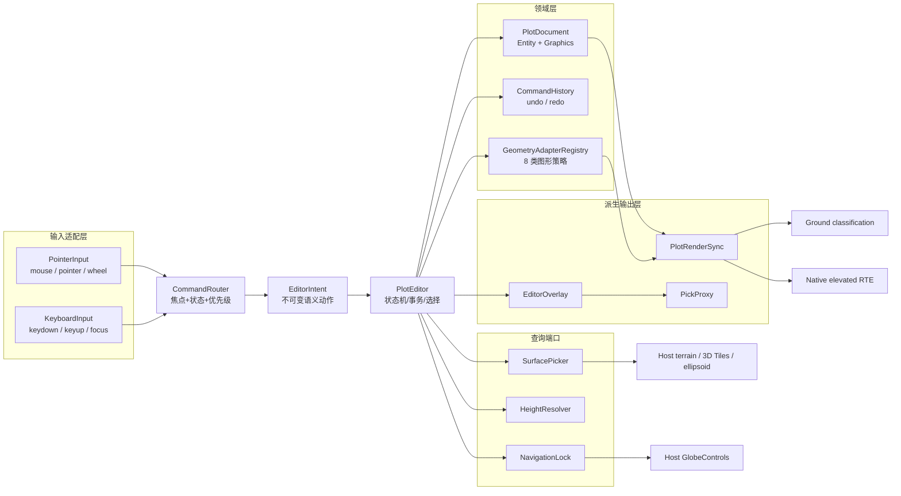
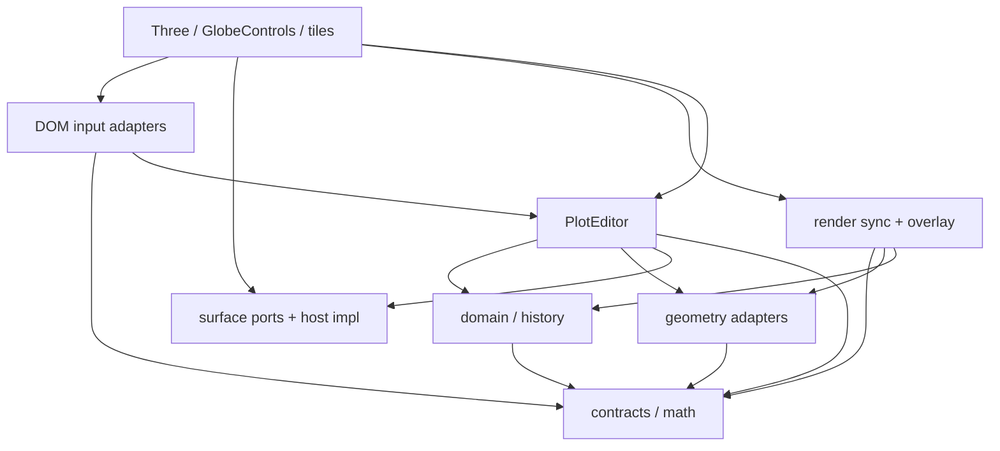
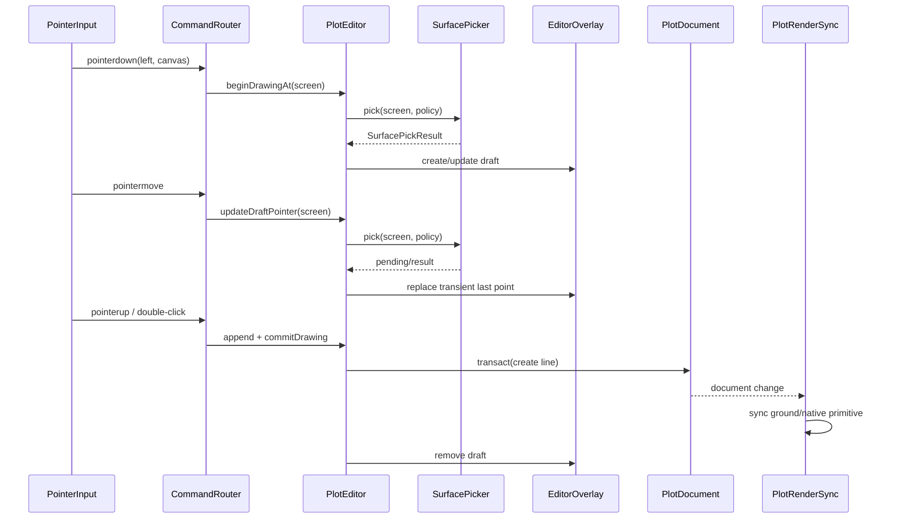
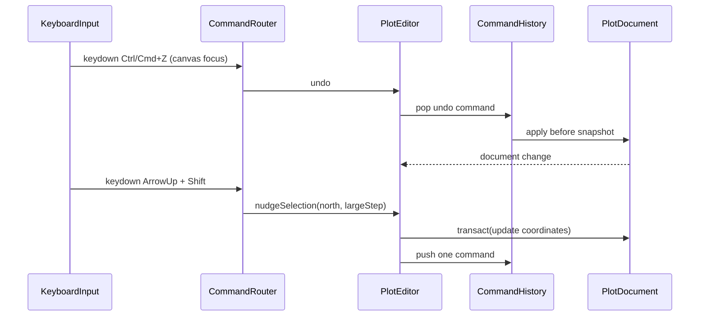

# 03 · 目标架构：输入、命令、领域与渲染分层

> 状态：**Proposed Architecture**
> 相关 Current 审计：[02](./02-current-project-audit.md)
> Cesium 依据：[01](./01-cesium-source-reference.md)
> 坐标和高度契约：[04](./04-coordinate-height-schema.md)

## 目标

目标架构必须同时满足三个事实：

1. 这是 GIS 图形编辑器，不是 glTF/GLB 或 3D Tiles 模型编辑器；
2. 桌面端鼠标和键盘是同等重要的输入源，二者都必须经过同一套命令和状态机；
3. 领域数据、表面高度、Three 渲染和宿主相机控制拥有不同生命周期，不能互相持有私有实现。

本篇锁定模块边界、依赖方向、关键接口和运行时数据流。符号和接口均为 **Proposed**，除非段落明确标为 Current。

## 架构结论

编辑器的唯一输入到领域写入链路固定为：

```text
PointerInput + KeyboardInput
        -> CommandRouter
        -> EditorIntent
        -> PlotEditor
        -> PlotDocument / CommandHistory
        -> RenderSync + EditorOverlay
```

输入层不得直接调用 `GroundDecalManager.setCoord()`；渲染层不得反向修改 `PlotDocument`；表面采样完成后只能通过带 revision 的解析结果更新派生位置。模型和 3D Tiles 只能通过宿主提供的参考/表面端口参与拾取，不得进入 `PlotDocument` 的可编辑 Graphics 联合。

## 总体数据流



## 1. 分层职责

### 1.1 L0：纯契约与地理数学

职责：

- `GeoPosition`、`HeightReference`、`GraphicsKind`、ID、版本和错误码；
- 经度规范化、连续经度展开、ENU/ECEF 转换、角度/米制单位；
- 不可变快照和结构化校验结果；
- 任何环境下都可运行的纯函数。

禁止：

- import DOM、Three、`GlobeControls`、terrain loader 或 WebGL；
- 读取 `window`、`document`、当前相机或 GPU 深度。

### 1.2 L1：领域文档与命令历史

`PlotDocument` 保存稳定顺序的 Entity 集合；每个 Entity 只有一个可编辑 Graphics payload 及元数据。它提供原子事务、批量变更事件、深快照和导入导出，但不创建 Primitive。

`CommandHistory` 保存编辑命令的 before/after 深快照，负责 undo/redo、合并连续微调和清空 redo；异步表面高度刷新不产生命令。

### 1.3 L2：几何适配器与查询端口

`GeometryAdapterRegistry` 为每种 Graphics 提供策略：

- 绘制步骤和最小输入；
- draft 预览；
- handles、midpoints、参数手柄；
- 地理命中、屏幕容差和约束；
- 验证、canonical 化、序列化；
- 到 ground/native render 的描述转换。

`SurfacePicker`、`HeightResolver`、`NavigationLock` 是端口（ports），具体 Three/Cesium/宿主实现位于适配层。这样核心编辑器可在无 GPU 的单元测试中运行。

### 1.4 L3：输入、路由与编辑状态机

`PointerInput` 把浏览器 Pointer Events 转成稳定的屏幕事件；`KeyboardInput` 独立处理 `keydown`、`keyup`、焦点和文本编辑域。`CommandRouter` 根据当前 focus domain、编辑状态、命中结果和修饰键把二者映射成 `EditorIntent`。

`PlotEditor` 消费意图，负责状态转移、选择、draft、导航租约和命令事务。它不需要知道事件来自鼠标还是键盘，除非意图本身携带输入来源以便诊断。

### 1.5 L4：渲染同步与编辑 Overlay

`PlotRenderSync` 把文档和适配器产物同步到：

- 现有贴附 classification primitives；
- 绝对/相对高度、挤出和参数化实体的 native RTE geometry；
- 独立 `EditorOverlay`（draft、选中轮廓、控制点、中点、Gizmo、pick proxy）。

Overlay 不是业务图形本身，不得被序列化；它可以有自己的 renderOrder、layer、深度策略和 GPU 资源。

### 1.6 L5：宿主适配与公共 facade

宿主负责 scene、camera、渲染循环、terrain/tiles、`GlobeControls`、viewport resize 和 request-render。公共 `PlotEditor` facade 接收这些端口和一个 `PlotDocument`，不接管宿主应用的全局生命周期。

## 2. 核心对象与 Proposed 接口

### 2.1 Canonical 文档

```ts
export type GeoPosition = [
  longitudeDegrees: number,
  latitudeDegrees: number,
  heightMeters: number,
];

export interface PlotEntity {
  readonly id: string;
  readonly order: number;
  readonly type: GraphicsKind;
  readonly graphics: CanonicalGraphics;
  readonly visible: boolean;
  readonly metadata?: Readonly<Record<string, unknown>>;
}

export interface PlotDocument {
  get(id: string): Readonly<PlotEntity> | null;
  list(): readonly Readonly<PlotEntity>[];
  transact<T>(label: string, work: (tx: PlotDocumentTransaction) => T): T;
  snapshot(): PlotDocumentSnapshot;
  subscribe(listener: (change: PlotDocumentChange) => void): () => void;
}
```

`CanonicalGraphics` 的具体字段在 [04](./04-coordinate-height-schema.md) 定义。文档必须保证 `heightReference` 显式存在，贴附坐标的 height 为零；读操作返回只读视图，写操作只通过事务。

### 2.2 输入端口

```ts
export interface PointerInput {
  attach(target: HTMLElement): void;
  detach(): void;
  subscribe(listener: (event: NormalizedPointerEvent) => void): () => void;
  capture(pointerId: number): void;
  release(pointerId: number): void;
}

export interface KeyboardInput {
  attach(target: HTMLElement, ownerDocument?: Document): void;
  detach(): void;
  subscribe(listener: (event: NormalizedKeyboardEvent) => void): () => void;
  getFocusDomain(): 'canvas' | 'text-input' | 'external' | 'none';
}

export interface NormalizedPointerEvent {
  readonly kind: 'down' | 'move' | 'up' | 'cancel' | 'wheel' | 'double-click';
  readonly pointerId: number;
  readonly pointerType: 'mouse' | 'pen' | 'touch';
  readonly button: 0 | 1 | 2 | -1;
  readonly buttons: number;
  readonly screen: { readonly x: number; readonly y: number };
  readonly modifiers: {
    readonly shift: boolean;
    readonly ctrl: boolean;
    readonly alt: boolean;
    readonly primary: boolean;
  };
}

export interface NormalizedKeyboardEvent {
  readonly phase: 'down' | 'up';
  readonly code: string;
  readonly key: string;
  readonly repeat: boolean;
  readonly modifiers: {
    readonly shift: boolean;
    readonly ctrl: boolean;
    readonly alt: boolean;
    readonly primary: boolean;
  };
  readonly focusDomain: 'canvas' | 'text-input' | 'external' | 'none';
}
```

Pointer and keyboard implementations are independent, but both publish immutable normalized facts. Detailed browser behavior and keymap见 [05](./05-pointer-input-and-camera.md) 与 [06](./06-keyboard-command-keymap.md)。

### 2.3 CommandRouter 与 EditorIntent

```ts
export type EditorIntent =
  | { type: 'selectAt'; screen: ScreenPoint; additive: boolean }
  | { type: 'beginDrawingAt'; screen: ScreenPoint }
  | { type: 'appendDraftPoint'; screen: ScreenPoint }
  | { type: 'updateDraftPointer'; screen: ScreenPoint }
  | { type: 'beginHandleDrag'; handleId: string; screen: ScreenPoint }
  | { type: 'updateHandleDrag'; screen: ScreenPoint }
  | { type: 'finishPointerTransaction' }
  | { type: 'cancelCurrentOperation'; reason: CancelReason }
  | { type: 'commitDrawing' }
  | { type: 'deleteSelection' }
  | { type: 'nudgeSelection'; axis: 'east' | 'north' | 'up'; amountMeters: number }
  | { type: 'rotateSelection'; angleDegrees: number }
  | { type: 'undo' }
  | { type: 'redo' };

export interface CommandRouter {
  route(event: NormalizedPointerEvent | NormalizedKeyboardEvent): EditorIntent[];
  setContext(context: RouterContext): void;
}
```

路由器只做优先级和参数转换，不直接写文档。`EditorIntent` 必须是可记录、可测试的值对象，便于在不启动浏览器的测试中重放输入序列。

### 2.4 PlotEditor facade

```ts
export interface PlotEditor {
  readonly document: PlotDocument;
  readonly selection: SelectionModel;
  setTool(tool: DrawingTool | null): void;
  dispatch(intent: EditorIntent): void;
  update(frame: EditorFrameState): void;
  cancel(): void;
  commit(): void;
  undo(): void;
  redo(): void;
  dispose(): void;
}
```

`dispatch()` 是唯一允许从输入层进入编辑器的写入口；`update()` 只刷新表面解析、overlay 和渲染同步，不自动创建历史命令。

## 3. 领域、交互和渲染模块关系

### 3.1 推荐模块树

```text
src/lib/plot/editor/
├── contracts/
│   ├── coordinates.ts       # GeoPosition、HeightReference、全球数学契约
│   ├── graphics.ts          # GraphicsKind、CanonicalGraphics、错误码
│   ├── intents.ts            # Normalized events、EditorIntent、取消原因
│   └── snapshots.ts          # 版本化文档和 deep snapshot
├── domain/
│   ├── PlotDocument.ts       # Entity 集合、事务、变更事件
│   ├── selection.ts          # 选择集合、顺序和组 pivot
│   └── CommandHistory.ts     # undo/redo、合并和历史容量
├── input/
│   ├── PointerInput.ts       # DOM Pointer Events、capture、阈值
│   ├── KeyboardInput.ts      # keydown/up、焦点和平台修饰键
│   ├── CommandRouter.ts      # 输入优先级和 keymap 路由
│   └── NavigationLock.ts     # 宿主 controls 租约
├── adapters/
│   ├── GeometryAdapter.ts    # 统一适配器接口
│   ├── GeometryAdapterRegistry.ts
│   └── builtins/             # 8 类图形策略
├── surface/
│   ├── SurfacePicker.ts      # terrain/tiles/ellipsoid 命中
│   └── HeightResolver.ts     # HeightReference 解析与缓存
├── overlay/
│   ├── EditorOverlay.ts      # draft、handles、gizmo
│   └── PickProxy.ts          # entityId/handleId 命中代理
├── render/
│   ├── PlotRenderSync.ts     # document -> primitive 生命周期
│   ├── GroundAdapter.ts      # 兼容 GroundDecalManager/分类路径
│   └── NativeGeometryAdapter.ts # elevated ENU/RTE 路径
└── PlotEditor.ts             # facade、状态机和生命周期编排
```

目录是实现建议，不代表当前仓库已经存在这些文件。阶段拆分见 [14](./14-implementation-roadmap.md)。

### 3.2 依赖方向



允许的依赖方向：

- contracts 不依赖任何运行时；
- domain 只依赖 contracts；
- adapters 依赖 contracts 和纯地理数学；
- input 依赖 contracts，并通过 `EditorIntent` 与 editor 通信；
- editor 依赖 domain、adapters 和抽象 surface/navigation ports；
- render/host adapter 可以依赖 Three、ground 和 tiles renderer；
- host 组合所有实现，但不把宿主私有对象泄漏给 domain。

禁止的反向依赖：

- `PlotDocument` import `three` 或读 `scene`；
- `KeyboardInput` 直接调用 `GroundDecalManager`；
- `CesiumGround*Primitive` 回写 `PlotDocument`；
- `SurfacePicker` 修改作者 height 或历史；
- `ModelGraphics`/GLB loader 作为 `GeometryAdapter` 注册到 GIS 编辑器。

## 4. 运行时序列

### 4.1 鼠标绘制一条线



双击只是一个输入事实；最终是否完成由当前 adapter 的绘制契约决定，见 [09](./09-shape-drawing-contracts.md)。

### 4.2 键盘撤销和微调



键盘命令不经过相机控制器；当焦点在 textarea/contenteditable 中时，路由器返回空意图或只处理明确允许的全局命令。详见 [06](./06-keyboard-command-keymap.md)。

### 4.3 拖动手柄与导航锁

1. pointerdown 命中 `handleId`，editor 保存选中实体和 before snapshot；
2. editor 调用 `NavigationLock.acquire()`，保存 controls 当前 enabled 状态；
3. pointermove 只更新 overlay/draft 和渲染预览，不推入 history；
4. pointerup 通过 adapter 校验，成功则提交一条 command，失败则恢复 before；
5. 无论成功、取消、异常、`pointercancel`、window blur 或 dispose，都释放 capture 和 navigation lock。

## 5. `GeometryAdapter` 策略接口

```ts
export interface GeometryAdapter<TGraphics = CanonicalGraphics> {
  readonly kind: GraphicsKind;
  createDraft(input: DrawStartContext): DraftState;
  reduceDraft(draft: DraftState, intent: DraftIntent): DraftState;
  listHandles(entity: Readonly<PlotEntity>): readonly EditHandle[];
  hitTest(entity: Readonly<PlotEntity>, query: GeoHitTestQuery): HitResult | null;
  applyHandle(
    entity: Readonly<PlotEntity>,
    handle: EditHandle,
    movement: HandleMovement,
  ): GeometryPatch;
  validate(graphics: TGraphics): ValidationResult;
  canonicalize(graphics: TGraphics): TGraphics;
  toRenderDescription(graphics: TGraphics, context: RenderContext): RenderDescription;
  toJSON(graphics: TGraphics): unknown;
}
```

适配器的职责是类型化图形规则，不是创建 DOM 或直接管理 GPU。箭头 adapter 的 `toRenderDescription` 可以生成派生轮廓，但 `toJSON` 只能写原始控制点；polygon adapter 必须在 `validate` 中检查重复点、自交、孔洞关系和全球环绕。每类控制点和绘制动作见 [09](./09-shape-drawing-contracts.md) 与 [10](./10-shape-editing-handles.md)。

## 6. 渲染分层和兼容 facade

### 6.1 文档到渲染

```text
PlotDocument change
  -> PlotRenderSync diff
     -> GroundAdapter (heightReference=CLAMP_* 且 footprint 可分类)
     -> NativeGeometryAdapter (NONE/RELATIVE/extrusion/wall/volume)
  -> EditorOverlay (always transient, pickable)
```

`GroundAdapter` 可以暂时调用现有 `GroundDecalManager`/`PlotPrimitiveBridge`，但只能把 canonical 三元数据转换为旧 facade 所需的兼容 options；贴地时显式丢弃运行时表面高度而保留作者 `0`。`NativeGeometryAdapter` 使用 ENU 局部坐标和高低位 RTE，不能把 elevated 对象偷偷送入旧 classification。

### 6.2 兼容层边界

```ts
export interface LegacyPlotFacade {
  addPlot(options: LegacyPlotAddOptions): string;
  setCoords(id: string, points: readonly [number, number][]): void;
  setStyle(id: string, patch: Record<string, unknown>): void;
}

export interface CanonicalPlotSink {
  create(entity: PlotEntity): void;
  patch(id: string, patch: GraphicsPatch): void;
  remove(id: string): void;
}
```

`LegacyPlotFacade` 只在边界做 `[lon,lat] -> [lon,lat,0]` 和旧字段迁移。核心的 `CanonicalPlotSink` 不接收二元点。现有 manager 的静默不存在 ID 行为可以保留在兼容 facade，但新 API 应返回结构化 `NOT_FOUND` 或事务错误，详见 [13](./13-public-api-history-persistence.md)。

## 7. 帧调度与更新粒度

宿主仍拥有唯一 RAF。建议 editor 暴露两个更新入口：

```ts
editor.dispatch(intent); // 事件/命令，可能产生文档事务
editor.update({
  frameNumber,
  camera,
  viewport,
  terrainRevision,
  tilesRevision,
}); // 每帧派生更新，不自动产生历史
```

更新粒度分为：

| 变化 | 领域 | overlay | GPU 图元 |
| --- | --- | --- | --- |
| draft 鼠标移动 | 不写或只写 transient | 每帧更新 | 可选轻量预览；不生成历史 |
| 控制点拖动 | pointerup 时一次事务 | 每帧更新 | 允许 adapter 选择原位 geometry 或重建 |
| 样式 | 一次事务 | 选中态可能更新 | 按 primitive 能力热更新，否则重建 |
| terrain revision | 不写作者数据 | 重新定位手柄 | 重新解析/更新派生位置，不进 history |
| selection/hover | 不写文档 | 更新 overlay/pick proxy | 不应重建业务 geometry |
| undo/redo | apply snapshot | 重新生成 handles | 由 render sync diff |

这一区分防止把每个 pointermove 当成 `GroundDecalManager._markDirty()` 的独立业务操作，也防止异步地形采样污染撤销栈。

## 8. 扩展与模型隔离

### 8.1 GIS Graphics 注册

适配器 registry 只接受 `GraphicsKind` 和 `GeometryAdapter`。首期注册八类；未来静态 Cesium Graphics 可逐项注册。每个 adapter 必须声明 `editable: true` 和能力集合（vertex、radius、rotation、height、holes 等）。

### 8.2 参考对象端口

模型和 tileset 通过另一个只读端口暴露：

```ts
export interface ReferenceLayer {
  readonly id: string;
  readonly kind: 'model' | '3d-tiles' | 'terrain';
  pick(screen: ScreenPoint): ReferenceHit | null;
  getSurface?(screen: ScreenPoint): SurfacePickResult | null;
}
```

该端口的结果可供 `SurfacePicker` 或信息面板使用，但不能被 `GeometryAdapterRegistry.register()` 接受为可编辑 Graphics。这样既支持“在模型表面画 polygon”，又不会出现“编辑模型”的概念混淆。

## 9. 不变量

1. `PointerInput + KeyboardInput -> CommandRouter -> EditorIntent -> PlotEditor` 是唯一输入写链路。
2. `PlotDocument` 是作者数据唯一真相；渲染 Primitive、overlay、pick proxy、surface cache 和派生箭头轮廓都不是数据源。
3. 核心领域层不依赖 DOM、Three、Cesium、GlobeControls、TilesRenderer 或 WebGL。
4. 所有 canonical positions 是 `[lon, lat, height]`；兼容二元输入只在 legacy normalizer 出现。
5. 贴附作者高度固定为 0；relative/absolute 高度切换必须显式命令并记录事务。
6. 模型和 3D Tiles 是 reference/surface layer，不是 `PlotEntity` 的可编辑 `GraphicsKind`。
7. 一次 pointer drag、一次键盘连续微调或一次多选变换在 history 中都是可解释的命令粒度。
8. 表面异步结果必须携带实体/请求 revision；过期结果不可覆盖新文档。
9. navigation lock、pointer capture、事件订阅、overlay GPU 资源和异步任务都必须幂等释放。
10. 扩展新图形只能添加 adapter 和 render adapter，不得把类别分支重新散落到输入、history 或 facade。

## 失败路径

- **缺少必需 port：** 构造 `PlotEditor` 时缺 camera、surface picker 或 requestRender，应立即抛 `MISSING_HOST_PORT`，而不是延迟到第一次 pointermove 才崩溃。
- **路由无上下文：** `CommandRouter` 收到键盘事件但 focus domain 为 text-input 时返回空意图；不得删除图形或提交草稿。
- **适配器未注册：** 文档可读取但无法渲染时报告 `UNSUPPORTED_GRAPHICS_KIND`，保留领域实体和错误上下文。
- **surface pending：** editor 保留 draft/选中状态并显示 pending；不把特定 3D Tiles 参考静默降级为 terrain。
- **渲染重建失败：** 保留 before/after 文档快照和错误状态，清理候选 GPU 资源；不得用空图元覆盖文档。
- **导航锁重复/乱序释放：** 使用 token/引用计数；只有持有者释放自己的租约，避免一个工具恢复另一个工具仍需要的禁用状态。
- **跨日界线移动失败：** adapter 在局部 ENU/连续经度空间计算，禁止直接用 `dLon = newLon - oldLon` 作为世界平移。
- **dispose 中仍有事件：** 所有 listener 在 dispose 后 no-op；异步回调通过 disposed/revision 检查丢弃。

## 验收项

- [ ] 文档中明确出现并实现链路 `PointerInput + KeyboardInput -> CommandRouter -> EditorIntent -> PlotEditor`。
- [ ] 能画出依赖图并证明 contracts/domain 不依赖浏览器或 Three，host 依赖方向不反向污染核心。
- [ ] `PlotDocument`、`GeometryAdapterRegistry`、`SurfacePicker`、`HeightResolver`、`NavigationLock`、`PlotRenderSync` 均有单一职责和 Proposed 接口。
- [ ] 运行时序列覆盖鼠标绘制、键盘 undo/nudge、手柄拖动和导航锁恢复。
- [ ] Ground classification 与 native elevated RTE 的分流条件明确，贴附作者高度 0 与运行时表面高度分离。
- [ ] 兼容 facade 能描述当前 `GroundDecalManager`，但不能让它成为新核心写入口。
- [ ] 模型/tileset 只能进入 ReferenceLayer/SurfacePicker，注册可编辑 adapter 会失败。
- [ ] 新增图形只需注册 adapter，不需要修改输入路由和 history 核心。
- [ ] 失败路径覆盖 pending、pointercancel、失焦、过期采样、渲染异常和 dispose。
- [ ] 实现路线可链接到 [14](./14-implementation-roadmap.md)，测试矩阵可链接到 [15](./15-test-and-acceptance.md)。
