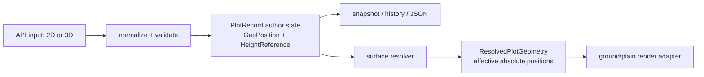

# 04. 坐标、高度与持久化模式

## 目标

本文定义 GIS 图形编辑框架唯一允许进入规范状态（canonical state）的坐标格式、高度语义、身份与顺序字段，以及旧二维坐标的迁移边界。绘制、编辑、拾取、历史和序列化都必须依赖本文，不得各自解释高度。

相关章节：

- [08. 拾取、表面选择与高度解析](./08-picking-surface-height.md)
- [09. 八类图形绘制契约](./09-shape-drawing-contracts.md)
- [10. 图形编辑控制点与拓扑](./10-shape-editing-handles.md)

## Current：当前实现证据

当前 plot 数据层仍以二维足迹为唯一坐标：

- `../../src/lib/plot/plugins/types.ts` 定义 `LonLatPoint = [number, number]`，`GisPlotBaseOptions.points`、八类 options 和箭头 `generatedCoords` 都使用该类型。
- `../../src/lib/plot/plugins/base.ts` 构造、深快照和中心/范围查询只复制 `[p[0], p[1]]`；第三维即使由调用方传入也会被丢弃。
- `../../src/lib/plot/GroundDecalManager.ts` 的 `setCenter`、`setCoords`、`setCoord`、`insertCoord`、`translateCoords` 都只读写经纬度。
- `../../src/lib/plot/PlotPrimitiveBridge.ts` 用 `clampToGround` 决定 ground/plain 两条路径，并用全图形共享的 `heightMeters` 表达非贴地高度。
- 当前 `GisPlotSnapshot` 只有 `{ type, options }`，不含 `id` 和显示顺序；`id` 由模块级自增计数器生成，显示顺序来自 `Map` 插入顺序。
- 当前没有正式 plot 文档格式、schema version、反序列化迁移器或历史事务快照格式。

这些行为无法表达逐点绝对高度、逐点相对高度，也无法在删除恢复、撤销重做和跨进程保存时稳定保留身份与层序。

## Proposed：规范坐标与公共类型

### 唯一规范坐标

```ts
/** 经度为度，纬度为度，高度为米。三个分量始终必填。 */
export type GeoPosition = [
  longitudeDegrees: number,
  latitudeDegrees: number,
  heightMeters: number,
];

/** 仅用于旧调用输入；不得出现在 store、snapshot、history 或 JSON 输出中。 */
export type LegacyLonLatPoint = [
  longitudeDegrees: number,
  latitudeDegrees: number,
];

export type GeoPositionInput = GeoPosition | LegacyLonLatPoint;
```

规范状态中的 `points`、运行时快照中的 `points`、箭头派生的 `generatedCoords` 全部是 `GeoPosition[]`。不得用可选第三维、`number[]` 或另一个图形级 `heightMeters` 代替。

旧 `[lon, lat]` 输入只在 API 边界被接受，并在进入任何 store、图形类或事务之前立即转换为 `[lon, lat, 0]`。后续代码只能看见三元组。

### Cesium 对齐的 HeightReference

本项目不依赖 Cesium 运行时，但值和含义与 Cesium `Scene/HeightReference.js` 精确对齐：

```ts
export const HeightReference = Object.freeze({
  NONE: 0,
  CLAMP_TO_GROUND: 1,
  RELATIVE_TO_GROUND: 2,
  CLAMP_TO_TERRAIN: 3,
  RELATIVE_TO_TERRAIN: 4,
  CLAMP_TO_3D_TILE: 5,
  RELATIVE_TO_3D_TILE: 6,
} as const);

export type HeightReference =
  typeof HeightReference[keyof typeof HeightReference];

export type HeightReferenceName = keyof typeof HeightReference;
export type HeightMode = 'absolute' | 'clamp' | 'relative';
export type HeightSurface = 'ellipsoid' | 'ground' | 'terrain' | '3d-tile';
```

| 值 | 模式 | 目标表面 | `GeoPosition[2]` 的 author 含义 |
| --- | --- | --- | --- |
| `NONE` | absolute | WGS84 椭球参考 | 相对 WGS84 椭球面的绝对高度，米 |
| `CLAMP_TO_GROUND` | clamp | terrain 与 3D Tiles 的可用上表面 | 必须为 `0` |
| `RELATIVE_TO_GROUND` | relative | terrain 与 3D Tiles 的可用上表面 | 相对表面的偏移，米，可正可负 |
| `CLAMP_TO_TERRAIN` | clamp | terrain | 必须为 `0` |
| `RELATIVE_TO_TERRAIN` | relative | terrain | 相对 terrain 的偏移，米 |
| `CLAMP_TO_3D_TILE` | clamp | 3D Tiles | 必须为 `0` |
| `RELATIVE_TO_3D_TILE` | relative | 3D Tiles | 相对 3D Tiles 表面的偏移，米 |

`GROUND` 表示 terrain 与 3D Tiles 的组合表面；它不表示模型编辑。`3D_TILE` 也只表示图形贴附或相对高度的采样目标，任何模型节点、矩阵、缩放、旋转或材质编辑都不属于本框架。

公共辅助函数必须集中实现，禁止在 bridge、draw tool 和 edit tool 中复制 switch：

```ts
export function isHeightReferenceClamp(value: HeightReference): boolean;
export function isHeightReferenceRelative(value: HeightReference): boolean;
export function getHeightMode(value: HeightReference): HeightMode;
export function getHeightSurface(value: HeightReference): HeightSurface;
export function getClassificationType(
  value: HeightReference,
): ClassificationType | undefined;
```

映射规则为：

- `*_GROUND` -> `ClassificationType.BOTH`
- `*_TERRAIN` -> `ClassificationType.TERRAIN`
- `*_3D_TILE` -> `ClassificationType.CESIUM_3D_TILE`
- `NONE` -> `undefined`

其中 `ClassificationType` 只是当前 ground renderer 的内部适配字段，不再是 plot 规范状态中的 authoring 字段。

### 图形规范状态

```ts
export type PlotId = string;

export interface PlotIdentity {
  id: PlotId;
  /** 非负安全整数；值越小越先绘制。 */
  order: number;
}

export interface GisPlotBaseOptions {
  points: GeoPosition[];
  heightReference: HeightReference;
  strokeColor: string;
  strokeWidth: number;
  strokeOpacity: number;
  fillColor: string;
  fillOpacity: number;
  visible: boolean;
}

export interface GisPlotSnapshot<TOptions extends GisPlotBaseOptions> {
  id: PlotId;
  order: number;
  type: GisPlotCategory;
  options: TOptions;
}
```

八类图形仍使用 `points` 作为 author 控制点；类别特有字段见 [09. 八类图形绘制契约](./09-shape-drawing-contracts.md)。`id` 和 `order` 是图形记录元数据，不放进 style/options。

### author 状态与 resolved 状态分离

持久数据只描述用户输入。terrain/3D Tiles 的实际高度属于随瓦片、相机和场景变化的运行时结果。



建议的内部结果类型：

```ts
interface ResolvedPlotGeometry {
  plotId: PlotId;
  sourceRevision: number;
  /** 最终用于普通 Three 几何的 WGS84 绝对高度。 */
  effectivePoints: GeoPosition[];
  status: 'ready' | 'pending' | 'unavailable';
}
```

关键边界：

- `CLAMP_*`：author height 始终是 `0`；bridge 使用 depth/classification 贴附，不把 surface height 写回 `points`。
- `RELATIVE_*`：author height 始终是 offset；resolver 计算 `surfaceHeight + offset` 到 `effectivePoints`，但不修改原记录。
- `NONE`：author height 就是有效绝对高度，不需要 surface resolver。
- terrain LOD 或 3D Tiles 加载变化只使 resolved cache 失效，不产生 history entry，也不改变文档 dirty 状态。

## 输入归一化与验证算法

### 单点归一化

```ts
function normalizeGeoPosition(
  input: GeoPositionInput,
  heightReference: HeightReference,
): GeoPosition {
  assertFinite(input[0], input[1]);
  const longitude = wrapLongitudeDegrees(input[0]);
  const latitude = validateLatitudeDegrees(input[1]);
  const suppliedHeight = input.length === 3 ? input[2] : 0;
  assertFinite(suppliedHeight);

  return isHeightReferenceClamp(heightReference)
    ? [longitude, latitude, 0]
    : [longitude, latitude, suppliedHeight];
}
```

规则：

1. 二维输入先补 `0`，随后才执行 `HeightReference` 规则。
2. `CLAMP_*` 即使收到非零三维输入也规范为 `0`；开发模式应发出一次诊断 warning，严格文档解析应报错，避免悄悄保存无效高度。
3. `RELATIVE_*` 的第三维不准替换为采样后的绝对高度。
4. `NONE` 的第三维不准根据当前地形自动改写。
5. 所有输入分量必须是 finite number；不得把 `NaN`、`Infinity`、数字字符串或 `null` 修成 `0`。

### 切换 HeightReference

`setHeightReference(id, next)` 是一个原子事务：

- 切到 `CLAMP_*`：所有 author height 归零。
- 从 `CLAMP_*` 切到 `NONE`：高度保持为 `0`，即 WGS84 椭球面高度；如需保留当前视觉高度，调用方必须先通过显式“烘焙 resolved 高度”命令转换，不能隐式采样。
- 从 `CLAMP_*` 切到 `RELATIVE_*`：offset 为 `0`。
- `NONE` 与 `RELATIVE_*` 互切默认只重解释现有第三维，不做 surface 查询；UI 若需要视觉位置不变，应调用带 resolver 的显式转换命令。
- undo 必须恢复切换前的完整三元组和旧 `heightReference`。

### 旧字段兼容

旧调用可在一个兼容周期内传入 `clampToGround`、`heightMeters` 和 `classificationType`，但这些字段只能存在于 `LegacyPlotAddOptions`：

- 新 `heightReference` 存在时以它为准；严格 parser 对同时存在且语义冲突的字段报错。
- `clampToGround !== false` 按 `classificationType` 映射为三个 `CLAMP_*` 值；二维 points 规范为高度 `0`。
- `clampToGround === false` 映射为 `NONE`。二维 points 仍先规范为高度 `0`；若旧对象显式提供有限的 `heightMeters`，兼容适配器可作为独立迁移步骤把所有点的第三维设为该值，并发出 deprecated 诊断。新 API 不再接受图形级高度。
- canonical snapshot 和 JSON 永远不输出上述三个旧字段。

旧 mutation overload 的补高规则固定如下：

- `setCoords(id, LegacyLonLatPoint[])` 与 `insertCoord(id, ..., LegacyLonLatPoint)` 先补 `0`。
- 若目标是 `CLAMP_*`，最终仍为 `0`。
- 若目标是 `NONE` 或 `RELATIVE_*`，旧二维调用也保持 `0`，不猜测首点高度；需要非零高度必须调用三维 overload。

## 经度环绕、日期变更线与极区

### 持久经度

文档中的经度统一规范为半开区间 `[-180, 180)`：

```ts
function wrapLongitudeDegrees(lon: number): number {
  return ((lon + 180) % 360 + 360) % 360 - 180;
}
```

`180` 因此写成 `-180`。这只用于持久边界，不得直接用于线段插值、中心求平均或面积计算。

### 连续运算经度

跨日期变更线的图形先建立连续经度序列：对每个后继点选择 `lon + 360*k`，使它与前一个展开经度的差值绝对值最小；相等时选择较小的 `k`。拖拽期间保留相对 pointer-down 的展开经度，commit 时才 rewrap。

闭环判等使用 wrapped angular distance 或 ECEF 距离，不用 `first.lon === last.lon`。例如 `179.9` 与 `-180.1` 应视为同一经度。

### 纬度与极区

- canonical 纬度只接受 `[-90, 90]`；数值输入越界时失败，不静默 clamp。
- 屏幕拾取和 ECEF 反算天然返回合法纬度。
- 精确极点的经度在几何上不唯一，但为保证快照可逆仍保留规范化经度。
- 中心、半径、旋转、平移和面积计算使用 WGS84 ECEF、测地线或局部 ENU；禁止使用 `dLon = meters / cos(latitude)` 作为编辑算法，因为它在极区发散。
- 构造 ENU 时若常规 east 轴退化，使用确定性的参考轴 fallback，且同一 anchor 必须得到相同结果。

## 快照、身份、顺序与文档版本

### 快照

`getItem` 返回深快照；`getItemDeep` 保留为 deprecated alias。任何 snapshot 修改都不能改变 store。除 `points` 外，文本 `padding` 等嵌套 tuple 也必须复制。

箭头运行时快照可额外包含 `generatedCoords: GeoPosition[]`，但它是可重算派生值，不属于序列化 source of truth。其高度派生规则见 [09](./09-shape-drawing-contracts.md#箭头-arrow)。

### id 与 order

- `id` 在创建时分配，保存、加载、删除撤销和重做期间保持不变。
- 恢复 snapshot 时允许内部传入原 `id`；冲突必须失败，不得静默改 id。
- `order` 是非负安全整数。manager 的 `movePlot(id, toIndex)` 负责重排并生成确定性连续 order。
- bridge 按 `(order, id)` 排序，不能再依赖 `Map` 插入顺序。
- 几何或样式编辑不改变 `id` 或 `order`。

### JSON 文档

```ts
interface PlotDocumentV1 {
  schema: 'cesium-to-three/plot';
  version: 1;
  items: SerializedPlotItemV1[];
}
```

约束：

- 第一版正式格式即 `version: 1`；此前 `{type, options}` 或数组形式视为 unversioned legacy input。
- JSON 中 `heightReference` 建议写稳定字符串名，如 `"CLAMP_TO_GROUND"`；parser 可接受数值 `0..6`，serializer 只输出字符串名。
- items 按 `order` 升序输出，`id` 唯一，`order` 唯一且合法。
- 所有坐标输出三元组；所有 `CLAMP_*` 高度为 `0`。
- 不输出 resolved surface height、GPU/depth 信息、选中状态、控制点、draft、history stack 或箭头 `generatedCoords`。
- 加载 unversioned legacy 数组时，以数组位置生成 order；缺失 id 时由导入器生成并在 import result 中返回映射与 warning。
- 正式 v1 文档遇到二维点、未知 HeightReference、重复 id/order 或非法数字时应拒绝，不走宽松 legacy 修复。

## 历史事务中的坐标

history entry 保存 deep canonical before/after：

```ts
interface PlotHistoryDelta {
  id: PlotId;
  before: GisPlotSnapshot<any> | null;
  after: GisPlotSnapshot<any> | null;
}

interface PlotHistoryEntry {
  label: string;
  deltas: PlotHistoryDelta[];
}
```

一次拖拽中的多帧预览合并为一个 entry。terrain/tiles 重新采样不入历史。撤销创建、删除或重排必须恢复原 `id`、`order`、`heightReference` 和每个第三维。

## 不变量

1. store、snapshot、history 和 JSON 中不存在二维坐标。
2. store 中每个位置恰好三个 finite number。
3. `CLAMP_*` 的所有 author height 恒等于 `0`。
4. surface height 永远不写回 author points。
5. `RELATIVE_*` 的第三维永远是 offset，不是 resolved absolute height。
6. `NONE` 的第三维永远是 WGS84 椭球绝对高度。
7. `heightReference` 在规范状态中显式存在，不依赖缺省或 `clampToGround` 推断。
8. `id` 唯一稳定，`order` 显式确定；渲染顺序不依赖集合插入副作用。
9. 日期变更线计算先 unwrap，持久化再 wrap；极区计算不使用经纬度平面近似。
10. 任何规范化、转换或事务失败都不得留下半更新状态。

## 失败路径

- 输入少于两个或多于三个分量：拒绝；只有明确的 legacy tuple 类型允许两个分量。
- 任一分量非 finite：拒绝并指出 item id、point index 和字段。
- 纬度越界：拒绝，不自动 clamp。
- 未知 `heightReference`：拒绝，不回退 `CLAMP_TO_GROUND`。
- 严格 v1 文档中的 clamp 点高度非零：拒绝；API 实时输入可归零并给诊断。
- id/order 冲突：整个 load/transaction rollback。
- 相对高度暂时无法解析：author record 仍合法，resolved 状态为 `pending` 或 `unavailable`，不得改写为高度 `0`。
- 异步解析返回旧 revision：丢弃结果，不触发文档 dirty 或 history。

## 验收项

- [ ] 七个 `HeightReference` 的数值、模式、目标和 helper 映射与 Cesium 对齐。
- [ ] 八类图形通过 add、update、snapshot 后所有坐标都是三元组。
- [ ] 所有二维兼容输入在离开 API 边界前变为第三维 `0`。
- [ ] 任意 clamp 创建、编辑、导入和 undo/redo 后 height 均为 `0`。
- [ ] relative 的 surface 采样变化不会修改 snapshot、JSON 或 history 长度。
- [ ] absolute 图形可保留逐点不同高度。
- [ ] `getItem` 返回值被修改后 store 不变。
- [ ] 文档 v1 round-trip 保留 id、order、type、heightReference 和每个坐标分量。
- [ ] legacy 无版本数据能迁移并报告 warning；非法正式 v1 数据原子失败。
- [ ] 跨 `179.x/-179.x` 的线和面走短路径，持久经度仍在 `[-180, 180)`。
- [ ] 纬度接近或等于 `±90` 时中心、半径、旋转和平移不出现 NaN/Infinity。
