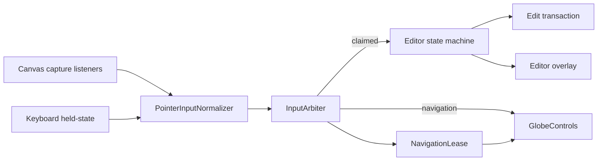
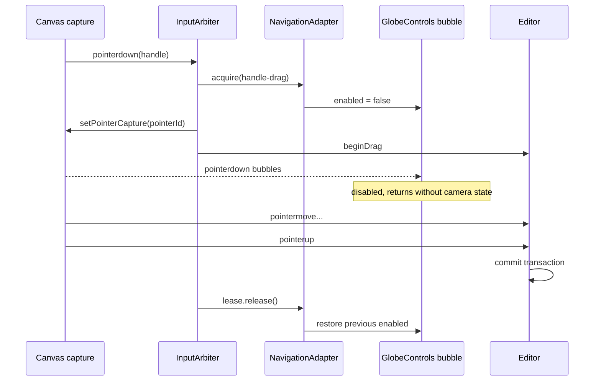

# 05. 指针输入与相机仲裁

本文定义 GIS 编辑器的指针输入协议，以及编辑操作与 `GlobeControls` 相机导航之间的唯一仲裁边界。这里的“指针”以鼠标为首要设备，同时使用 Pointer Events 兼容笔和触摸；键盘修饰键和完整快捷键分别由本文与 [06-keyboard-command-keymap.md](./06-keyboard-command-keymap.md) 共同定义。

本文不定义几何生成算法、命中算法内部实现或高度采样细节。状态转换见 [07-editor-state-machine.md](./07-editor-state-machine.md)，选择、框选和 Gizmo 行为见 [11-selection-transform-gizmo.md](./11-selection-transform-gizmo.md)。

## 1. Current 证据与问题

### 1.1 当前项目

当前交互只够支撑 Demo 采点，不能作为公共编辑框架：

| 证据 | Current 行为 | 缺口 |
| --- | --- | --- |
| `src/demo/draw-tool.ts:293-297` | 用 `pointerdown`/`pointerup` 距离和 6 px 阈值判断单击 | 没有拖拽 session、hover、pointer capture 和设备归一化 |
| `src/demo/draw-tool.ts:352-390` | 仅监听画布 `pointerdown`、`pointerup` | 离开画布、`pointercancel`、`lostpointercapture` 后可能残留状态 |
| `src/demo/draw-tool.ts:397-421` | 撤点、清空和完成只绑定面板按钮 | 鼠标与键盘不是同一个命令体系 |
| `src/demo/plot-demo.ts:526-533` | `GlobeControls` 先于绘制工具创建并直接绑定同一画布 | 后注册的 bubble listener 无法可靠阻止相机先响应 |
| `src/demo/plot-demo.ts:1759-1808` | 绘制工具与 `GroundDecalManager` 直接相连 | 没有输入仲裁、事务、选择或统一状态机 |

项目实际使用的 `EnvironmentControls` 位于 `node_modules/um-3d-tiles-renderer/src/three/renderer/controls/EnvironmentControls.js`：

- `:224-320`：画布 `pointerdown` 会立即建立相机 DRAG/ROTATE 状态；左拖平移，右拖或 Shift+左拖旋转。
- `:322-448`：`pointermove` 和 `pointerup` 在画布 root 上监听，而不是只在 canvas 上监听。
- `:507-527`：画布监听 `contextmenu`、`pointerdown`、`wheel`，root 监听 `pointermove`、`pointerup`、`pointerleave`。
- `:63-75`、`:612-625`：设置 `enabled=false` 会重置 controls 状态、pointer tracker 和惯性。

这意味着编辑器不能仅在 canvas bubble 阶段调用 `stopPropagation()`。仲裁必须发生在 capture 阶段，并在 `GlobeControls` 的 pointerdown listener 执行前完成暂停。

### 1.2 Cesium 源码可借鉴边界

Cesium `packages/engine/Source/Core/ScreenSpaceEventHandler.js` 提供了有价值的低层规则：

- `:25-53`：指针事件类型与 Shift/Ctrl/Alt 组合共同构成 action key。
- `:61-177`：以 `passive:false` 注册 pointer、mouse、touch、double-click 和 wheel。
- `:201-207`、`:289-301`：按屏幕像素容差区分 click 与 drag。
- `:837-898`：Pointer Events 路径使用 `setPointerCapture()`，并处理 `pointercancel`。
- `:374-389`：一帧内 motion 保留 start/end，只有被消费的手势才阻止默认行为。

Cesium `ScreenSpaceEventHandler` 本身不监听 `keydown`/`keyup`。`KeyboardEventModifier` 只是指针事件发生时的修饰键，不是完整键盘框架。完整键盘命令必须由本项目单独设计，不能声称直接复刻 Cesium。

## 2. Proposed 输入分层



输入层只做四件事：

1. 把 DOM Pointer Events 归一化为稳定数据结构。
2. 在 pointerdown 时决定本次指针 session 归编辑器还是相机。
3. 对归编辑器的 session 获取 pointer capture 和 navigation lease。
4. 把事件送进状态机；输入层不直接修改图形数据。

## 3. 公共类型

```ts
export type PointerDevice = 'mouse' | 'pen' | 'touch';
export type PointerButton = 'primary' | 'auxiliary' | 'secondary' | 'eraser';
export type PointerPhase =
  | 'down'
  | 'move'
  | 'up'
  | 'cancel'
  | 'lost-capture';

export interface ModifierState {
  readonly shift: boolean;
  readonly ctrl: boolean;
  readonly alt: boolean;
  readonly meta: boolean;
  /** Windows/Linux 为 Ctrl，macOS 为 Meta。 */
  readonly primary: boolean;
  /** AltGraph 不能被误判成 Ctrl+Alt 快捷键。 */
  readonly altGraph: boolean;
  readonly space: boolean;
}

export interface NormalizedPointerInput {
  readonly phase: PointerPhase;
  readonly pointerId: number;
  readonly device: PointerDevice;
  readonly button: PointerButton | null;
  readonly buttons: number;
  /** 相对 canvas 内容盒的 CSS 像素。 */
  readonly canvasX: number;
  readonly canvasY: number;
  readonly clientX: number;
  readonly clientY: number;
  readonly movementX: number;
  readonly movementY: number;
  readonly pressure: number;
  readonly tiltX: number;
  readonly tiltY: number;
  readonly modifiers: ModifierState;
  readonly timeStamp: number;
  readonly originalEvent: PointerEvent;
}

export type PointerOwner = 'editor' | 'navigation' | 'native-ui';

export interface PointerClaim {
  readonly owner: PointerOwner;
  readonly reason:
    | 'draw'
    | 'handle'
    | 'entity'
    | 'box-select'
    | 'camera-override'
    | 'empty-surface'
    | 'native-ui';
  readonly capture: boolean;
  readonly preventDefault: boolean;
}

export interface PointerInputOptions {
  clickToleranceCssPixels?: number;       // default 6
  touchClickToleranceCssPixels?: number;  // default 10
  hoverThrottle?: 'animation-frame';      // v1 only
  focusCanvasOnPrimaryDown?: boolean;      // default true
}
```

`canvasX/canvasY` 必须由 `clientX/clientY - getBoundingClientRect().left/top` 计算，单位固定为 CSS 像素。不能混用 drawing-buffer 像素，否则 DPI 改变会同时改变 click 容差和 handle 命中范围。

## 4. 鼠标与修饰键契约

`Primary` 表示平台主快捷键，不表示鼠标主键。表中的“主键”表示鼠标左键。

| 当前上下文 | 输入 | Owner | 结果 |
| --- | --- | --- | --- |
| drawing | 主键单击 | editor | 添加控制点 |
| drawing | 主键移动 | editor | 更新 floating point 和草稿预览 |
| drawing | 主键双击 | editor | 满足最小点数时完成 |
| drawing | 右键单击 | editor | 与 Enter 相同，尝试完成；不满足约束时保持 drawing |
| 任意 editor session | 右键拖拽超过阈值 | navigation | 相机旋转；不得同时触发“完成绘制” |
| select | 主键单击实体 | editor | 替换选择 |
| select | Shift+主键单击实体 | editor | 加入选择，不移除既有项 |
| select | Primary+主键单击实体 | editor | 切换该实体是否选中 |
| select | 主键按下 handle 后拖拽 | editor | 编辑控制点或 Gizmo |
| select | 主键按下实体主体后拖拽 | editor | 按当前变换策略移动实体 |
| select | Primary+空白主键拖拽 | editor | 框选并替换选择 |
| select | Primary+Shift+空白主键拖拽 | editor | 框选并追加选择 |
| select | 空白主键拖拽 | navigation | 保留现有 GlobeControls 平移 |
| 任意非 active drag | Space+主键拖拽 | navigation | 强制相机导航，即使起点命中实体或 handle |
| 任意 | Shift+主键拖拽空白 | navigation | 保留 GlobeControls 旋转 |
| 任意 | 滚轮 | navigation | 相机缩放；编辑器 v1 不占用 canvas wheel |
| 任意 | 中键 | navigation | 保留给宿主/未来相机映射，编辑器不消费 |

右键 click 与 drag 必须在同一 pending session 中判定：移动未超过 `clickToleranceCssPixels` 才派发 `drawing.finish`；一旦超过阈值，session 永久转为 navigation rotation，pointerup 不再派发 click。

### 4.1 修饰键在拖拽中的实时语义

pointerdown 时保存一份 `startModifiers`，每次 move 再附带 `currentModifiers`：

- Shift：选择阶段表示追加；变换阶段表示方向/角度约束或 10 倍步长。
- Primary：空白 drag 表示框选；click 表示 toggle。
- Alt：变换阶段临时关闭 snapping；键盘微调阶段表示 0.1 倍步长。
- Space：只在 pointerdown 前决定相机覆盖。active editor drag 中途按下 Space 不转交 owner，避免一半编辑、一半相机的不可回滚 session。

修饰键在 active drag 中按下或释放时，只更新 constraint，不结束事务、不创建新的历史记录。这一点与 Cesium `CameraEventAggregator.refreshMouseDownStatus()` 处理拖拽期间 modifier 变化的意图一致。

## 5. Pointer session 与 capture

```ts
interface PointerSession {
  readonly pointerId: number;
  readonly owner: PointerOwner;
  readonly down: NormalizedPointerInput;
  readonly startModifiers: ModifierState;
  currentModifiers: ModifierState;
  phase: 'pending' | 'click' | 'dragging' | 'ended';
  navigationLease?: NavigationLease;
}
```

### 5.1 注册顺序

编辑器在 canvas 上以 `{ capture: true, passive: false }` 监听：

- `pointerdown`
- `pointermove`
- `pointerup`
- `pointercancel`
- `lostpointercapture`
- `dblclick`
- `contextmenu`
- `wheel`

即使 `GlobeControls` 比编辑器先构造，DOM capture 仍先于 target/bubble listener 执行。编辑器 claim 成功后必须在同一次 pointerdown 回调内获取 navigation lease；`GlobeControls` 随后的 bubble callback看到 `enabled=false` 并立即返回。

不能依赖 listener 的注册先后顺序，也不能访问 `GlobeControls.pointerTracker` 等私有字段。

### 5.2 Capture 规则

当且仅当 `PointerClaim.owner === 'editor' && claim.capture`：

1. 调用 `canvas.setPointerCapture(pointerId)`。
2. 建立唯一 `PointerSession`。
3. 消费该指针后续 move/up/cancel。
4. pointerup 正常结束时调用 `releasePointerCapture(pointerId)`。

以下事件都必须走统一 `endPointerSession(reason)`：

- `pointerup`：按状态机结果 commit 或保持 drawing。
- `pointercancel`：rollback 未提交事务。
- `lostpointercapture`：等价于 cancel；即使先收到 pointerup，也必须幂等。
- `window.blur`、`document.visibilitychange(hidden)`：等价于 cancel。
- `dispose()`：rollback、释放 capture、lease 和所有 listener。

多指针 v1 规则：编辑事务只接受一个 primary pointer。第二个 touch pointer 到来时，当前 editor drag 回滚，并把手势交给 navigation；鼠标的其他 button 不得改变 active editor session owner。

## 6. Navigation lease

直接写 `controls.enabled = false/true` 会覆盖宿主原有状态，也无法处理嵌套编辑原因。必须提供可恢复 lease：

```ts
export interface NavigationLease {
  readonly id: string;
  readonly released: boolean;
  release(): void;
}

export interface NavigationAdapter {
  readonly enabled: boolean;
  acquire(reason: {
    owner: 'plot-editor';
    kind: 'draw' | 'handle-drag' | 'entity-drag' | 'box-select' | 'gizmo';
    pointerId?: number;
  }): NavigationLease;
  dispose(): void;
}
```

推荐实现 `GlobeControlsNavigationAdapter`：

1. 第一份 lease 记录 `enabledBeforeFirstLease`。
2. 第一份 lease 将 `controls.enabled=false`。
3. 后续 lease 只增加活动 token，不重复切换 controls。
4. 任意 lease 的 `release()` 幂等；只有最后一份释放才恢复 `enabledBeforeFirstLease`。
5. 如果宿主进入 lease 前已经禁用 controls，释放后仍保持禁用。
6. `dispose()` 释放全部 token，但只能恢复本 adapter 取得第一份 lease 前的状态。



### 6.1 Space 相机覆盖

Space 不是“临时把已开始的 editor drag 切给相机”，而是下一次 pointerdown 的 owner override：

- Space 在 pointerdown 前已按住：不 acquire lease，事件自然进入 `GlobeControls`。
- Space 在 editor drag 中途按下：记录 held state，但当前 session 仍归 editor。
- Space 在相机 drag 中途释放：相机 session 继续到 pointerup。

这样 owner 在一个 pointer lifecycle 内保持不可变。

## 7. Hover、move 聚合与 wheel

- hover 只在没有 active pointer capture 时执行。
- 高频 `pointermove` 以最后一个事件覆盖 pending event，每个 animation frame 最多做一次 hit test 和 overlay 更新。
- active drag 同样每帧最多应用一次 working-copy 更新，但必须保留最终 pointerup 位置；pointerup 前先 flush pending move。
- `getCoalescedEvents()` 可用于笔迹采样，但 GIS v1 只使用最后一点，不把每个原始事件写入历史。
- wheel 按 Cesium 做法归一化 `deltaMode`，默认完全交给 navigation；只有宿主明确注册 editor wheel command 且 command 可执行时才阻止默认行为。
- `contextmenu` 只在 canvas editor scope 或 right-drag navigation 中阻止；在原生 UI、输入框和宿主菜单区域放行。

## 8. 不变量

1. 一个 `pointerId` 在一次 lifecycle 内只有一个 owner。
2. claimed editor pointer 必须有且只有一个可释放 navigation lease。
3. pointerup、cancel、lost capture、blur、hidden、dispose 的清理函数幂等。
4. 只有被 editor 消费的 DOM 事件才调用 `preventDefault()`/`stopPropagation()`。
5. click/drag 容差使用 CSS 像素，不受 devicePixelRatio 影响。
6. active drag 中修饰键变化不拆分事务。
7. pointermove 每帧最多触发一次昂贵命中或几何预览。
8. 贴地对象的任何指针变换都不能把 authored height 从 0 改为其他值；详见 [11-selection-transform-gizmo.md](./11-selection-transform-gizmo.md)。
9. navigation lease 不能把宿主原本 disabled 的 controls 错误开启。
10. 输入层不直接写 `PlotDocument`；所有修改经 [07-editor-state-machine.md](./07-editor-state-machine.md) 的 transaction effect。

## 9. 失败路径

| 失败或中断 | 必须行为 | 禁止行为 |
| --- | --- | --- |
| pointerdown 未命中 globe/surface | 不创建控制点；保留当前 drawing | 写入 NaN 或退回 `(0,0,0)` |
| setPointerCapture 抛错 | 取消本次 editor claim，释放 lease并报告 `POINTER_CAPTURE_FAILED` | 留下半开的 drag transaction |
| pointercancel/lost capture | rollback working copy、释放 lease、清 held pointer | commit 不完整几何 |
| pointerup 到达前仍有 pending move | 先 flush 最终 move，再校验和 commit | 丢掉最终位置 |
| hit test 异步结果晚到 | 用 session id/revision 丢弃 stale 结果 | 改写已结束的新 session |
| navigation acquire 后状态机 begin 失败 | `finally` 释放 lease | 永久禁用相机 |
| 右键移动越过阈值 | 永久判为相机旋转直到 up | up 时又完成绘制 |
| window blur/hidden | rollback active pointer transaction、清理 capture/lease | 等待不会到来的 pointerup |
| dispose 重复调用 | no-op | 重复恢复 controls 导致状态翻转 |

## 10. 验收项

- [ ] 即使 `GlobeControls` 先构造，handle drag 也不会改变 camera pose。
- [ ] 空白左拖、右拖、Shift+左拖和 wheel 保持 Current 相机行为。
- [ ] Space+左拖从 handle 上开始时仍只移动相机，不移动实体。
- [ ] pointer 离开 canvas 后拖拽继续；up 后 capture 和 lease 均释放。
- [ ] `pointercancel`、`lostpointercapture`、blur、hidden、dispose 都回滚 working copy并恢复相机原状态。
- [ ] 宿主预先设置 `controls.enabled=false` 时，完成编辑后仍为 false。
- [ ] Shift/Alt 在拖拽中按下和释放会实时改变 constraint，但 history 只有一条。
- [ ] 右键 click 完成 drawing，右键 drag 只旋转相机，两者不双触发。
- [ ] hover/hit test 和 drag preview 每帧最多运行一次，pointerup 最终位置不丢失。
- [ ] mouse、pen、touch 都经过相同 normalized contract；鼠标加键盘是默认验收路径。

## 11. 交叉链接

- Cesium 源码依据：[01-cesium-source-reference.md](./01-cesium-source-reference.md)
- 当前项目审计：[02-current-project-audit.md](./02-current-project-audit.md)
- 总体模块边界：[03-target-architecture.md](./03-target-architecture.md)
- 键盘、命令和 keymap：[06-keyboard-command-keymap.md](./06-keyboard-command-keymap.md)
- 共同状态机与事务：[07-editor-state-machine.md](./07-editor-state-machine.md)
- 选择、框选和 Gizmo：[11-selection-transform-gizmo.md](./11-selection-transform-gizmo.md)
