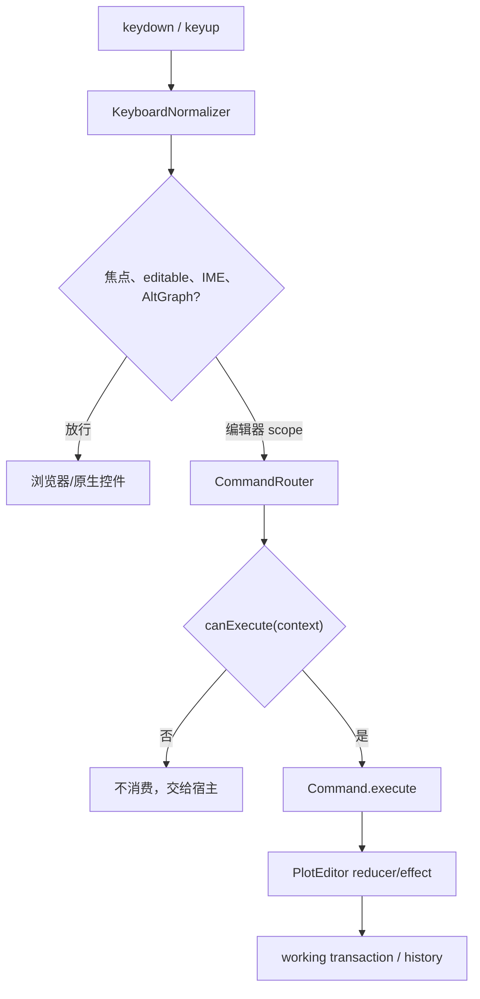

# 06. 键盘命令与 Keymap

键盘是 GIS 编辑器的一等输入源，而不是鼠标事件上的几个可选 modifier。本文规定键盘焦点、按键归一化、命令路由、默认快捷键、重复触发、文本/IME 隔离和事务合并。指针归属与相机仲裁见 [05-pointer-input-and-camera.md](./05-pointer-input-and-camera.md)，命令如何驱动状态机见 [07-editor-state-machine.md](./07-editor-state-machine.md)。

## 1. Current 证据与边界

当前仓库没有编辑器键盘层：

- `src/demo/draw-tool.ts:328-349` 只能通过面板按钮切换 picking；`:397-421` 的撤点、清空、确认也只有 DOM click 回调。
- `src/demo/draw-tool.ts:352-390` 没有 `keydown`/`keyup`，因此 Enter、Escape、Backspace 和历史快捷键都不可用。
- `src/demo/plot-demo.ts:438-443` 仅对文本 `textarea` 调用 `stopPropagation()`；这不是完整的焦点规则，也不能阻止 capture 阶段的全局快捷键。
- 全仓库 `src` 与 `tests` 没有编辑器级 `keydown`/`keyup`、held-key 清理或 keyboard Playwright 用例。

Cesium 1.143.0 的 `KeyboardEventModifier.js` 只有 `SHIFT/CTRL/ALT` 三项；`ScreenSpaceEventHandler.js` 只把 `shiftKey/ctrlKey/altKey` 作为 pointer/wheel action key。它没有 `Meta`、文本输入隔离、命令 registry 或 `keydown` listener。本项目借鉴 Cesium 的 modifier 组合和事件消费规则，但必须增加完整 KeyboardInput。

## 2. 输入流水线



路由器必须先判断上下文，再匹配 keymap；不能把 `keydown` 直接写成一长串 `if (event.key === ...)`。命令的执行结果是 `consumed`、`blocked` 或 `ignored`：

- `consumed`：命令已执行，调用 `preventDefault()`；只有必要时 `stopPropagation()`。
- `blocked`：命令属于当前 editor scope，但当前状态不允许执行；显示可诊断状态并阻止浏览器默认行为，例如 canvas 上的 `Primary+S`。
- `ignored`：当前 scope 不拥有该键，不阻止浏览器或宿主。

## 3. 公共类型

```ts
export type KeyPhase = 'keydown' | 'keyup';
export type RepeatPolicy = 'never' | 'repeat' | 'held';
export type CommandResult = 'consumed' | 'blocked' | 'ignored';

export interface KeyboardStateSnapshot {
  readonly pressedCodes: ReadonlySet<string>;
  readonly pressedKeys: ReadonlySet<string>;
  readonly shift: boolean;
  readonly ctrl: boolean;
  readonly alt: boolean;
  readonly meta: boolean;
  readonly primary: boolean;
  readonly space: boolean;
  readonly altGraph: boolean;
  readonly composing: boolean;
  readonly focused: boolean;
}

export interface KeyStroke {
  /** 语义键，例：'Escape'、'z'、'Enter'。大小写在归一化时折叠。 */
  readonly key?: string;
  /** 物理键，例：'KeyG'、'ArrowUp'；用于布局无关的连续控制。 */
  readonly code?: string;
  readonly primary?: boolean;
  readonly shift?: boolean;
  readonly ctrl?: boolean;
  readonly alt?: boolean;
  readonly meta?: boolean;
  readonly phase?: KeyPhase;
}

export interface CommandContext {
  readonly focus: 'canvas' | 'editor-ui' | 'native-editable' | 'outside';
  readonly mode: 'select' | 'draw' | 'transform' | 'text-edit';
  readonly transaction: 'none' | 'draft' | 'pointer-drag' | 'keyboard-nudge' | 'text';
  readonly selectionCount: number;
  readonly primarySelectionId?: string;
  readonly activeHandleId?: string;
  readonly heightReference?: HeightReference;
  readonly keyboard: KeyboardStateSnapshot;
}

export interface EditorCommandDefinition {
  readonly id: string;
  readonly bindings: readonly KeyStroke[];
  readonly repeat?: RepeatPolicy;
  readonly priority?: number;
  readonly when?: (context: CommandContext) => boolean;
  execute(context: CommandContext): CommandResult;
}

export interface EditorKeymap {
  bind(commandId: string, stroke: KeyStroke): void;
  unbind(commandId: string, stroke?: KeyStroke): void;
  resolve(event: KeyboardEvent, context: CommandContext): EditorCommandDefinition | undefined;
  validate(): readonly { commandId: string; conflictWith: string; stroke: KeyStroke }[];
}

export interface KeyboardInputOptions {
  readonly root: HTMLElement;
  readonly keymap?: EditorKeymap;
  readonly focusOnPointerDown?: boolean;
  readonly platform?: 'auto' | 'windows-linux' | 'macos';
  readonly onCommandError?: (error: unknown, commandId: string) => void;
}
```

命令 ID 是稳定公共 API，键位只是默认配置。宿主可以重绑定 `draw.finish` 或 `transform.translate`，但不能绕过 `PlotEditor` reducer 直接修改实体。

## 4. 焦点与目标过滤

### 4.1 焦点所有权

编辑器 root（通常是 canvas）必须设置 `tabIndex=0`，并在 editor pointerdown 时 `focus({ preventScroll: true })`。只有以下条件之一成立，才路由编辑器快捷键：

1. `document.activeElement` 是 editor root 或其明确的 editor overlay 子节点；
2. 存在 editor-owned pointer capture 且事件来自同一 editor session；
3. 宿主显式调用 `editor.focus()`。

Tab 不被默认拦截，保证用户可以离开 canvas 进入工具栏。失去焦点不会自动清除 selection，但会结束所有未提交 interaction transaction 并清除 held keys。

### 4.2 Editable target 与 IME

```ts
function isNativeEditableTarget(target: EventTarget | null): boolean {
  const node = target instanceof HTMLElement ? target : null;
  return node !== null && (
    node.isContentEditable ||
    node.matches('input, textarea, select, [contenteditable="true"]')
  );
}
```

在 root capture listener 中，按以下顺序放行：

- `isNativeEditableTarget(event.target)`；
- `event.isComposing === true`；
- `keyboard.composing === true`（由 `compositionstart/end` 维护）；
- `event.key === 'Process'` 或 `event.keyCode === 229` 的 IME 过程；
- `event.getModifierState('AltGraph') === true`。

原生文本输入中的 Enter、Backspace、Delete、Primary+Z 等都由控件处理。F2 进入文本编辑后，编辑器只切换到 overlay/native input scope，不在 capture 层吞掉换行和输入法。

### 4.3 Primary 与 AltGraph

```ts
const isMac = platform === 'macos';
const primary = isMac ? event.metaKey : event.ctrlKey;
const altGraph = event.getModifierState?.('AltGraph') === true;
```

`Primary` 默认按 `navigator.platform`/`navigator.userAgentData.platform` 自动判断，也允许宿主固定。AltGraph 同时报告 Ctrl+Alt 时，不得误触发 `Primary+Alt` 命令。`Meta` 必须独立保留，不能只复刻 Cesium 的三项枚举。

## 5. 默认键位矩阵

以下是 v1 默认 keymap。每一行是命令，不是 UI 文案；所有绑定都可由宿主重绑定。未列出的字母不自动占用，避免与八类图形工具的产品快捷键冲突。

| Scope | 默认键位 | Command ID | 语义与边界 |
| --- | --- | --- | --- |
| 全局 editor | `Escape` | `interaction.cancel` | 取消最高优先级的当前事务；无事务时清空选择 |
| drawing/transform | `Enter` | `interaction.commit` | 校验通过后完成草稿或提交变换；失败则保持当前状态 |
| drawing | `Backspace` | `drawing.removeLastPoint` | 删除最后一个草稿控制点，不低于 adapter 最小点数 |
| selected/editing | `Delete` | `selection.delete` | 删除 active vertex；无 active vertex 时删除选中实体 |
| 全局 editor | `Primary+Z` | `history.undo` | 当前事务外撤销一条命令；draft 内只撤销 draft-local journal |
| 全局 editor | `Primary+Shift+Z`、`Primary+Y` | `history.redo` | 重做；新编辑后清空 redo 栈 |
| canvas | `Primary+A` | `selection.selectAll` | 选择所有可见、可编辑、未锁定实体，不包含 tileset/model 参考层 |
| canvas | `Primary+S` | `document.save` | 调用宿主 `onSave(snapshot)`；不隐式提交 active draft |
| selected | `G` | `transform.translate` | 进入平移模式；重复按键不切换坐标系 |
| selected | `R` | `transform.rotate` | 进入旋转模式 |
| selected | `S` | `transform.scale` | 进入缩放模式；adapter 不支持时 blocked |
| transform | `X` / `Y` / `Z` | `transform.constrainAxis` | 约束 ENU East / North / Up；`Z` 对贴地对象 blocked |
| transform | `ArrowLeft/Right` | `transform.nudgeEast` | East -/+；按住可 repeat |
| transform | `ArrowDown/Up` | `transform.nudgeNorth` | North -/+；按住可 repeat |
| transform | `PageDown/PageUp` | `transform.nudgeUp` | Up -/+；贴地对象 blocked，不能改变 authored height |
| transform/nudge | `Shift` | `transform.stepLarge` | 步长倍率 10；只在当前 keydown 作用域内生效 |
| transform/nudge | `Alt` | `transform.stepSmall` | 步长倍率 0.1；同时按住时以 1 倍（10×0.1）计算 |
| navigation override | `Space` + 主键拖拽 | `navigation.overrideDrag` | Space 必须在 pointerdown 前按下；当前 editor drag 不中途转交 |
| selected text | `F2` | `text.beginEdit` | 创建文本输入 overlay；非 text 实体 blocked |
| text-edit | `Enter` | native | 普通 Enter 换行 |
| text-edit | `Primary+Enter` | `text.commit` | 提交文本；验证后退出 text scope |
| text-edit | `Escape` | `text.cancel` | 恢复进入前文本并退出 overlay |

### 5.1 G/R/S 与轴语义

编辑器使用 GIS 局部 ENU，而不是把 Three 世界轴直接暴露给调用者：

- `X = East`，`Y = North`，`Z = Up`。
- heading/yaw 绕 Up（Z）旋转；pitch 绕 East（X）；roll 绕 North（Y）。
- 贴地模式只允许水平平移、heading 和水平参数调整；Up、pitch、roll、垂直 scale 均为 blocked。
- 绝对或相对高度模式才开放 Up/pitch/roll，且图形 adapter 可以进一步声明不支持。

### 5.2 步长与 repeat

默认 `nudgeStepMeters=1`，角度步长 `1°`，scale 步长由 adapter 提供。倍率计算顺序固定为：

```text
effectiveStep = baseStep * (Shift ? 10 : 1) * (Alt ? 0.1 : 1)
```

同一方向的第一次 keydown 开启一个 `keyboard-nudge` transaction；`event.repeat` 只更新 working copy，不生成独立 history。最后一个 nudge keyup 提交一条历史命令。若用户在 repeat 期间按 Escape，整段 nudge 回滚。

one-shot 命令（Delete、Undo、Redo、Save、G/R/S、F2、Enter、Escape）默认 `repeat='never'`；即使浏览器重复发送 keydown，也只执行一次。

## 6. 命令优先级与冲突

命令 scope 从高到低固定为：

1. native editable/IME（不进入 editor router）。
2. text-edit 或 numeric-entry overlay。
3. active drawing/transform transaction。
4. active handle/entity selection。
5. global editor history/selection/save。
6. navigation adapter。
7. 浏览器默认行为。

同一 scope 的 keymap 冲突在 `validate()` 阶段报错，不能以注册顺序静默覆盖。不同 scope 允许相同键位，但只能由最高优先级且 `when(context)` 为真的命令消费。

命令执行只产生 intent/effect，例如 `interaction.commit`、`history.undo`、`transform.nudgeEast`；真正的数据修改在状态机事务中完成。命令 handler 抛错时由 `onCommandError` 报告，状态机执行 rollback，随后清理 held keys 和 navigation lease。

## 7. Held keys 与异常清理

键盘层维护 `pressedCodes` 和 `pressedKeys` 两套集合，避免不同浏览器只提供其中一项。处理规则：

- `keydown`：先更新集合，再匹配命令；modifier-only key 不触发命令。
- `keyup`：先更新集合，再通知 active transform/drawing 约束。
- `window.blur`、`document.visibilitychange(hidden)`、`pagehide`：清空集合，派发 `keyboard.cancelHeld`。
- `compositionstart`：设置 composing；`compositionend` 后才恢复命令匹配。
- `dispose`：移除 root/window/document listener，清空集合，不能留下 repeating RAF 或 timer。

任何命令都不能依赖“必然收到 keyup”来恢复状态。Space、Shift、Alt 尤其需要上述兜底。

## 8. 与指针事件的联合规则

指针事件上的 `event.shiftKey/ctrlKey/altKey/metaKey` 是该 pointer event 的即时快照；KeyboardState 是全局 held-state。仲裁器在每次 normalized pointer event 中同时提供二者：

- pointerdown 以事件快照决定 owner；
- pointermove 使用即时修饰键更新约束；
- keyboard keyup 不会改变已经归属的 pointer owner；
- Space 只影响尚未开始的 pointerdown。

这保证鼠标和键盘驱动同一状态机，而不是两个互相覆盖的实现。具体 transition 见 [07-editor-state-machine.md](./07-editor-state-machine.md)。

## 9. 失败路径与不变量

| 场景 | 行为 |
| --- | --- |
| canvas 未聚焦却收到 window keydown | 忽略，不阻止浏览器 |
| textarea 中按 Backspace/Enter | 放行原生输入，不删除图形、不提交 draft |
| IME composition 中按 Escape | 先交给 IME；composition 未结束前不取消 editor transaction |
| AltGraph 产生 Ctrl+Alt | 不匹配 Primary+Alt 命令 |
| `Primary+S` 无宿主 save handler | blocked 并报告 `SAVE_HANDLER_MISSING`，不弹浏览器保存页 |
| `Z` 作用于贴地实体 | blocked，height 仍为 0 |
| Arrow/PageUp 作用于无 selection | ignored/blocked，不创建空 transaction |
| repeat keydown | one-shot 不重复；nudge 合并至当前 keyboard transaction |
| blur 后收到迟到 keyup | no-op，held set 已清空 |
| keymap 冲突 | 初始化失败并列出冲突 command，不运行部分 keymap |

核心不变量：

1. 编辑器快捷键只能在拥有焦点或 active editor capture 时消费。
2. editable、IME、AltGraph 永不被全局 editor shortcut 抢占。
3. 每次 command 最多产生一个 reducer intent；数据写入经过事务。
4. 一段连续 nudge/drag 只产生一条 history。
5. held keys 在 blur/hidden/dispose 后为空。
6. blocked 命令不会改变文档或选择。
7. `Primary` 在平台上唯一且稳定，Meta 不丢失。

## 10. 验收项

- [ ] Windows/Linux 使用 Ctrl，macOS 使用 Meta 完成 undo/redo/select-all/save。
- [ ] Enter/Escape/Backspace/Delete 按当前 scope 正确提交、回滚、撤点或删除。
- [ ] G/R/S、X/Y/Z、Arrow、PageUp/PageDown 与 ENU/贴地限制一致。
- [ ] Shift/Alt 步长倍率在 pointer transform 和 keyboard nudge 中一致。
- [ ] 长按箭头只生成一条 history；one-shot repeat 不重复。
- [ ] F2 只对文本实体进入编辑；文本框 Enter 换行，Primary+Enter 提交，Escape 取消。
- [ ] Space 在 pointerdown 前按下时相机接管；中途按下不偷换 owner。
- [ ] textarea、contenteditable、IME、AltGraph、焦点离开 canvas 均无误触发。
- [ ] blur/hidden/dispose 后没有 stuck Space/Shift/Alt、重复 RAF 或残留 transaction。
- [ ] 自定义 keymap 的冲突能在启动时被检测并给出 command ID。

## 11. 交叉链接

- Cesium 与项目现状：[01-cesium-source-reference.md](./01-cesium-source-reference.md)、[02-current-project-audit.md](./02-current-project-audit.md)
- 总体模块/API：[03-target-architecture.md](./03-target-architecture.md)
- 指针 owner、capture 和 navigation lease：[05-pointer-input-and-camera.md](./05-pointer-input-and-camera.md)
- 状态机、事务和回滚：[07-editor-state-machine.md](./07-editor-state-machine.md)
- 选择与 Gizmo：[11-selection-transform-gizmo.md](./11-selection-transform-gizmo.md)
