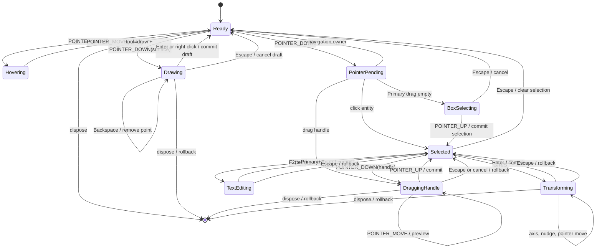
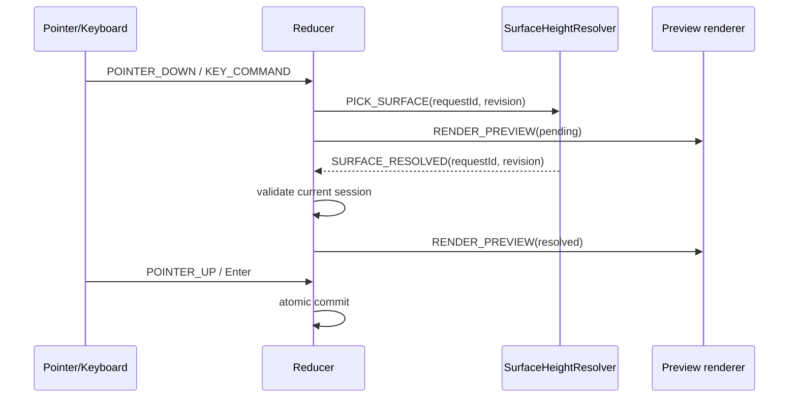

# 07. 编辑器状态机与事务

本文把鼠标、键盘和异步表面拾取统一到一个可测试的 `PlotEditor` 状态机。它规定绘制、选择、拖拽、变换、文本编辑、提交、回滚和销毁的生命周期；渲染层只消费状态机产生的 snapshot/overlay effect，不自行猜测输入意图。

指针归属和相机 lease 见 [05-pointer-input-and-camera.md](./05-pointer-input-and-camera.md)，键盘命令与默认 keymap 见 [06-keyboard-command-keymap.md](./06-keyboard-command-keymap.md)，实体坐标/高度参考和公共图形类型见 [03-target-architecture.md](./03-target-architecture.md)，选择和 Gizmo 细节见 [11-selection-transform-gizmo.md](./11-selection-transform-gizmo.md)。

## 1. Current 证据与问题

当前项目有渲染管理器，但没有编辑器状态机：

- `src/lib/plot/GroundDecalManager.ts:185-238` 提供 `addPlot`，`:309-421` 提供中心、坐标、文本和平移 setter；这些是立即写入并触发渲染同步的管理 API，不是可回滚 transaction。
- `src/lib/plot/PlotPrimitiveBridge.ts:202-340` 以 geometry/style signature 决定重建或热更新；它负责 GPU 生命周期，不负责 pointer owner、selection 或 history。
- `src/demo/draw-tool.ts:281-421` 把采集中的 points 保存在局部数组，确认时直接调用 `onConfirm`，没有 transient overlay、提交前校验、取消和全局 undo。
- `src/demo/plot-demo.ts:1759-1808` 在回调中直接 `decals.addPlot`，所以绘制、实体创建和 GUI 列表同步耦合在 Demo 层。

结论：编辑器必须引入独立的 reducer/transaction 层；`GroundDecalManager` 只能作为兼容渲染 facade，不能成为交互状态的唯一真相。

## 2. 状态与上下文

### 2.1 生命周期、工具和 session

```ts
export type EditorLifecycle = 'created' | 'ready' | 'disposed';
export type EditorTool =
  | { readonly kind: 'select' }
  | { readonly kind: 'draw'; readonly graphicsType: string };

export type InteractionState =
  | { readonly kind: 'idle' }
  | { readonly kind: 'hovering'; readonly hit: HitTarget | null }
  | { readonly kind: 'pointer-pending'; readonly pointerId: number; readonly owner: 'editor' | 'navigation' }
  | { readonly kind: 'drawing'; readonly draft: DraftState; readonly pointerId?: number }
  | { readonly kind: 'box-selecting'; readonly pointerId: number; readonly start: ScreenPoint; readonly current: ScreenPoint }
  | { readonly kind: 'dragging-handle'; readonly pointerId: number; readonly handleId: string; readonly transactionId: string }
  | { readonly kind: 'transforming'; readonly mode: 'translate' | 'rotate' | 'scale'; readonly transactionId: string; readonly axis?: 'east' | 'north' | 'up' }
  | { readonly kind: 'text-editing'; readonly entityId: string; readonly transactionId: string }
  | { readonly kind: 'error'; readonly code: string; readonly recoverable: boolean };

export interface ScreenPoint { readonly x: number; readonly y: number; }
export interface HitTarget {
  readonly kind: 'entity' | 'vertex' | 'midpoint' | 'gizmo' | 'surface' | 'none';
  readonly entityId?: string;
  readonly handleId?: string;
  readonly distanceCssPixels: number;
}

export interface DraftState {
  readonly graphicsType: string;
  readonly coordinates: readonly [number, number, number][];
  readonly previewCoordinate?: [number, number, number];
  readonly valid: boolean;
  readonly validationErrors: readonly string[];
}

export interface EditorState {
  readonly lifecycle: EditorLifecycle;
  readonly tool: EditorTool;
  readonly interaction: InteractionState;
  readonly selection: SelectionState;
  readonly documentRevision: number;
  readonly activeTransaction?: TransactionState;
}
```

`ready` 是可交互生命周期；`disposed` 是终态，任何输入都必须被忽略。`error` 不是终态：可恢复错误回到上一个稳定状态，非恢复错误执行 dispose 前的清理。

### 2.2 事件与 effect

```ts
export type EditorEvent =
  | { type: 'POINTER_DOWN'; input: NormalizedPointerInput; hit: HitTarget | null }
  | { type: 'POINTER_MOVE'; input: NormalizedPointerInput; hit?: HitTarget | null }
  | { type: 'POINTER_UP'; input: NormalizedPointerInput }
  | { type: 'POINTER_CANCEL'; pointerId: number; reason: string }
  | { type: 'LOST_POINTER_CAPTURE'; pointerId: number }
  | { type: 'KEY_COMMAND'; id: string; input: KeyboardStateSnapshot }
  | { type: 'SURFACE_RESOLVED'; requestId: string; revision: number; position: [number, number, number] }
  | { type: 'SURFACE_FAILED'; requestId: string; revision: number; error: unknown }
  | { type: 'EXTERNAL_DOCUMENT_CHANGE'; revision: number }
  | { type: 'FOCUS_LOST'; reason: 'blur' | 'hidden' | 'dispose' };

export type EditorEffect =
  | { type: 'RENDER_PREVIEW'; snapshot: EditorPreviewSnapshot }
  | { type: 'COMMIT_DOCUMENT'; before: DocumentSnapshot; after: DocumentSnapshot; label: string }
  | { type: 'ROLLBACK_PREVIEW'; transactionId: string }
  | { type: 'SELECTION_CHANGED'; selection: SelectionState }
  | { type: 'ACQUIRE_NAVIGATION'; reason: string; pointerId?: number }
  | { type: 'RELEASE_NAVIGATION'; leaseId: string }
  | { type: 'PICK_SURFACE'; requestId: string; screen: ScreenPoint; heightReference: HeightReference }
  | { type: 'FOCUS_TEXT_INPUT'; entityId: string }
  | { type: 'REPORT_ERROR'; code: string; detail?: unknown };
```

Reducer 必须是纯函数：同一个 `EditorState + EditorEvent` 产生同一状态和 effect 描述。异步拾取、Three 对象更新、DOM focus 和 navigation lease 由 effect runner 执行。

## 3. 状态图



## 4. 事件处理规则

### 4.1 Ready/hover/select

1. `POINTER_MOVE` 在无 capture 时只更新 hover overlay；命中优先级见 [11-selection-transform-gizmo.md](./11-selection-transform-gizmo.md)。
2. `POINTER_DOWN` 先询问 InputArbiter owner。编辑器 owner 才进入 `pointer-pending`，并获取 lease（见 05）。
3. `POINTER_UP` 在 click 容差内才执行 selection operation；超过阈值转为 drag session。
4. 单击实体、Shift 单击、Primary 单击分别执行 replace/add/toggle；selection change 不写 history。
5. `Primary+A` 只选择 document 中可见、可编辑、未锁定实体。

### 4.2 Drawing

绘制时，`PlotEditor` 持有 `DraftState`，而不是先把半成品写入 `PlotDocument`：

- 第一个有效 surface hit 建立 draft 和 `PICK_SURFACE` request。
- 每个主键 click 追加规范化 `[lon,lat,0]` 或显式高度三元组。
- pointer move 只替换 `previewCoordinate`，通过 `RENDER_PREVIEW` 更新 overlay/temporary primitive。
- `Enter`、右键 click 或双击调用 `tryCommitDraft()`；adapter 校验最小点数、闭合、自交、孔洞和高度规则。
- `Backspace` 只移除最后一个 authored point；不影响已提交实体。
- `Escape` 丢弃整个 draft，释放 floating point、temporary geometry 和 pending surface request。

完成时将 draft 深拷贝为 canonical entity，一次发出 `COMMIT_DOCUMENT`；箭头等派生几何只在 adapter 内生成，不能把 generated polygon 写进作者坐标。

### 4.3 Handle drag 与 Gizmo transform

pointerdown 命中 handle 后：

1. 捕获 pointer，获取 navigation lease。
2. 保存 `before` deep snapshot、document revision 和 selection snapshot。
3. 创建 `working` snapshot，所有 pointermove/keyboard constraint 只写 working。
4. 每帧发 `RENDER_PREVIEW`；不向 history 写入 move 次数。
5. pointerup flush 最终位置，执行 adapter validate；成功发一条 `COMMIT_DOCUMENT`，失败 rollback。
6. Escape、pointercancel、lost capture、blur、hidden 或 dispose rollback，并释放 lease。

G/R/S 进入 `transforming` 时不需要 pointer；后续 Arrow/PageUp/Down 走同一 working transaction。第一次 nudge 创建 transaction，最后一个 nudge keyup 提交。G/R/S 再次按下只切换 mode，不创建新 history。

### 4.4 Text editing

F2 只对 `text` Graphics 生效：

- 保存原始 content、selection 和 document revision。
- 创建具有明确 focus 的 textarea/contenteditable overlay。
- overlay 内 Enter、Backspace、IME 由 native scope 处理。
- Primary+Enter 调用 `tryCommitText()`；Escape 恢复原文本。
- 文档 revision 改变或 overlay blur 按宿主策略处理；默认 blur commit，异常 `visibilitychange` rollback。

## 5. 事务与历史

### 5.1 Transaction 类型

```ts
export interface TransactionState {
  readonly id: string;
  readonly kind: 'draw' | 'pointer-drag' | 'keyboard-nudge' | 'text' | 'delete';
  readonly documentRevisionAtBegin: number;
  readonly before: DocumentSnapshot;
  readonly working: DocumentSnapshot;
  readonly selectionBefore: SelectionState;
  readonly startedAt: number;
  readonly dirty: boolean;
}
```

`before` 和 `working` 都是 deep snapshot；不能只保存数组引用。snapshot 必须包括稳定 id、插入顺序、Graphics 类型、所有 `[lon,lat,height]` 坐标、heightReference、姿态、尺寸和嵌套样式，但不包括 GPU object、地形采样缓存或 generated geometry。

### 5.2 Commit

`tryCommitTransaction()` 按固定顺序执行：

1. 检查 lifecycle 仍为 `ready`，且 document revision 未被外部修改。
2. 对 working snapshot 做 canonical normalize：经度归一到 `[-180,180)`，纬度限制在 `[-90,90]`，贴地 height 强制为 `0`。
3. 调用对应 geometry adapter 的 `validate()`。
4. 生成新的 document revision，并原子替换受影响实体。
5. 把 `{ before, after, label }` 作为一条 history command 压栈；清空 redo。
6. 发出 selection/document change，再销毁 preview overlay。

commit 任一步失败都不改 committed document，保留 working 状态供用户修正（几何验证失败）或完整 rollback（资源/外部 revision 失败）。

### 5.3 Rollback 与异常

rollback 只丢弃 working 和 preview，不调用 `GroundDecalManager` 的逐点 setter。外部渲染层若已收到 transient preview，必须收到 `ROLLBACK_PREVIEW` 以恢复 committed snapshot。

以下情形默认 rollback：

- `pointercancel`、`lostpointercapture`、window blur、document hidden、dispose；
- 异步 surface request 的 revision 已过期；
- `documentRevision` 与 begin revision 不一致；
- adapter 或 renderer 抛出不可恢复错误。

以下情形保持 transaction 供用户修正：

- 点数不足、重复点、自交、孔洞非法、半径/宽度非正；
- 贴地状态尝试设置非零 authored height；
- 当前 Graphics 不支持所请求的轴/姿态。

错误代码至少包括：`STALE_TRANSACTION`、`INVALID_GEOMETRY`、`HEIGHT_REFERENCE_CONFLICT`、`SURFACE_PICK_PENDING`、`UNSUPPORTED_TRANSFORM`、`RESOURCE_DISPOSED`。

### 5.4 外部修改

`PlotEditor` 订阅 document revision。active transaction 期间如果外部 manager/API 修改了同一实体：

- 不静默合并；
- 发 `EXTERNAL_DOCUMENT_CHANGE`；
- 默认 rollback 并报告 `STALE_TRANSACTION`；
- 宿主若需要合并，必须在 transaction 开始前提供显式 conflict resolver，不能由 renderer 猜测。

## 6. 异步表面拾取

每次 surface pick 携带 `{requestId, editorRevision, pointerSessionId}`。状态机只接受 requestId、sessionId 和 revision 都匹配的结果：



迟到结果一律丢弃；不能把旧 terrain revision 的高度写回新 transaction。贴地模式仍把 authored height 保持为 0，解析出的表面高度只是 render-time resolved value。

## 7. 相机、焦点和销毁

状态机通过 effect 调用 [05-pointer-input-and-camera.md](./05-pointer-input-and-camera.md) 的 `NavigationLease`，不直接访问 `controls.enabled`。进入 dragging/box-selecting/gizmo 时 acquire，稳定结束或 rollback 时 release。键盘 G/R/S 不自动锁相机，只有实际 pointer Gizmo drag 或显式 keyboard transform transaction 需要锁相机；Space override 优先交给相机。

`dispose()` 顺序固定：

1. 标记 lifecycle=`disposed`，拒绝新事件。
2. rollback active transaction。
3. 取消 surface requests/timers/RAF。
4. 释放 pointer capture 和 navigation leases。
5. 移除 keyboard/pointer/focus listeners。
6. 清理 overlay handles、pick proxies 和临时 Three resources。

重复 dispose 必须 no-op。

## 8. 状态机不变量

1. `committed document` 只有 commit effect 才能改变。
2. 一个 editor session 最多一个 active transaction；新 transaction 必须先结束或明确拒绝。
3. drawing preview、Gizmo 和 hover 不进入 history。
4. 一次 pointer drag、一次 keyboard nudge 或一次 delete command 最多生成一条 history entry。
5. selection 改变不写 history，但 delete 的实体变化写 history。
6. commit/rollback 都是幂等；失效事件不能二次替换文档。
7. 任一错误路径都不留下 pointer capture、navigation lease、surface request 或 overlay。
8. 所有坐标在 commit 前规范为 `[longitude, latitude, height]`；任何 clamp heightReference 的 authored height 必须为 0。
9. geometry adapter 拒绝非法 working snapshot 时，committed snapshot 保持字节级不变。
10. 过期异步结果不能改变 selection、history 或 camera。

## 9. 失败路径表

| 事件 | 当前状态 | 结果 |
| --- | --- | --- |
| Enter 点数不足 | drawing | 保持 drawing，暴露 validation errors，不清 draft |
| Backspace 低于最小点数 | drawing | no-op/报告 `MIN_POINTS` |
| Escape | drawing/dragging/transforming/text | rollback 当前层级；不影响已提交实体 |
| pointercancel/lost capture | 任意 pointer session | rollback并释放 lease |
| window blur/hidden | 任意 active transaction | rollback、清 held keys、恢复 camera |
| surface pick 超时 | drawing | 保持 pending；不退回随机椭球点；宿主可重试或取消 |
| surface pick 迟到 | 已提交/新 revision | 丢弃 stale response |
| adapter validate 失败 | transforming | 保持 working，允许继续修正 |
| 外部 revision 改变 | active transaction | 默认 rollback + `STALE_TRANSACTION` |
| renderer/GPU 更新失败 | commit | committed document 不变，清理 preview 后报告错误 |
| dispose | 任意 | 终态 disposed，所有输入 no-op |

## 10. 验收项

- [ ] 鼠标 click、drag、双击、右键完成和键盘 Enter/Escape/Backspace 走同一 reducer。
- [ ] G/R/S、轴约束、箭头微调在无 pointer 的情况下可启动并形成 working transaction。
- [ ] pointer drag 期间相机 lease 正确获取/释放；Space 只在新 pointerdown 时覆盖 owner。
- [ ] 事务 commit 一次写 document/renderer/history；move 数量不影响 history 长度。
- [ ] Escape、pointercancel、lost capture、blur、hidden、dispose 都能完整 rollback。
- [ ] 非法几何保持编辑态并给出可诊断错误；不会破坏 committed entity。
- [ ] 异步 surface height 只接受匹配 request/session/revision 的结果。
- [ ] 外部 document revision 冲突不会静默覆盖用户数据。
- [ ] disposed 后所有输入都 no-op，且无 listener、RAF、timer、lease 泄漏。
- [ ] Playwright 覆盖 mouse+keyboard 混合序列、键盘-only nudge、IME/文本编辑隔离和资源清理。

## 11. 交叉链接

- 输入、capture 和相机 lease：[05-pointer-input-and-camera.md](./05-pointer-input-and-camera.md)
- 键盘命令和默认键位：[06-keyboard-command-keymap.md](./06-keyboard-command-keymap.md)
- Cesium 依据与项目审计：[01-cesium-source-reference.md](./01-cesium-source-reference.md)、[02-current-project-audit.md](./02-current-project-audit.md)
- 目标实体/API：[03-target-architecture.md](./03-target-architecture.md)
- 选择、Gizmo 和 ENU 变换：[11-selection-transform-gizmo.md](./11-selection-transform-gizmo.md)
