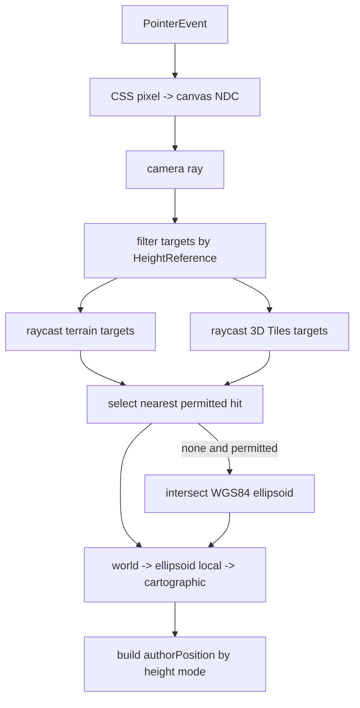

# 08. 拾取、表面选择与高度解析

> **职责边界修订（2026-08-12）**：本文的 terrain、3D Tiles、ellipsoid 拾取用于创建采点和拖拽落点，不再承担标绘实体单击选择。实体选择统一使用 Three.js `Raycaster`，详见 [标绘编辑器 Raycaster 拾取设计](../plot-editor-raycaster/README.md)。

## 目标

本文定义屏幕指针如何得到规范 `GeoPosition`、terrain/3D Tiles/椭球之间如何按 `HeightReference` 选择，以及相对高度如何异步解析。本文的核心原则是：拾取结果可以驱动 author 坐标，但 surface height 是运行时事实，不能污染持久数据。

前置定义见 [04. 坐标、高度与持久化模式](./04-coordinate-height-schema.md)。绘制和编辑分别消费本文接口：

- [09. 八类图形绘制契约](./09-shape-drawing-contracts.md)
- [10. 图形编辑控制点与拓扑](./10-shape-editing-handles.md)

## Current：当前实现证据

- `../../src/demo/draw-tool.ts` 已有最小拾取：先 `Raycaster.intersectObject(tilesRenderer.group, true)`，未命中再与 WGS84 椭球求交。
- 该工具把命中点转换为 cartographic 后只返回 `[lon, lat]`，明确丢弃 `carto.height`，并且仅服务箭头和图片点 demo。
- 它把 `tilesRenderer.group` 整体称为 terrain，无法区分 terrain 与普通 3D Tiles 目标，也没有按七个 `HeightReference` 过滤目标。
- `../../src/lib/ground/classification-depth.ts` 和 frame state 已能为渲染提供 terrain、tileset、both 深度纹理，但这些 GPU 深度不是稳定的 author 高度来源。
- `../../src/lib/ground/terrain-heights.ts` 提供的是 shadow-volume 用近似 min/max 范围，不是某一经纬度的真实 surface height，不能用于相对高度放置。
- 当前没有统一的 pick result、surface sampler、异步失效版本或 tiles 更新订阅。

## Proposed：公共接口

### 拾取类型

```ts
export type PickSurface = 'terrain' | '3d-tile' | 'ellipsoid';

export interface ScreenPosition {
  clientX: number;
  clientY: number;
}

export interface SurfaceHit {
  /** 在 WGS84 椭球坐标系下的绝对位置。 */
  surfacePosition: GeoPosition;
  surface: PickSurface;
  distanceFromCamera: number;
  /** 仅用于诊断/业务关联，不参与 plot identity。 */
  sourceId?: string;
}

export interface PlotPickResult {
  /** 可直接进入绘制或编辑 API 的 author 坐标。 */
  authorPosition: GeoPosition;
  /** 命中的真实绝对表面位置；只读、瞬态。 */
  surfacePosition: GeoPosition;
  surface: PickSurface;
  heightReference: HeightReference;
}

export interface PickOptions {
  heightReference: HeightReference;
  /** NONE 水平拖拽默认保留旧绝对高度，创建时默认使用 hit 高度。 */
  absoluteHeight?: number;
  /** relative 水平拖拽默认保留旧 offset，创建时默认 0。 */
  relativeOffset?: number;
  /** terrain/ground 是否允许椭球兜底；默认 true。 */
  allowEllipsoidFallback?: boolean;
}

export interface PlotSurfacePicker {
  pick(screen: ScreenPosition, options: PickOptions): PlotPickResult | null;
}
```

picker 必须由宿主显式注入可拾取对象集合，禁止对整个 Three scene 无过滤 raycast，否则会命中 plot shadow volume、编辑控制点、相机辅助对象或业务模型。

### 高度采样类型

```ts
export type SurfaceTarget = 'ground' | 'terrain' | '3d-tile';

export interface HeightSampleRequest {
  positions: readonly GeoPosition[];
  target: SurfaceTarget;
  signal: AbortSignal;
}

export interface HeightSample {
  longitude: number;
  latitude: number;
  /** 目标表面相对 WGS84 椭球面的绝对高度。 */
  surfaceHeight: number | null;
  source: PickSurface | null;
}

export interface PlotSurfaceHeightProvider {
  sampleHeights(request: HeightSampleRequest): Promise<readonly HeightSample[]>;
  /** terrain LOD、tiles 加载/卸载或表面变换后通知 cache 失效。 */
  subscribe(listener: () => void): () => void;
}
```

`GroundDecalManager` 可选接收该 provider。`RELATIVE_*` 非零 offset 的正确渲染需要它；`CLAMP_*` 继续使用当前 depth/classification 管线，不要求 CPU 高度采样。

## 表面选择矩阵

| HeightReference | 可命中目标 | 选择规则 | author height |
| --- | --- | --- | --- |
| `NONE` | terrain、3D Tiles、椭球兜底 | 取射线最近可见 hit | 新建取 hit 的绝对高度；编辑按选项保留旧绝对高度 |
| `CLAMP_TO_GROUND` | terrain、3D Tiles；可椭球兜底 | terrain/tile 取射线最近可见 hit | `0` |
| `RELATIVE_TO_GROUND` | terrain、3D Tiles；可椭球兜底 | 同上 | 新建 `0`，编辑保留旧 offset |
| `CLAMP_TO_TERRAIN` | terrain；可椭球兜底 | 忽略 3D Tiles | `0` |
| `RELATIVE_TO_TERRAIN` | terrain；可椭球兜底 | 忽略 3D Tiles | 新建 `0`，编辑保留旧 offset |
| `CLAMP_TO_3D_TILE` | 3D Tiles | 忽略 terrain，不允许椭球冒充 tile | `0` |
| `RELATIVE_TO_3D_TILE` | 3D Tiles | 同上 | 新建 `0`，编辑保留旧 offset |

屏幕拾取以“当前可见且离相机最近的命中”为准，保证指针所见即所得。按经纬度批量采样 `GROUND` 时，provider 应返回 terrain 与 3D Tiles 中较高的有效表面，与 Cesium `Scene.getHeight` 的组合语义一致。

## 屏幕拾取算法



详细步骤：

1. 用 renderer canvas 的 `getBoundingClientRect()` 把 `clientX/clientY` 转为 NDC；考虑 CSS 尺寸与 drawing-buffer pixel ratio 的差异。
2. 调用相机更新矩阵，再从 NDC 构造世界射线。
3. 编辑控制点使用独立 pick layer 并先行命中；只有未命中 handle 时才进入 surface picker。
4. 按 `HeightReference` 过滤 terrain 和 3D Tiles roots。隐藏、不可选或尚未 ready 的 root 不参与。
5. 每个 root 在 raycast 前 `updateMatrixWorld()`；命中世界坐标必须转换到该 ellipsoid frame，再做 cartographic 反算。
6. `GROUND` 在所有允许命中中取最小正 ray distance；terrain-only/tile-only 不得跨目标回退。
7. 允许兜底且没有目标命中时，把世界射线变换到 ellipsoid local frame，与 WGS84 椭球求交。
8. 反算得到 `[longitude, latitude, absoluteSurfaceHeight]`，经度按 [04](./04-coordinate-height-schema.md#经度环绕日期变更线与极区) 规范。
9. 构造 author position：
   - clamp：`[lon, lat, 0]`
   - relative：`[lon, lat, options.relativeOffset ?? 0]`
   - absolute：`[lon, lat, options.absoluteHeight ?? absoluteSurfaceHeight]`
10. 返回 surface 与 author 两套位置；调用方只把 `authorPosition` 写入 plot。

## 相对高度解析算法

每个 plot 维护单调递增的 geometry revision。任何 points、`heightReference` 或影响派生点的形状参数变化都使旧请求失效。

```ts
async function resolveRelativePlot(
  snapshot: GisPlotSnapshot<any>,
  revision: number,
  provider: PlotSurfaceHeightProvider,
  signal: AbortSignal,
): Promise<ResolvedPlotGeometry> {
  const target = getSurfaceTarget(snapshot.options.heightReference);
  const samples = await provider.sampleHeights({
    positions: snapshot.options.points,
    target,
    signal,
  });

  assertSameLength(samples, snapshot.options.points);
  return {
    plotId: snapshot.id,
    sourceRevision: revision,
    effectivePoints: snapshot.options.points.map((point, index) => [
      point[0],
      point[1],
      requireSurfaceHeight(samples[index]) + point[2],
    ]),
    status: 'ready',
  };
}
```

提交结果前再次检查：plot 仍存在、请求未 abort、id 相同、revision 相同、`heightReference` 仍相同。任一不满足都丢弃，不得让旧请求覆盖新拖拽。

### 缺失表面的策略

- `ground`：terrain/tile 均无样本时可用 WGS84 椭球高度 `0` 作为暂时兜底，并在 provider change 后重新采样。
- `terrain`：terrain 未就绪时可用椭球高度 `0` 暂时显示，状态保留 `pending`，加载后更新。
- `3d-tile`：没有 tile 命中时返回 `null`，对应图元 resolved 状态为 `unavailable` 并隐藏；不得落到 terrain 或椭球。
- 同一多点图形部分点无样本时，默认整幅图形保持上一次完整 ready 几何；首次解析则隐藏。禁止把缺失点单独补零造成折面撕裂。
- provider 抛出 `AbortError` 属于正常取消，不报告业务错误；其它错误通过 manager diagnostics 发出，author 数据仍保留。

### 采样结果不持久化

surface cache 的 key 至少包含：

- plot id 与 geometry revision
- target surface
- 规范化 lon/lat 序列
- provider surface revision

cache value 只进入 renderer。terrain LOD 细化、tiles 进出视野、3D Tiles 内容加载完成或 provider invalidate 后可以变化，但不得调用 `setCoords`，不得创建 history entry，serializer 也看不到它。

## 日期变更线与极区

- 射线命中先转换 ECEF/cartographic，再规范经度；不得在屏幕射线阶段做经度猜测。
- 批量采样跨日期变更线的线/面时，以 [04](./04-coordinate-height-schema.md#连续运算经度) 的 unwrap 序列切分 bbox；禁止用 `min(-179), max(179)` 得到几乎全球的范围。
- terrain/tile 的垂直采样沿 WGS84 geodetic normal，不沿世界固定 Z 轴。
- 精确极点附近用 ECEF 距离与 geodetic normal；经度只作为可逆元数据，不参与“最近点”平面距离。
- ellipse group 存在变换时，所有 ray、hit 和 normal 都必须在明确坐标系间转换；不得假定 group matrix 为单位矩阵。

## 与编辑控制点的拾取优先级

统一优先级：

1. 当前选中图形的可见编辑 handle
2. 可选择的 plot 图形
3. 允许的 GIS surface
4. 空白/天空

handle 放在专用 Three layer，plot shadow-volume 和 depth helper 放在不可拾取 layer。`3D_TILE` 表面可作为第三步的 target，但不会生成模型变换 handle，详见 [10](./10-shape-editing-handles.md)。

## 不变量

1. picker 返回的 author 坐标始终是三元组。
2. clamp pick 的 author height 永远为 `0`。
3. relative pick 的 author height 是 offset，surface height 只存在于 `surfacePosition`/resolved cache。
4. tile-only 绝不回退 terrain 或 ellipsoid。
5. surface pick 不命中编辑 handles、plot 辅助几何或任意未注册 scene object。
6. 异步结果只有在 id、revision、reference 都匹配时才能生效。
7. surface 更新不改变 author snapshot、history、dirty 状态或 serialized document。
8. 所有坐标变换明确区分 world、tiles group local、ellipsoid local 和 cartographic。

## 失败路径

- 指针在 canvas 外、canvas 尺寸为零或相机不可用：返回 `null`。
- 射线指向天空且不允许兜底：返回 `null`，绘制 session 保持原状态。
- `CLAMP_TO_3D_TILE`/`RELATIVE_TO_3D_TILE` 未命中 tile：返回 `null`，不得创建错误位置的图形。
- terrain/tiles root 尚未 ready：按目标策略 pending 或无命中，不抛破坏交互循环的异常。
- cartographic 反算失败或结果非 finite：丢弃 hit 并记录诊断。
- provider 返回长度不匹配、非法高度或错误目标：整次结果拒绝。
- pointer drag 中瓦片更新：继续使用本次 drag 起始的有效 surface 结果，结束后按新 revision 重算，避免 handle 抖动。
- manager/provider dispose：abort 所有请求并解除订阅，迟到 Promise 结果无效。

## 验收项

- [ ] 七种 HeightReference 的可拾取目标、fallback 和 author height 与表格一致。
- [ ] clamp 点击高山或建筑后 snapshot 仍保存 `[lon, lat, 0]`。
- [ ] relative 图形 terrain/tiles 高度变化后视觉更新，但 JSON 与 history 不变。
- [ ] tile-only 在无 tile 处不错误贴到 terrain。
- [ ] `GROUND` 重叠 terrain/tiles 时选中屏幕上最近可见表面。
- [ ] 编辑 handle、plot helper 和 shadow-volume 不会被 surface raycast 命中。
- [ ] 多个快速拖拽/切 reference 导致的旧异步结果全部被 revision 守卫丢弃。
- [ ] terrain/tiles group 带非单位 matrix 时仍得到正确经纬高。
- [ ] 日期变更线附近拾取、bbox 与批量采样不绕全球。
- [ ] 极区采样沿 geodetic normal，结果无 NaN/Infinity。
- [ ] dispose 后无残留 listener、AbortController 或异步写入。
