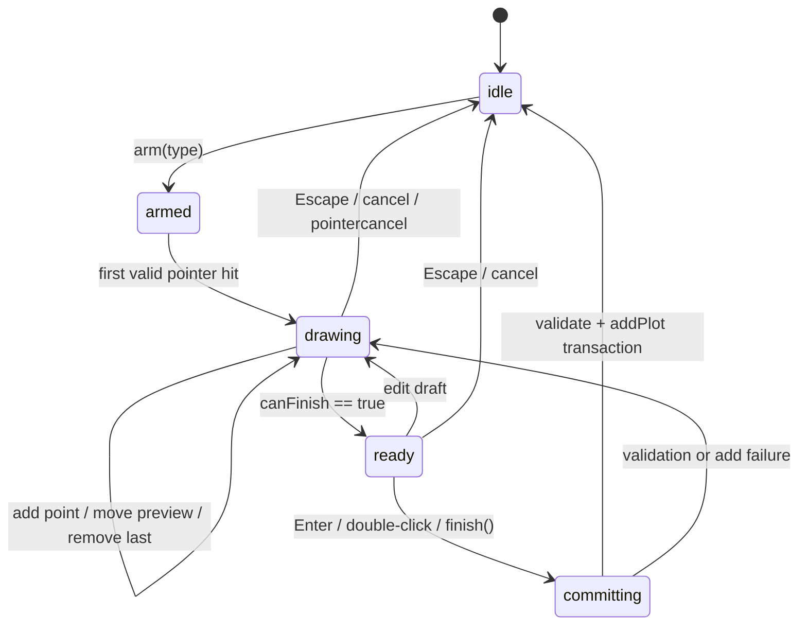
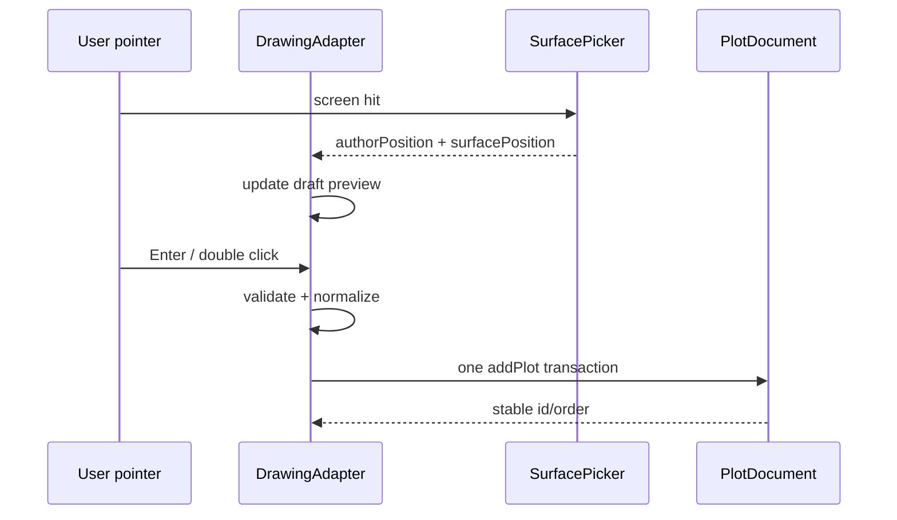

# 09. 八类图形绘制契约

## 目标与边界

本文把“选择一个绘制工具到提交一幅 GIS 图形”定义成可测试的 adapter 契约。绘制只产生 GIS 图形的作者数据；terrain 和 3D Tiles 只是拾取、贴附、相对高度和遮挡表面，绝不产生模型编辑操作。

坐标、高度和持久化规则以 [04. 坐标、高度与持久化模式](./04-coordinate-height-schema.md) 为唯一来源；屏幕命中以 [08. 拾取、表面选择与高度解析](./08-picking-surface-height.md) 为唯一来源；输入 owner、pointer capture 和键盘完成规则分别见 [05](./05-pointer-input-and-camera.md) 与 [06](./06-keyboard-command-keymap.md)。提交后的控制点编辑见 [10. 图形编辑控制点与拓扑](./10-shape-editing-handles.md)。

## Current：当前实现证据

当前项目已经有八个数据类别和八个 plugin class，但没有统一绘制 adapter：

| Current 证据 | 已有行为 | 绘制层缺口 |
| --- | --- | --- |
| `../../src/lib/plot/plugins/types.ts` 的 `GisPlotCategory`、`PlotAddOptions` | `point/line/polygon/rectangle/sector/arrow/text/circle` 八类判别联合 | 没有统一的 draft、preview、finish、cancel 契约 |
| `../../src/lib/plot/plugins/base.ts` | 纯数据对象、中心/范围查询 | 没有绘制状态或控制点约束 |
| `../../src/lib/plot/GroundDecalManager.ts:addPlot` | 已提交 options 立即创建 id 和图元同步 | 绘制过程无法留在 transient 层，取消容易留下半成品 |
| `../../src/demo/draw-tool.ts` | 只实现箭头和图片点的点击采集；面板按钮撤销/清空/确认 | 没有八类工具、双击/Enter 完成、键盘撤销和结构化错误 |
| `../../src/lib/plot/plugins/arrow.ts` | 五种箭头控制点规则和派生轮廓 | 派生轮廓不应成为可直接编辑的 source |
| `../../src/lib/plot/PlainPlotPrimitive.ts`、`PlotPrimitiveBridge.ts` | 已有 ground/plain 两条渲染路径 | 没有 draft overlay 与 adapter 注册表 |

## Proposed：公共绘制接口

### 工具与 session

```ts
export type DrawingPhase = 'idle' | 'armed' | 'drawing' | 'ready' | 'committing';

export interface DrawingSessionId {
  readonly value: string;
}

export interface DrawToolContext<TOptions extends PlotAddOptions = PlotAddOptions> {
  readonly type: GisPlotCategory;
  readonly heightReference: HeightReference;
  readonly style: Readonly<PlotStyleDefaults>;
  readonly options: Readonly<TOptions>;
}

export interface DrawingDraft<TDraft = unknown> {
  readonly sessionId: DrawingSessionId;
  readonly type: GisPlotCategory;
  readonly phase: DrawingPhase;
  readonly draft: TDraft;
  readonly points: readonly GeoPosition[];
  readonly validation: DrawingValidation;
}

export interface DrawingValidation {
  readonly valid: boolean;
  readonly code?: string;
  readonly message?: string;
  readonly pointIndex?: number;
}

export interface ShapeDrawingAdapter<TDraft, TOptions extends PlotAddOptions> {
  readonly type: GisPlotCategory;
  begin(context: DrawToolContext<TOptions>): TDraft;
  addPoint(draft: TDraft, point: GeoPosition, hit: PlotPickResult): TDraft;
  movePointer(draft: TDraft, point: GeoPosition, hit: PlotPickResult): TDraft;
  removeLastPoint(draft: TDraft): TDraft;
  validate(draft: TDraft): DrawingValidation;
  canFinish(draft: TDraft): boolean;
  finish(draft: TDraft): CanonicalPlotAddOptions;
  cancel(draft: TDraft): void;
  preview(draft: TDraft): DraftPreviewGeometry;
}

export interface PlotDrawingController {
  arm(type: GisPlotCategory, options?: DrawToolOptions): DrawingSessionId;
  handlePointer(intent: DrawingPointerIntent): void;
  handleKeyboard(intent: DrawingKeyboardIntent): void;
  finish(): string | null;
  cancel(reason?: string): void;
  readonly draft: DrawingDraft | null;
}
```

`CanonicalPlotAddOptions` 是已经归一化、包含显式 `heightReference` 和三元 points 的判别联合。`PlotAddOptions` 的 legacy union 只能在 controller 边界接受，不能成为 draft 或 adapter 内部类型。

### 通用状态机



规则：

1. `arm` 只建立 transient session，不分配 plot id，不写 history。
2. 只有 surface picker 返回有效 `PlotPickResult` 时才追加点。
3. pointermove 只更新 draft preview，不创建 author snapshot。
4. 完成时 adapter 重新校验全部点，归一化成三元坐标，调用一次 `addPlot` transaction；id/order 从该提交点开始存在。
5. 取消、pointercancel、失焦或 `dispose` 清理 draft 和 overlay，不留下空图形。
6. 所有 shape adapter 的 `finish` 都返回 author height；resolved surface height 不得写入结果。

### 通用指针和键盘动作

| 动作 | 默认语义 |
| --- | --- |
| 左键单击 | 追加一个离散控制点或推进当前阶段 |
| 左键移动 | 更新当前阶段的 preview point，不追加 |
| 左键双击 | 对 line/polygon/variable arrow 尝试 finish；去除重复终点 |
| Enter | 对当前 draft 执行 finish；校验失败保留 draft |
| Backspace | 删除最后一个 draft 点；不低于 adapter 的最小点数 |
| Escape | 取消当前 session，回滚全部 draft 变化 |
| 右键单击 | 默认等价 finish（仅在 adapter 声明 `rightClickFinish` 时） |
| 右键拖拽 | 交给相机，不得同时 finish |
| Shift/Alt | 只改变 adapter 的约束（例如正交、角度、半径步长），不改变高度模式 |

双击的第二个 click 不得再次追加为新点；pointer capture 和 click/drag 判定由 [05](./05-pointer-input-and-camera.md) 统一处理。

## 八类绘制契约

下表中的 `P` 均为 `GeoPosition`。除特别说明外，闭合面存储不重复首点，renderer 在绘制时闭合。

### 1. 点（point）

**输入步骤**

1. 左键命中一次得到 anchor `P0`。
2. 立即进入 `ready`；图片点可在面板选择 image URL/宽高后提交。

**提交结构**

```ts
{ type: 'point', points: [P0], pointStyle, size | imageUrl/imageWidth/imageHeight, rotation, ...style }
```

**约束**

- 只能有一个点；后续 pointermove 只预览位置。
- `circle/square` 的 `size > 0`；image 的宽高均 `> 0`。
- `HeightReference` 由 session 固定；clamp 的 `P0[2]` 强制 `0`。
- image 的 `rotation` 是俯视平面 heading，不是模型旋转。

**完成/失败**

无命中不创建；无效尺寸返回 `INVALID_POINT_SIZE`，保留 session 供修正。

### 2. 线（line）

**输入步骤**

1. 每次左键追加一个折点；pointermove 预览从最后一点到当前点的段。
2. 至少两个不同的点后进入 `ready`。
3. 双击或 Enter 提交；重复双击终点只保留一次。

**提交结构**

```ts
{
  type: 'line', points: [P0, P1, ...],
  strokeStyle, showArrow, startArrowStyle, endArrowStyle, ...style
}
```

**约束**

- 最少 2 个点；相邻点不能重合到 geodesic epsilon 内。
- closure 不自动添加，`loop` 若未来加入必须是显式字段。
- 端点箭头只影响 line 参数，不生成可编辑的独立 polygon。
- 长度/插值在连续经度序列上计算，跨日期变更线不走全球长弧。

### 3. 多边形（polygon）

**输入步骤**

1. 左键追加外环顶点，pointermove 预览闭合边。
2. 至少三个不共线点后进入 `ready`。
3. 双击/Enter 提交；双击产生的重复终点去除，内部不存首尾重复点。

**提交结构**

```ts
{ type: 'polygon', points: [P0, P1, P2, ...], ...style }
```

**约束**

- 外环必须为简单环；自交、零面积、连续重复点分别返回结构化错误。
- v1 不通过绘制工具创建 holes；如未来支持，holes 作为独立环数组并有自己的 adapter。
- 三角化前使用连续经度和局部 ENU；不以 `minLon/maxLon` 横跨 IDL 的 bbox 判断合法性。
- clamp 高度全零；relative 的每点高度是 offset，解析在 [08](./08-picking-surface-height.md) 完成。

### 4. 矩形（rectangle）

**交互构造**

1. 第一次命中为对角锚点 `A`。
2. pointermove/第二次命中为相对对角点 `C`，实时预览四角。
3. Enter/第二次左键提交四个规范角点。

角点顺序固定为连续经度下的 `southWest -> southEast -> northEast -> northWest`，不重复首点。程序化 API 仍可直接传四个角点，但必须经过同一矩形验证器。

**高度规则**

- clamp：四角 author height 全为 `0`。
- NONE/relative：如果四角需要逐点绝对/相对高度，adapter 在四角生成后调用 height resolver；surface 结果仅进入 resolved geometry。缺少明确第三维时四角先为 `0`。

**约束**

- 宽和高都必须大于 geodesic epsilon；A/C 不得相同。
- 在日期变更线两侧，`C` 按连续经度解释，不生成跨全球矩形。
- 极区矩形不使用经度差乘 `cos(lat)` 估算尺寸；用 WGS84/ECEF。

### 5. 扇形（sector）

**输入步骤**

1. 第一次命中为圆心 `C`。
2. 第二次命中确定半径 `r` 与起始方向 `startAngle`。
3. 第三次命中确定终止方向；计算有符号顺时针 `sectorAngle`，进入 `ready`。
4. Enter 提交；不足三次点击不能 finish。

**提交结构**

```ts
{
  type: 'sector', points: [C], radius: r,
  startAngle: normalizeHeading(startAngle),
  sectorAngle: normalizeSweep(sectorAngle), ...style
}
```

角度约定沿用当前 plugin：北为 `0°`，顺时针为正；`startAngle` 规范到 `[0, 360)`，`sectorAngle` 为 `(0, 360]`。超过一周的输入必须显式拒绝或归一化成 `360°`，不能产生负半径。

**约束**

- `radius > 0` 且 finite。
- 圆心与第二/第三命中不能退化为相同地理点。
- 角度计算使用 ENU `atan2(east,north)`，不在经度/纬度平面直接 atan。

### 6. 箭头（arrow）

箭头的 source 是控制点，不是生成的闭合 polygon。当前 `../../src/lib/plot/plugins/arrow.ts` 支持 `fine`、`assaultDirection`、`attack`、`swallowtailAttack`、`curved` 五种 `arrowType`。

| arrowType | 最小控制点 | 完成方式 | 控制点解释 |
| --- | ---: | --- | --- |
| `fine` | 2 | 第二点自动 ready；Enter/第二次点击提交 | 起点、终点 |
| `assaultDirection` | 2 | 同上 | 起点、终点 |
| `attack` | 3 | 双击/Enter | 前两点尾边，其余为脊线，末点 tip |
| `swallowtailAttack` | 3 | 双击/Enter | 与 attack 相同，尾部另有燕尾 |
| `curved` | 2 | 双击/Enter | 全部点为曲线脊线 |

**提交结构**

```ts
{
  type: 'arrow', points: controlPoints,
  arrowType, sizeScale,
  curvedBodyWidthFactor, curvedHeadWidthFactor, curvedHeadLengthFactor,
  ...style
}
```

**约束与派生高度**

- 控制点数不能低于类型最小值；SDK 输出超过其顶点预算时按当前 arrow SDK 的确定性 clamp 规则处理，不能让生成结果反过来修改 source points。
- `generatedCoords` 每次 preview/commit 由 control points 重算，运行时可出现在 snapshot 但不是 JSON source。
- 生成轮廓的第三维按连续控制线段的最近投影线性插值；等距时选择较小 segment index。clamp 轮廓高度仍全零。
- 编辑时只显示和拖拽控制点，禁止直接拖拽派生轮廓顶点，详见 [10](./10-shape-editing-handles.md#箭头控制点)。
- `sizeScale` 和曲线体型参数必须 finite 且正；非法值不提交。

### 7. 文本（text）

**输入步骤**

1. 左键命中一次得到文本 anchor `P0`。
2. 创建 transient text editor；文字输入由 native input/IME 管理。
3. 非空内容 + Enter/Primary+Enter 提交；Escape 取消。普通 Enter 在多行文本中换行。

**提交结构**

```ts
{
  type: 'text', points: [P0], content,
  fontColor, fontSize, textAlign, verticalAlign,
  anchorX, anchorY, layoutDirection, rotation,
  boxWidth, boxHeight, padding, offsetX, offsetY, scale,
  ...style
}
```

**约束**

- `fontSize > 0`；固定 box 宽高若提供必须 > 0；padding 每个分量不能为负。
- anchor 是唯一 GIS 坐标；文本框尺寸、边框和旋转是图形参数，不创建模型。
- clamp anchor height 恒为 `0`；relative anchor height 为 offset。
- 文本输入期间编辑器必须放行 IME 和 native key handling，详见 [06](./06-keyboard-command-keymap.md#editable-target-与-ime)。

### 8. 圆（circle）

**输入步骤**

1. 第一次命中为圆心 `C`。
2. pointermove/第二次命中计算 WGS84 geodesic radius。
3. 第二次点击或 Enter 提交。

**提交结构**

```ts
{ type: 'circle', points: [C], radius: r, ...style }
```

**约束**

- `radius > 0` 且 finite；第二点不能与圆心重合。
- 半径是米，不是经纬度差；使用椭球 geodesic distance。
- circle 没有 rotation 参数；若 UI 显示方向控制，该方向只能作为未来 ellipse 扩展，不能改变 circle 结果。

## 高度和表面在绘制中的统一规则

绘制工具从 [08](./08-picking-surface-height.md) 得到 `PlotPickResult`：



- `CLAMP_*`：只取 `authorPosition[0..1]`，第三维写 `0`。
- `RELATIVE_*`：新图形默认 offset `0`，后续 parameter UI 可改 offset；surface absolute 高度只进入 resolver。
- `NONE`：首次创建默认使用命中点绝对高度，使新图形贴在用户所见位置；调用方可显式指定高度。
- 一幅图形多点采样时，所有 author 点均须经过同一 reference；不能同一 ring 混用 terrain 与 tile 语义。
- surface provider 暂时无结果时，绘制 session 不把 `null` 变成 `[0, 0, 0]`；按 [08](./08-picking-surface-height.md#失败路径) 保持 pending、等待或取消。

## 通用校验与提交错误

adapter 的 `validate` 必须返回稳定 code，至少包括：

| Code | 触发条件 |
| --- | --- |
| `DRAW_PICK_MISS` | 当前步骤没有有效表面命中 |
| `DRAW_TOO_FEW_POINTS` | 未达到该类型最小点数 |
| `DRAW_DEGENERATE_GEOMETRY` | 重合、零半径、零面积或共线 |
| `DRAW_SELF_INTERSECTION` | 多边形外环自交 |
| `DRAW_INVALID_HEIGHT` | 坐标高度非 finite 或 reference 约束不满足 |
| `DRAW_INVALID_PARAMETER` | radius、angle、size、font 等参数非法 |
| `DRAW_POINT_LIMIT` | 超出 adapter/renderer 顶点预算 |
| `DRAW_SURFACE_UNAVAILABLE` | 必需 terrain/3D Tiles 尚未可用 |
| `DRAW_TEXT_INPUT_REQUIRED` | 文本尚未完成或 native input 未提交 |

校验失败时保留 draft、最后一个有效 preview 和用户已输入参数；只有用户显式取消才清理。`finish` 必须原子化：校验、normalize、add transaction 任一步失败都不分配稳定 id。

## 不变量

1. draft 可以暂时不完整，但进入 document 的图形必须满足对应最小点数和参数约束。
2. 任何提交的 points 都是 `[lon, lat, height]`，且 reference 显式存在。
3. clamp author height 恒为 `0`；surface resolved height 不进入提交对象。
4. 面图形存储不重复首点；渲染闭合由 adapter/renderer 负责。
5. 箭头只持有控制点；generated polygon 永远是派生值。
6. 每个绘制 session 最多产生一个 add history entry；取消产生零 entry。
7. 绘制期间不改变已有实体的 id/order；新实体的 id/order 只在 commit 分配。
8. 输入事件不能直接写 manager 或 scene，必须经过 adapter -> editor transaction。
9. 经度跨 IDL 先连续展开；极区半径和角度使用 ECEF/ENU/geodesic。
10. 绘制失败不会留下 GPU primitive、pick proxy、surface request 或 navigation lease。

## 失败路径

- 首点命中天空：不启动 drawing，保留 armed 状态并报告 `DRAW_PICK_MISS`。
- 中途特定 surface 未加载：draft 保持已有点，等待/重试或 Escape 取消；不回退到错误 surface。
- pointercancel、失焦、相机 dispose：回滚 draft，释放 capture/lease，产生零 history。
- 双击第二次事件重复追加：检测 click sequence，去掉重复终点后再校验。
- 非法自交 polygon：保留 draft，标出冲突边，允许拖回合法状态。
- 文本输入抛错或 IME 未结束：不提交，不吞掉 native input 状态。
- addPlot/renderer 构建失败：document transaction rollback，清理 preview，不修改 order/id 分配器。
- 选中的 3D Tiles 模型被误判为可编辑图形：picker 只返回 surface hit；不得进入 GIS adapter。

## 验收项

- [ ] 八种工具均能 arm、采点、预览、完成、取消，并通过统一 controller 产生一条 add transaction。
- [ ] point/text/circle/sector 的最小步骤和 Enter/Escape 语义正确。
- [ ] line/polygon/arrow 的双击不重复终点，Backspace 不低于最小点数。
- [ ] rectangle 两点构造得到固定顺序四角，程序化四角输入经过同一验证器。
- [ ] 五种 arrowType 的最小控制点、完成方式和派生轮廓规则正确。
- [ ] polygon 自交、零面积、重复点、line 零段、circle/sector 零半径全部结构化失败。
- [ ] 文本 IME、换行、Primary+Enter 和 Escape 不互相误触发。
- [ ] clamp 绘制任何 terrain/tile 高度都提交第三维 `0`；relative surface sample 不污染 document。
- [ ] NONE 新建可保存命中绝对高度；显式高度不被 terrain 重采样覆盖。
- [ ] 跨 IDL、极区和高纬半径绘制结果不绕全球、不产生 NaN。
- [ ] 取消/异常/失焦后没有半成品 id、history entry、overlay 或异步请求。

## 交叉链接

- 坐标、HeightReference、legacy 与 JSON：[04-coordinate-height-schema.md](./04-coordinate-height-schema.md)
- 屏幕命中和 surface resolver：[08-picking-surface-height.md](./08-picking-surface-height.md)
- 指针与相机 owner：[05-pointer-input-and-camera.md](./05-pointer-input-and-camera.md)
- 键盘完成/撤点/取消：[06-keyboard-command-keymap.md](./06-keyboard-command-keymap.md)
- 状态机和事务：[07-editor-state-machine.md](./07-editor-state-machine.md)
- 编辑控制点：[10-shape-editing-handles.md](./10-shape-editing-handles.md)
- 文档/history 公共 facade：[13-public-api-history-persistence.md](./13-public-api-history-persistence.md)
