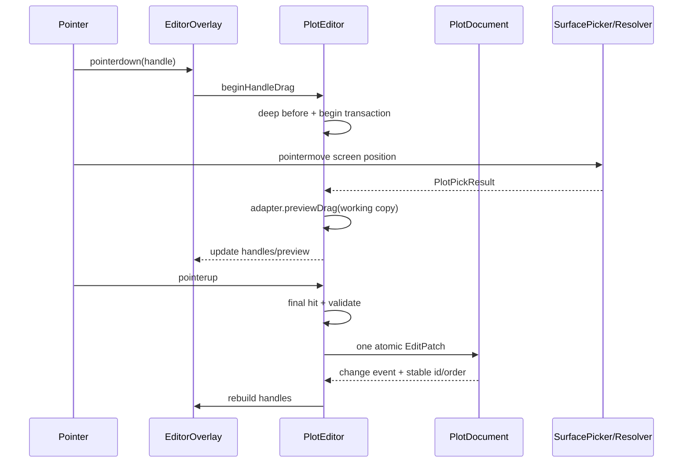

# 10. 八类图形编辑手柄与拓扑

## 目标与非目标

本文定义已提交 GIS 图形的选择、控制点 overlay、拖拽变换、参数手柄、拓扑增删和事务边界。编辑对象始终是 plot 的 author geometry 与参数；模型网格、glTF/GLB 节点、3D Tiles 内容、骨骼、材质和模型矩阵都不是编辑对象。3D Tiles 只可能作为 [08](./08-picking-surface-height.md) 的表面命中目标。

坐标、高度和经纬度全球边界以 [04. 坐标、高度与持久化模式](./04-coordinate-height-schema.md) 为准；绘制得到的 source 控制点以 [09. 八类图形绘制契约](./09-shape-drawing-contracts.md) 为准；鼠标 owner 与键盘命令分别由 [05](./05-pointer-input-and-camera.md) 和 [06](./06-keyboard-command-keymap.md) 规定。

## Cesium 对照边界：Graphics 不是编辑器

这套 handle 契约是本项目新增的 GIS 交互层，不能声称是 Cesium 已有的“模型编辑” API。Cesium 源码的职责边界很明确：

- `D:\my\explore\cesium\packages\engine\Source\DataSources\Entity.js` 和各类 `*Graphics.js` 只描述属性，并通过 visualizer/updater 同步到渲染图元；这些类没有 `getHandles`、顶点拖拽、编辑事务或撤销接口。
- `D:\my\explore\cesium\packages\engine\Source\DataSources\ModelGraphics.js` 的 `uri`、显示样式、节点变换和动画属性只控制 glTF 的运行时显示，源码没有网格顶点/索引编辑入口。它不是本项目的 plot 类型，也不进入 `ShapeEditAdapter` 注册表。
- Cesium 官方 `packages/sandcastle/gallery/drawing-on-terrain/main.js` 只是 `ScreenSpaceEventHandler -> scene.globe.pick -> CallbackProperty -> Entity` 的绘制示例；示例完成后没有通用的控制点编辑层。

因此本文出现的 `handle`、`overlay` 和 `ShapeEditAdapter` 都只针对八类 GIS 图形的 author points/参数。点击模型或 3D Tiles 时，拾取层最多返回表面命中供高度解析；不得创建模型控制点、修改节点矩阵/网格，或把命中结果转成可编辑的 plot。任何需要编辑模型实例的工具都必须位于独立模块，不能复用本编辑器的 adapter 或 history。

### 提案类型的命名对齐

总架构文档 [03](./03-target-architecture.md) 将持久记录称为 `PlotEntity`，图形字段称为 `CanonicalGraphics`；[04](./04-coordinate-height-schema.md) 使用 `GisPlotSnapshot<TOptions>` 表示带 `id/order` 的只读快照。为便于按图形类别描述手柄，本文代码块中的 `CanonicalPlotOptions` 是 `CanonicalGraphics` 的概念别名，`GisPlotSnapshot<TOptions>` 指 [04] 的快照类型，不新增第二套持久化结构。实现时应以 [03]/[04] 的正式导出名为准。

## Current：当前实现证据

当前项目已有数据 mutation，但没有可交互 handle 层：

- `../../src/lib/plot/GroundDecalManager.ts` 提供 `setCenter`、`setCoords`、`setCoord`、`insertCoord`、`removeCoord` 和 `translateCoords`，它们直接就地修改 `points`，没有 pointer session、working copy 或 rollback。
- `setCenter` 只修改 `points[0]` 的经纬度；没有统一的三维高度与 `HeightReference` 约束。
- `removeCoord` 只对 `polygon` 使用 3 点下限，其余类别统一用 2 点下限，不符合箭头、矩形、点、文本、圆和扇形的真实拓扑。
- `../../src/lib/plot/plugins/arrow.ts` 把控制点生成 `generatedCoords`，但当前 bridge/编辑层没有区分 source control points 与派生轮廓。
- `../../src/lib/plot/plugins/circle.ts`、`sector.ts` 用纬度方向近似把米换成经纬度范围；在极区或日期变更线附近不能作为编辑拖拽算法。
- `../../src/demo/draw-tool.ts` 的“撤销”只对未提交箭头 draft `pop()`，没有已提交图形的顶点手柄、中心/半径/旋转手柄或命令历史。
- `PlotPrimitiveBridge` 管理的是渲染图元，不提供可拾取的业务控制点；classification shadow volume 也不应直接作为 editor handle。

## Proposed：编辑公共接口

### Handle 身份与 overlay

```ts
export type HandleKind =
  | 'vertex'
  | 'midpoint'
  | 'center'
  | 'radius'
  | 'start-angle'
  | 'end-angle'
  | 'size'
  | 'width'
  | 'height'
  | 'rotation';

export interface PlotHandleId {
  readonly plotId: PlotId;
  readonly kind: HandleKind;
  /** 顶点/边/参数索引；无索引的中心手柄为 undefined。 */
  readonly index?: number;
}

export interface PlotHandle {
  readonly id: PlotHandleId;
  readonly position: GeoPosition;
  readonly visible: boolean;
  readonly enabled: boolean;
  readonly cursor: 'move' | 'crosshair' | 'rotate' | 'ew-resize' | 'ns-resize';
  readonly screenSizePx: number;
}

export interface ShapeEditAdapter<TOptions extends CanonicalPlotOptions = CanonicalPlotOptions> {
  readonly type: GisPlotCategory;
  getHandles(snapshot: GisPlotSnapshot<TOptions>): readonly PlotHandle[];
  beginDrag(
    snapshot: GisPlotSnapshot<TOptions>,
    handle: PlotHandleId,
    start: PlotPickResult,
    modifiers: EditModifiers,
  ): EditSession;
  previewDrag(session: EditSession, hit: PlotPickResult, modifiers: EditModifiers): EditPreview;
  commitDrag(session: EditSession): EditPatch;
  cancelDrag(session: EditSession): void;
  insertAtMidpoint?(snapshot: GisPlotSnapshot<TOptions>, edgeIndex: number): EditPatch;
  removeVertex?(snapshot: GisPlotSnapshot<TOptions>, index: number): EditPatch;
  validate(options: TOptions): DrawingValidation;
}

export interface EditSession {
  readonly plotId: PlotId;
  readonly handle: PlotHandleId;
  readonly before: GisPlotSnapshot<any>;
  readonly sourceRevision: number;
  readonly navigationLease: NavigationLease;
}

export interface EditPreview {
  readonly workingOptions: CanonicalPlotOptions;
  readonly handles: readonly PlotHandle[];
  readonly validation: DrawingValidation;
}

export interface EditPatch {
  readonly plotId: PlotId;
  readonly patch: Partial<CanonicalPlotOptions>;
}

export interface EditModifiers {
  readonly shift: boolean;
  readonly alt: boolean;
  readonly ctrl: boolean;
  readonly preserveHeight: boolean;
  readonly snapAngle?: number;
}
```

Handles是 transient overlay：不进入 `PlotDocument`、`getItem`、JSON 或 history。提交时只把 `EditPatch` 应用于 PlotDocument；history 保存 patch 前后的 deep snapshot。overlay 必须有独立 layer/pick proxy，并以稳定 render order 显示在 plot 之上。

### 一次拖拽的生命周期



固定规则：

1. pointerdown 命中 handle 后立即取得 navigation lease；相机不再响应该 pointer。
2. `before` 是 deep canonical snapshot；pointermove 只改 working copy 和 preview overlay。
3. pointerup 先 flush 最后一条 move，再校验，成功才 commit 一条 history entry。
4. `pointercancel`、`lostpointercapture`、blur、Escape、异常和 dispose 都 rollback working copy，释放 lease/capture。
5. surface async 结果必须带 plot revision；旧结果不能覆盖当前 preview。
6. 几何编辑不改变 plot `id` 或 `order`。

### 高度编辑政策

编辑器必须将水平位置与高度明确分开：

- `CLAMP_*`：所有 vertex/center/midpoint/radius 结果的 author height 强制 `0`；不显示 `height`/Up handle。
- `RELATIVE_*`：水平拖拽默认保留已有 offset；surface 采样只改变 resolved position。可选 `height` handle 或 PageUp/PageDown 改 offset。
- `NONE`：水平拖拽默认保留已有绝对高度；创建或显式启用 `followSurfaceOnDrag` 时才采用 hit 的绝对高度。Up/height handle 修改 WGS84 height。
- 贴地对象只开放地表平移、水平尺寸/顶点和 heading rotation；Up、pitch、roll 及会改变第三维的缩放必须 blocked。这与 [README](./README.md#锁定决策) 的高度解锁决策一致。

## 通用几何算法

### 顶点与中点

- `vertex(i)` 把 pointer hit 的经纬度写回第 `i` 个 source point，并按 HeightReference 归一化第三维。
- `midpoint(i)` 位于 edge `i -> (i+1)%n` 的 geodesic 中点；拖拽它时先插入一个新 source point，再继续同一事务。
- line 的中点只在相邻 segment 之间；polygon 的中点包括闭合边；rectangle 不允许通过 midpoint 改变四角数量。
- 插入后 handle index 重新编号，但 plot id/order 不变；preview 阶段不写 document。

### 中心与整体平移

中心手柄的行为取决于类别：

1. 以 `getCenterPoints()` 的语义得到 anchor/centroid；不能假定 `points[0]` 对所有类别都是中心（polygon/line 需要稳定 centroid）。
2. 将旧中心与新 surface hit 转为 WGS84 ECEF，构造旧中心的 ENU frame。
3. 对每个 source point 计算相对旧中心的 ENU east/north offset；把该 offset 施加到新中心的 ENU frame，再按 HeightReference 保留/归一化高度。
4. 对跨 IDL 或极区的 points 先用 [04](./04-coordinate-height-schema.md#连续运算经度) 的连续展开；最终每点经度再 wrap。
5. 超出局部 ENU 适用范围的超大图形改用 WGS84 geodesic displacement；不能用 `dLon/dLat` 平移。

这种“图形整体平移”只改变 GIS author coordinates，不移动场景中的模型或 tileset。

### 旋转

旋转手柄定义为绕图形 pivot 的平面 heading：

1. pivot 为显式 center 或稳定 geodesic centroid。
2. 把点投影到 pivot 的 ENU east/north；计算 pointer 相对 pivot 的 heading。
3. `delta = currentHeading - startHeading`，按 modifiers 做角度 snap（默认 15°，adapter 可覆盖）。
4. 在 ENU 平面旋转 east/north，重投影到 WGS84；height 按上节政策保持。
5. `rotation` 参数化图形（text/image/sector）直接改参数；polygon/rectangle/arrow 则改 source points，generated geometry 重新派生。

### 半径、尺寸与角度

- radius 使用 WGS84 geodesic distance，不使用纬度度数近似。
- 圆/扇形 radius handle 沿从 center 指向 pointer 的 geodesic 方向更新半径；中心不随 radius handle 改变。
- sector `start-angle`/`end-angle` 分别改 `startAngle`、`sectorAngle`；北向顺时针为正，角度归一化规则见 [09](./09-shape-drawing-contracts.md#扇形-sector)。
- point `size`/`width` handles 修改米制尺寸；image 的 width/height 可由角 handles 或属性面板修改，rotation handle 只改俯视 heading。
- text 的 box handles 只在 `boxWidth`/`boxHeight` 显式存在时启用；否则内容自适应，不能拖出隐式固定框。

## 八类图形手柄与拓扑矩阵

| 图形 | 默认 handles | 可插入/删除 | 参数/旋转 | 拓扑下限与特殊规则 |
| --- | --- | --- | --- | --- |
| point | `center`、`size`；image 另有 `width`、`height`、`rotation` | 不适用；Delete 删除实体 | size、heading | 始终一个 anchor；不生成 vertex list |
| line | 每个 `vertex`、每段 `midpoint`、`center` | midpoint 插入；vertex 删除 | 可整体 heading 旋转 | 至少 2 点；删除后不得低于 2 |
| polygon | 每个 `vertex`、闭合边 `midpoint`、`center`、`rotation` | midpoint 插入；vertex 删除 | 整体 heading 旋转 | 至少 3 点；删除/拖动不得自交或零面积 |
| rectangle | 4 `vertex`、4 `midpoint`、`center`、`rotation` | 不改变数量 | width/height、heading | 始终 4 角；相邻边保持正交，不能退化 |
| sector | `center`、`radius`、`start-angle`、`end-angle` | 不适用 | radius/start/sweep | center 一点；radius>0；sweep `(0,360]` |
| arrow | 原始 control `vertex`、允许的 `midpoint`、`center`、`rotation` | control midpoint 插入；control vertex 删除 | sizeScale、曲线体型、heading | 依 arrowType 最小点数；不能编辑 generated ring |
| text | `center`/anchor、显式 box `width`/`height`、`rotation` | 不适用；Delete 删除实体 | content/layout/box/heading | 只有一个地理 anchor；native text editor 管内容 |
| circle | `center`、`radius` | 不适用 | radius | center 一点；radius>0；无 rotation |

### 点（point）

- `center` 拖拽只改 `points[0]`。
- `size` 沿屏幕稳定方向拖拽，换算为米；image 可以分别改 width/height。
- image `rotation` 绕 anchor 的 Up 轴，顺时针 heading；circle/square 无 rotation。
- clamp 点没有 height handle；NONE/relative 可通过 `height` handle 修改第三维。

### 线（line）

- `vertex(i)` 是 source truth；箭头端装饰不是独立 handle。
- `midpoint(i)` 插入于连续经度 segment 中点；插入后可立即拖动。
- `center` 平移保留各 vertex 的 height policy；`rotation` 若启用则绕线 geodesic centroid 改所有 source points。
- 删除 vertex 先验证剩余点数和连续 segment；失败返回 `EDIT_MIN_VERTICES`。

### 多边形（polygon）

- 每个 source vertex 和闭合 edge midpoint 都可命中。
- `center` 使用稳定面积 centroid；若 polygon 自交或面积退化，回退所有点 ECEF 的平均方向并报告诊断。
- 任意 vertex/midpoint 提交前运行简单环自交和零面积检查；失败保留上一次合法 working copy。
- rotation 只改 source ring；不暴露三角化 generated vertex。

### 矩形（rectangle）

- 4 个角始终按 `southWest, southEast, northEast, northWest` 排序。
- corner 拖拽以对角 corner 为固定锚，重建两条边；side midpoint 只改变对应宽或高。
- `rotation` 绕中心旋转四角；旋转后的矩形仍保持相邻边正交且长度成对相等。
- 删除、插入和任意第五个 vertex 均禁止；Delete 键删除整个矩形实体而不是一个角。

### 扇形（sector）

- center 保持 radius/start/sweep 不变整体移动。
- radius handle 只改 `radius`。
- start/end handles 用 ENU heading 计算，更新 start/sweep；end 经过 360° 时沿连续角度，不跳变到负大角。
- 不提供 vertex deletion；删除命令作用于整个实体。

### 箭头控制点

- handles 只来自 `options.points`，`generatedCoords` 的轮廓点全部不可选。
- fine/assault 最少 2 点；attack/swallowtail 最少 3 点；curved 最少 2 点。删除若触及下限则 blocked。
- control midpoint 是否可插入由 arrowType adapter 声明：curved/attack/swallowtail 允许，fine/assault 默认不允许（它们只有起终点语义）。
- rotation/center 变换应用于 source control points，随后重算 generated ring；不会将 ring 反解成新的 control points。
- sizeScale、曲线体型参数可由属性命令修改并与 point drag 合并为同一事务。

### 文本（text）

- `center` 实际是 `points[0]` anchor；移动不改变 content/layout。
- rotation handle 修改 `rotation`；box width/height handle 只对显式 box 生效。
- F2/双击文本进入 native editor；文字内容修改遵守 [06](./06-keyboard-command-keymap.md#默认键位矩阵) 的 text scope，不把 Delete/Enter 误传给实体删除/提交命令。
- 文本框不是模型 billboard transform；它仍是 GIS text graphic 的参数。

### 圆（circle）

- center 只改 `points[0]`。
- radius handle 通过 geodesic distance 更新 `radius`；中心固定。
- 不提供 rotation、midpoint 或 vertex handle；圆周采样点是 renderer 派生几何。

## 拓扑命令

```ts
export type TopologyCommand =
  | { type: 'insert-vertex'; plotId: PlotId; edgeIndex: number }
  | { type: 'remove-vertex'; plotId: PlotId; vertexIndex: number }
  | { type: 'delete-plot'; plotId: PlotId };

export interface TopologyResult {
  readonly accepted: boolean;
  readonly error?: DrawingValidation;
  readonly nextActiveHandle?: PlotHandleId;
}
```

拓扑命令必须是原子 history transaction：

- midpoint insert 保存插入前/后的完整 points；新点默认使用 geodesic midpoint 和高度策略（clamp 0，relative 保留相邻 offset 的线性中值，NONE 取相邻绝对高度线性中值）。
- remove vertex 先按类别下限和几何验证器检查；polygon 自交修复失败则拒绝整个命令。
- 删除 plot 保存完整 snapshot（包括 id/order），undo 以原 id/order 恢复，不重新 add 生成新身份。
- handle index 在每次 topology commit 后重新计算；旧 handle id 失效，不能指向新 index。

## 全局边界处理

### 日期变更线

- handle position 到 source point 的转换使用连续展开经度；拖过 `±180°` 时屏幕拖拽连续，commit rewrap 到 `[-180,180)`。
- polygon closed edge 的 midpoint 在展开序列上求短路径；不能把 `179° -> -179°` 当成 358° 长边。
- center/rotation 使用 ECEF/ENU，不直接平均规范经度。

### 极区

- radius、center、rotation 和 translation 统一使用 WGS84 geodesic/ECEF；不使用 `1/cos(latitude)`。
- 极点处 east axis 使用 [04](./04-coordinate-height-schema.md#纬度与极区) 的确定性 fallback；同一操作重放结果必须一致。
- 纬度越界的拖拽结果先在 ECEF 中求交，若反算不合法则拒绝 preview，不写入 NaN。

## 不变量

1. handle 是 transient；只在 commit 时产生 document patch。
2. 一个 drag session 只对应一个 before/after history entry。
3. 任何编辑不改变 plot id/order。
4. clamp author height 始终为 0；surface sample 不回写。
5. 任何 source topology 约束失败都保留上一次合法 working copy。
6. generated arrow/circle/sector geometry 不可反向成为 source points。
7. pointercancel、lost capture、blur、Escape、exception 和 dispose 都 rollback 并释放 navigation lease。
8. 所有距离、中心、角度和旋转计算在连续经度和 ECEF/ENU 中完成。
9. editor overlay 不参与业务 surface raycast，不会把模型/tileset 变成可编辑对象。
10. 提交 patch 的 options 经过 [04](./04-coordinate-height-schema.md#输入归一化与验证算法) canonical normalize，不能绕过验证器。

## 失败路径

| 失败 | 必须行为 |
| --- | --- |
| handle pointerdown 未命中或 plot 已删除 | 不建立 session，返回 `EDIT_HANDLE_NOT_FOUND` |
| 拖拽命中天空/不允许 surface | 保持最后合法 preview；pointerup 不提交 |
| clamp 拖拽产生非零 height | 归一为 0（实时 API）或严格 patch 拒绝，并报告 `EDIT_CLAMP_HEIGHT` |
| polygon 自交/零面积 | preview 标记 invalid，commit rollback，不清除 draft |
| 删除低于类别最小点数 | blocked，history 不增加 |
| rectangle corner 破坏正交/顺序 | 重建候选四角失败则保留旧四角 |
| sector angle 跨 360° 数值跳变 | 用连续角度重算；仍非法则 `EDIT_INVALID_ANGLE` |
| arrow 试图编辑 generated ring | 返回 `EDIT_DERIVED_GEOMETRY_READONLY` |
| text 输入占用 Delete/Enter | native scope 消费，plot edit 不响应 |
| surface resolver 迟到/过期 | 依据 id+revision 丢弃，不覆盖 working copy |
| pointercancel/blur/dispose | rollback、release capture/lease、销毁 overlay，幂等 |

## 验收项

- [ ] 八类图形的 handle 集合、启用条件和拓扑矩阵与本文一致。
- [ ] point/image 的 center/size/rotation、line/polygon 的 vertex/midpoint/center、rectangle 四角约束、sector/circle radius、text box/rotation、arrow control points 均可预览和提交。
- [ ] polygon/line/arrow 的 vertex insert/remove 遵守各自最小点数；rectangle/circle/sector/text/point 不会误删单点拓扑。
- [ ] arrow 只编辑 source control points，generatedCoords 重新派生且不可命中。
- [ ] 一个连续拖拽只生成一条 history；Escape、pointercancel、blur 和异常零提交并恢复相机。
- [ ] clamp 模式拖拽任意 vertex/center/radius/rotation 后 author height 仍为 0；relative/absolute 高度策略符合 [04](./04-coordinate-height-schema.md#高度编辑政策)。
- [ ] midpoint 插入的 height、经度和 index 确定性一致；undo/redo 恢复原 id/order。
- [ ] 跨日期变更线、极区和超大经度跨度编辑不跳变、不绕全球、不产生 NaN。
- [ ] handle overlay 不会被 surface picker 命中；3D Tiles/model 只能作为表面，不出现模型控制点。
- [ ] dispose 后没有 overlay、pointer capture、navigation lease、resolver request 或事件监听泄漏。

## 交叉链接

- 坐标、高度和全球边界：[04-coordinate-height-schema.md](./04-coordinate-height-schema.md)
- surface pick/异步高度：[08-picking-surface-height.md](./08-picking-surface-height.md)
- 八类绘制最小点数与 source/derived 规则：[09-shape-drawing-contracts.md](./09-shape-drawing-contracts.md)
- 指针 capture 与相机 lease：[05-pointer-input-and-camera.md](./05-pointer-input-and-camera.md)
- 键盘拓扑/删除/撤销：[06-keyboard-command-keymap.md](./06-keyboard-command-keymap.md)
- 状态机与事务：[07-editor-state-machine.md](./07-editor-state-machine.md)
- 选择、组变换和高度解锁：[11-selection-transform-gizmo.md](./11-selection-transform-gizmo.md)
- rendering overlay 生命周期：[12-rendering-overlay-integration.md](./12-rendering-overlay-integration.md)
- 公共 API、history、JSON：[13-public-api-history-persistence.md](./13-public-api-history-persistence.md)
