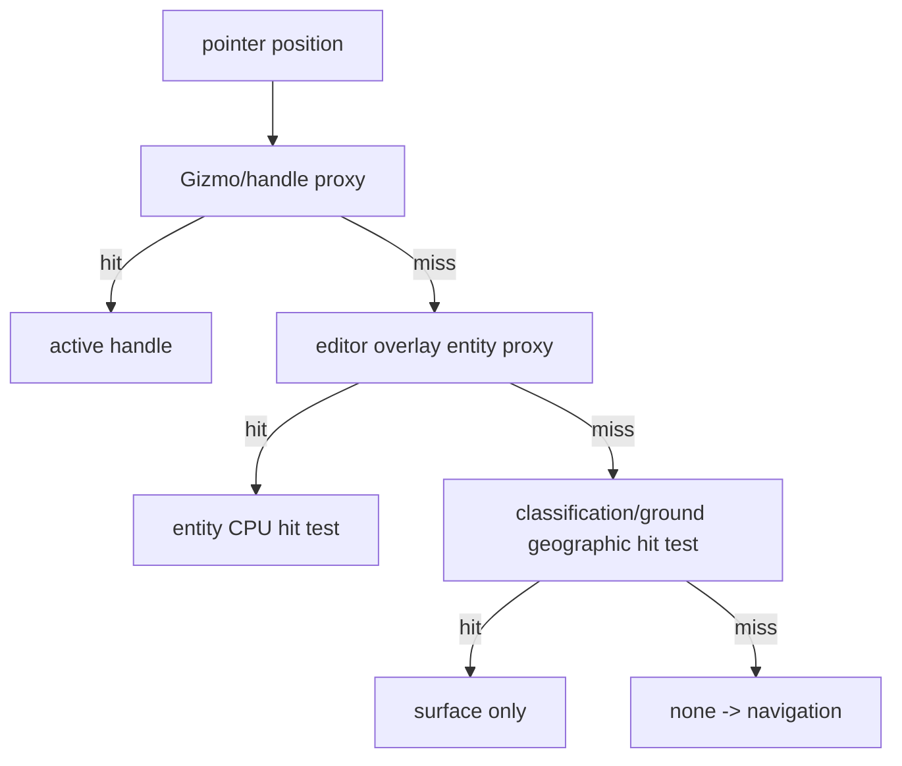
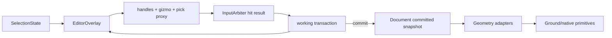

# 11. 选择、框选与 ENU Transform Gizmo

本文定义 GIS 图形实体的单选、多选、框选、命中优先级、控制点和三轴 Gizmo。编辑对象是点、线、多边形、矩形、扇形、箭头、文本、圆以及后续非模型 Cesium Graphics；不编辑 glTF 网格、节点拓扑或 3D Tiles 内容。

输入 owner/capture 与相机互斥见 [05-pointer-input-and-camera.md](./05-pointer-input-and-camera.md)，键盘命令见 [06-keyboard-command-keymap.md](./06-keyboard-command-keymap.md)，共同 transaction 生命周期见 [07-editor-state-machine.md](./07-editor-state-machine.md)。高度参考、规范三元坐标和实体文档见 [03-target-architecture.md](./03-target-architecture.md)。

## 1. Current 证据与问题

当前项目没有可编辑选择层：

- `src/lib/plot/GroundDecalManager.ts:185-238` 只创建图形，`:309-421` 暴露 setter/translate；没有 selection set、hit target、active handle 或事务。
- `src/demo/draw-tool.ts:352-390` 只把左键 click 反投影为采点，没有 hover、命中实体、控制点拖拽、单选/多选或框选。
- `src/lib/plot/PlotPrimitiveBridge.ts` 的贴地图元使用 classification 路径；当前 classification/RTE 几何没有普通 Three.js Raycaster 可直接消费的标准实体 `position` attribute，且贴地图层可设为 non-pickable。直接 `raycaster.intersectObject()` 不能成为选择协议。
- `src/lib/ground/classification-depth.ts` 负责 terrain/tileset 深度贡献，不是编辑器 selection owner。

因此 v1 使用“CPU 地理命中 + 独立可拾取 overlay/pick proxy”：渲染图元负责显示，editor overlay 负责 handle、实体 ID 和 Gizmo 命中。

## 2. 选择数据结构

```ts
export interface SelectionState {
  /** 稳定、去重、按 document order 排序。 */
  readonly ids: readonly string[];
  /** 多选变换 pivot 的主实体；单选时必为 ids[0]。 */
  readonly primaryId?: string;
  readonly activeHandleId?: string;
  readonly hoverTarget?: HitTarget;
}

export type SelectionOperation =
  | { readonly kind: 'replace'; readonly ids: readonly string[] }
  | { readonly kind: 'add'; readonly ids: readonly string[] }
  | { readonly kind: 'toggle'; readonly id: string }
  | { readonly kind: 'clear' };

export interface SelectionFilter {
  readonly visibleOnly?: boolean;       // default true
  readonly editableOnly?: boolean;      // default true
  readonly lockedOnly?: boolean;
  readonly selectThrough?: boolean;     // default false
  readonly typeAllowList?: readonly string[];
}

export interface HitTarget {
  readonly kind: 'entity' | 'vertex' | 'midpoint' | 'gizmo' | 'surface' | 'none';
  readonly entityId?: string;
  readonly handleId?: string;
  readonly distanceCssPixels: number;
  readonly depth?: number;
  readonly zOrder?: number;
}
```

选择顺序是确定性的：先按屏幕距离，再按 overlay priority，再按 document order。selection ids 始终去重；primaryId 只能指向 ids 中现存且可编辑的实体。隐藏、锁定、删除或外部替换实体时，selection 自动清理，但 selection 清理不产生 history。

## 3. 命中与选择优先级



命中优先级固定为：

1. 当前选中实体的 Gizmo 轴、旋转环和中心 handle；
2. 当前选中实体的 vertex/midpoint handle；
3. 可编辑 entity proxy；
4. CPU 地理命中结果；
5. surface/none。

handle 命中半径使用 CSS 像素（默认 8 px，触摸 14 px），并保持稳定屏幕尺寸；不能随着地球 ECEF 距离直接缩放到不可点选。实体命中先过滤 `visible && editable && !locked`，再按 depth/priority 选择最前对象。`selectThrough=true` 只由宿主明确开启，用于框选多个被遮挡图形；默认 false。

### 3.1 CPU 命中规则

- point/text：投影 anchor 与屏幕 hit radius 距离。
- line/arrow：对每条控制线段做屏幕点到线段距离，箭头命中基于原始控制线和 adapter 的 stroke width。
- polygon/rectangle/circle/sector：先做投影 bounds，再做 winding/扇形角度/半径检查。
- classification 图元：以 canonical lon/lat/height 进行地理命中，不把 classification mesh 当普通 Three Object3D 选择。
- 高度实体：优先使用 editor pick proxy 的深度；proxy 不存在时使用 CPU 几何与屏幕深度近似，并标记 `depthApproximate=true`。

日期变更线附近的经度使用最短展开差，极区命中在局部 ENU 平面完成，不能直接把 `lon` 当无限平面 x。

## 4. 鼠标与键盘选择协议

| 操作 | 默认输入 | 结果 |
| --- | --- | --- |
| 单选 | 主键 click entity | replace selection，primary=该实体 |
| 追加 | Shift+主键 click | add entity，primary=最近点击实体 |
| 切换 | Primary+主键 click | toggle entity；移除 primary 时选择最后一个剩余项 |
| 清空 | 空白主键 click；无 transaction 时 Escape | clear |
| 替换框选 | Primary+空白主键 drag | 命中框内实体后 replace |
| 追加框选 | Primary+Shift+空白主键 drag | 命中框内实体后 add |
| 删除 | Delete | 删除 active vertex；否则删除 selection |
| 全选 | Primary+A | 所有可见、可编辑、未锁定实体 |
| 循环命中 | `[`/`]`（可选 host binding） | 在同一点的候选实体中前后循环，不改变默认浏览器快捷键 |
| 文本编辑 | F2 | text 实体进入 text-edit；其他类型 blocked |

普通空白左拖不框选，继续交给 `GlobeControls` 平移；这样不会破坏 Current 导航。框选必须有 Primary 前缀，capture 阶段才可暂停相机。Shift 作为选择追加只在 click/box-select context 解释，进入 transform 后由约束规则解释。

## 5. 框选几何

框选 session 保存起点和当前点，overlay 使用稳定的 screen-space rectangle。pointerup 时计算 `minX/minY/maxX/maxY`，不受拖拽方向影响。默认选择模式为 `intersects`：实体投影 bounds、线段或 anchor 与矩形相交即可入选；宿主可以切换 `contains`，要求所有可见控制点都在框内。

```ts
export interface BoxSelectionOptions {
  readonly mode: 'intersects' | 'contains'; // default intersects
  readonly filter: SelectionFilter;
  readonly maxCandidates?: number;         // default 10_000
}
```

框选必须使用同一帧的 camera matrix 和 viewport snapshot；相机在 editor-owned box session 中被 lease 锁定，不能一边框选一边改变投影。超过 `maxCandidates` 时按 document order 截断并报告 `BOX_SELECTION_LIMIT`，不能卡死主线程。

## 6. Gizmo 公共契约

```ts
export type GizmoAxis = 'east' | 'north' | 'up' | 'uniform';
export type GizmoRotation = 'heading' | 'pitch' | 'roll';
export type GizmoHandleKind =
  | 'translate-axis'
  | 'translate-plane'
  | 'rotate-ring'
  | 'scale-axis'
  | 'scale-uniform'
  | 'vertex'
  | 'midpoint'
  | 'center'
  | 'radius'
  | 'angle';

export interface GizmoCapabilities {
  readonly translateEast: boolean;
  readonly translateNorth: boolean;
  readonly translateUp: boolean;
  readonly rotateHeading: boolean;
  readonly rotatePitch: boolean;
  readonly rotateRoll: boolean;
  readonly scaleHorizontal: boolean;
  readonly scaleVertical: boolean;
  readonly editVertices: boolean;
}

export interface TransformSession {
  readonly transactionId: string;
  readonly pivotEcef: readonly [number, number, number];
  readonly east: readonly [number, number, number];
  readonly north: readonly [number, number, number];
  readonly up: readonly [number, number, number];
  readonly capabilities: GizmoCapabilities;
  readonly selectedIds: readonly string[];
  readonly axis?: GizmoAxis;
  readonly rotation?: GizmoRotation;
}
```

### 6.1 Gizmo 轴和姿态

Gizmo 在选中 pivot 的局部 ENU frame 中绘制：

- East 轴：X，平移/水平 scale；
- North 轴：Y，平移/水平 scale；
- Up 轴：Z，垂直平移/垂直 scale；
- heading ring：绕 Up/Z；
- pitch ring：绕 East/X；
- roll ring：绕 North/Y；
- center handle：自由平移；uniform handle：等比缩放。

single selection 的 pivot 由 adapter 提供（点为 position，footprint 为中心，文本为 anchor）。multi selection 的 pivot 为选中实体 anchor 的 ECEF 平均方向投影到椭球表面；若向量长度接近 0（例如近似对跖点），回退 primary entity anchor，并报告 `PIVOT_FALLBACK_PRIMARY`。pivot 的 ENU basis 每次相机帧不重建，只有 selection 或 pivot 改变时更新。

### 6.2 多选变换

多选变换采用一套刚性 pivot 变换：

1. 将每个实体的 author coordinates 从 `[lon,lat,height]` 转为 ECEF。
2. 以 pivot ECEF 和 ENU basis 建立局部坐标。
3. 在局部坐标应用平移/旋转/scale matrix。
4. 转回 ECEF，再转回 geodetic 三元坐标。
5. 对每个 entity 运行 adapter constraint；若任一实体不支持所请求变换，整个 transaction blocked/rollback，不部分应用。

这种做法在日期变更线和极区不依赖经度差的符号；提交时统一将 longitude 归一到 `[-180,180)`。大范围选择仍保持数学确定，但宿主可以对跨越极大 chord 的组给出 UX 警告。

## 7. 贴地与高度能力

所有输入和输出都是 `[longitude, latitude, height]`。贴地不是“没有 height”，而是：

```text
heightReference ∈ CLAMP_TO_GROUND | CLAMP_TO_TERRAIN | CLAMP_TO_3D_TILE
=> authored height = 0
=> render-time surface height 由 SurfaceHeightResolver 解析
```

### 7.1 Gizmo capability 矩阵

| heightReference | East/North 平移 | Up 平移 | heading | pitch/roll | vertical scale |
| --- | ---: | ---: | ---: | ---: | ---: |
| `NONE` | 开 | 开 | 开 | 开（adapter 支持时） | 开（adapter 支持时） |
| `RELATIVE_TO_GROUND` | 开 | 开 | 开 | 开（adapter 支持时） | 开（adapter 支持时） |
| `RELATIVE_TO_TERRAIN` | 开 | 开 | 开 | 开（adapter 支持时） | 开（adapter 支持时） |
| `RELATIVE_TO_3D_TILE` | 开 | 开 | 开 | 开（adapter 支持时） | 开（adapter 支持时） |
| `CLAMP_TO_GROUND` | 开 | 禁用 | 开 | 禁用 | 禁用 |
| `CLAMP_TO_TERRAIN` | 开 | 禁用 | 开 | 禁用 | 禁用 |
| `CLAMP_TO_3D_TILE` | 开 | 禁用 | 开 | 禁用 | 禁用 |

贴地对象被禁用的 handle 必须保持 visible=false、raycast=false，并在 keyboard command 返回 `blocked`；不能显示可拖但最终无效的 Up/pitch/roll 控件。多选中只要有一个对象禁用某能力，组 Gizmo 对应能力整体禁用，保证原子事务。

显式从 clamp 切换到 absolute/relative 时，先以当前 surface resolved height bake 变换基准，再解锁 Up/pitch/roll；切回 clamp 时 authored height 全部重置为 0，surface height 不写入 history。

## 8. 变换数学与约束

### 8.1 平移

- East/North drag 在 pivot 切平面投影 pointer ray，得到米制 delta；不要用固定 `111320` 近似 lon/lat。
- Up drag 使用 camera ray 与 Up axis 的最近点；不能在极低视角时用屏幕 y 直接当米。
- 贴地 East/North 平移后，对每个顶点重新请求对应表面高度，但 author height 仍为 0。

### 8.2 旋转

- heading 角在局部 Up 轴上应用；默认以 15° snap，Alt 按住时关闭 snap。
- pitch/roll 仅在能力矩阵开放时启用；旋转矩阵应用于实体姿态和相对顶点，不改变 heightReference。
- 旋转过程中使用 shortest-angle unwrap，避免跨 `±180°` 跳变。

### 8.3 缩放

- uniform scale 必须为正且受 adapter 最小/最大范围限制。
- horizontal scale 对 footprint 以 pivot ENU 平面计算；经度/纬度只在最终转换阶段生成。
- vertical scale 对体/挤出图形才有意义；贴地 footprint 永久禁用。

### 8.4 键盘微调

`06-keyboard-command-keymap.md` 的 Arrow/PageUp/PageDown 直接调用相同 transform adapter；每次 nudge 的米制 delta 先在 pivot ENU 计算，再按上述 ECEF/geodetic 流程更新。重复按键合并为一个 transaction，Enter commit、Escape rollback。

## 9. Handle 与 overlay 渲染

Editor overlay 与 classification primitive 分离：

- handle、Gizmo 和 pick proxy 使用独立 render layer/scene，带 `entityId`、`handleId`、`priority`。
- handle 的屏幕尺寸稳定，最小命中半径 8 CSS px（touch 14 px），不能因为地球尺度缩小到零。
- hover、selected、active drag 三种视觉状态互斥且可区分；active handle 不能被实体 body proxy 遮住。
- overlay 的深度策略由 `depthTest` + depth texture 采样控制；选择时要先过滤不可编辑 3D Tiles/model reference。
- selection outline 和 hover preview 不写入 `PlotDocument`，dispose 时移除所有 geometry/material/texture。



## 10. 选择和变换失败路径

| 失败 | 行为 |
| --- | --- |
| 命中 classification mesh 但无 entity proxy | 只返回 surface，不能伪造可编辑 entity |
| handle 被遮挡或离屏 | hit test 失败，保持 selection，不启动 drag |
| 选中实体被隐藏/锁定/删除 | 从 selection 清理；active transaction rollback |
| 多选包含不兼容 adapter | 整个组 command blocked，报告不兼容类型 |
| 多选 pivot 近似对跖 | 回退 primary anchor，发 warning，不使用 NaN basis |
| ENU basis 在极点退化 | 使用椭球法线和稳定经度参考构造正交 frame；失败则 `PIVOT_FRAME_INVALID` 并 rollback |
| 日期变更线跨越 | longitude 先连续展开，提交时归一；不产生 360° 跳跃 |
| 地形/tileset 尚未加载 | 保持 pending surface；不静默改为错误 heightReference |
| clamp 尝试 Up/pitch/roll | command blocked；坐标和 authored height 不变 |
| scale 结果 <= 0 或超范围 | 保持 working，显示 validation error，不能提交 |
| pointercancel/blur/dispose | rollback、释放 lease、清理 overlay |

## 11. 不变量

1. `SelectionState.ids` 唯一、稳定排序；`primaryId` 必须属于 ids。
2. 所有 Gizmo 变换都在 pivot ENU/ECEF 中计算，禁止固定 lon/lat 米换算。
3. 每次变换是原子事务；不允许组内部分实体提交。
4. 贴地 heightReference 的 authored height 永远为 0；resolved terrain height 不进入 author snapshot。
5. 禁用的 Up/pitch/roll handle 不可见、不可拾取、不可通过键盘命令执行。
6. 选择和 hover 不写 history；实体删除和变换各写一条 history。
7. overlay pick proxy 的 ID 必须能反查到当前 document revision；过期 proxy 命中必须丢弃。
8. 任何失败都保留 committed document 不变，并释放输入/相机资源。
9. `G/R/S`、`X/Y/Z` 和 Arrow/PageUp/PageDown 走与鼠标 Gizmo 相同的 adapter 约束。
10. 经度最终规范为 `[-180,180)`，纬度在 `[-90,90]`，高度单位为米。

## 12. 验收项

- [ ] 单选、Shift 追加、Primary toggle、空白清除和 Primary 框选结果稳定可重复。
- [ ] Gizmo handle 命中优先于 entity body，entity body 优先于 surface/navigation。
- [ ] 单选和多选的 ENU pivot 可拖拽、旋转、缩放；跨日期变更线不跳变。
- [ ] 极区、经度环绕和近似对跖多选不会产生 NaN 或异常角度跳变。
- [ ] clamp 对象只有 East/North/heading 和允许的水平参数手柄；Up/pitch/roll/vertical scale 完全禁用。
- [ ] 切换到 absolute/relative 后 Up/pitch/roll 可用；切回 clamp 将 authored height 归零。
- [ ] classification 图元不会被普通 Raycaster 误选；pick proxy 能返回 entityId/handleId。
- [ ] 鼠标 drag、键盘 nudge 和 G/R/S 变换各自产生一条 history，Escape 可完整回滚。
- [ ] 删除 active vertex 遵守 adapter 最小点数、自交和孔洞约束。
- [ ] 隐藏、锁定、外部删除或 revision 冲突不会留下 stale selection/handle。
- [ ] Playwright 覆盖单选、多选、框选、三轴拖拽、轴约束、贴地禁用、撤销重做和 dispose 资源检查。

## 13. 交叉链接

- 指针 owner、capture、拖拽阈值和相机 lease：[05-pointer-input-and-camera.md](./05-pointer-input-and-camera.md)
- 键盘命令、焦点和默认 keymap：[06-keyboard-command-keymap.md](./06-keyboard-command-keymap.md)
- 编辑器 reducer、commit/rollback 和异步 revision：[07-editor-state-machine.md](./07-editor-state-machine.md)
- Cesium 源码依据：[01-cesium-source-reference.md](./01-cesium-source-reference.md)
- 当前项目审计：[02-current-project-audit.md](./02-current-project-audit.md)
- 目标架构与公共实体：[03-target-architecture.md](./03-target-architecture.md)
