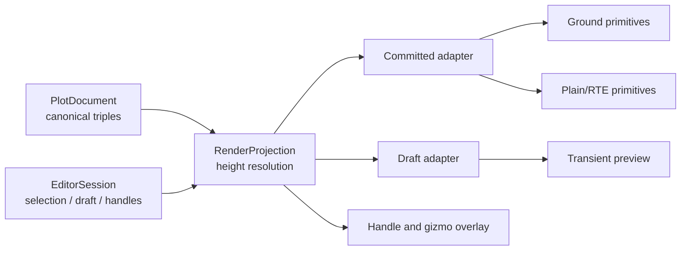

# 渲染与编辑 Overlay 集成

> 状态：**Proposed**。本文描述目标实现，不表示当前仓库已经具备编辑 Overlay。
> 前置阅读：[目标架构](./03-target-architecture.md)、[坐标与高度](./04-coordinate-height-schema.md)、[拾取与表面高度](./08-picking-surface-height.md)。

## 1. 目标

编辑器必须在不破坏现有 Ground 渲染管线的前提下，同时显示四类内容：已提交图形、绘制草稿、编辑控制点和选择/变换反馈。本文定义领域文档到现有图元的投影边界、Overlay 场景结构、每帧调用顺序、更新策略、拾取隔离和资源生命周期。

核心原则是：**编辑器拥有文档和交互状态，渲染层只拥有可丢弃的投影与 GPU 资源**。任何渲染重建、瓦片卸载或 WebGL context 恢复都不得反向修改 canonical 文档。

## 2. Current：现有渲染事实

当前仓库已有八类标绘数据和两条渲染路径，但尚无通用编辑 Overlay。

| 位置 | 已有能力 | 与编辑器的差距 |
| --- | --- | --- |
| `src/lib/plot/plugins/types.ts` | 定义 point、line、polygon、rectangle、sector、arrow、text、circle；顶点仍为 `[lon, lat]` | 目标 schema 必须统一为 `[lon, lat, height]` 并显式携带 `heightReference` |
| `src/lib/plot/GroundDecalManager.ts` | 持有图形 Map，提供增删、坐标/样式更新，并通过 RAF 合并 redraw | 无草稿隔离、选择状态、事务历史或编辑事件 |
| `src/lib/plot/PlotPrimitiveBridge.ts` | 按几何/样式签名选择重建或轻量更新；统一 `update(frameState)` | 只投影正式图形，未区分 committed/draft/handles/gizmo |
| `src/lib/plot/PlainPlotPrimitive.ts` | `clampToGround === false` 时构造普通 Three 图元并用 RTE 保持大坐标精度 | 使用单一 `heightMeters`，尚未消费逐顶点高度和七值高度参考 |
| `src/lib/ground/*` | classification、packed depth、RTE、log depth、stencil 和多类 Ground primitive | Ground 图元是显示能力，不是编辑状态容器 |

当前 `vite.lib.config.ts` 和 `package.json` 只发布根入口、`./ground` 与 `./arrow`；`src/lib/plot` 仍是内部模块。首次实现编辑器前不得把文档里的 Proposed API 描述成已发布入口。

## 3. 目标场景结构

编辑器为每个 viewport 创建一个 `EditorOverlayRenderer`，其内部挂载固定分组，分组顺序不随选中数量变化：

```text
scene
├── host terrain / 3D Tiles / ordinary objects
├── plotCommittedRoot       已提交图形的渲染投影
├── plotDraftRoot           当前绘制或变换预览
├── plotSelectionRoot       轮廓、高亮、框选矩形
├── plotHandleRoot          顶点、中点、半径、角度控制点
└── plotGizmoRoot           ENU 平移/旋转/缩放 Gizmo
```

这些节点不是文档层级，禁止将它们序列化。`plotDraftRoot` 只消费当前 transaction 的 working copy；提交后由 document change 触发 committed 投影，随后清空 draft。取消时直接丢弃 draft，不触碰 committed 图元。



## 4. 领域对象与渲染 DTO 的边界

渲染层不得直接保存或修改 `PlotFeature`。统一通过纯函数生成 DTO：

```ts
// Proposed API：名称可在实现阶段调整，语义不可改变。
interface PlotRenderProjection {
  projectFeature(
    feature: Readonly<PlotFeature>,
    context: ProjectionContext,
  ): RenderFeature;
}

interface ProjectionContext {
  revision: number;
  resolvedSurface: ReadonlyMap<VertexKey, SurfaceSample>;
  preview?: Readonly<EditorWorkingCopy>;
}

interface RenderVertex {
  longitude: number;
  latitude: number;
  authorHeight: number;
  resolvedWorldHeight: number;
}

interface RenderFeature {
  id: string;
  type: PlotFeatureType;
  heightReference: HeightReference;
  vertices: readonly RenderVertex[];
  style: Readonly<PlotStyle>;
  revision: number;
}
```

`authorHeight` 来自持久数据；`resolvedWorldHeight` 是当帧/当前表面版本的派生值。对于所有 CLAMP 值，`authorHeight` 必须为 `0`；对 RELATIVE 值，世界高度为表面高度加 author height；对 `NONE`，世界高度就是 author height。任何 Ground/Plain adapter 都只能读取 `resolvedWorldHeight`，不能写回 feature。

### 4.1 旧 Plot 结构适配

迁移期保留一个单向 `LegacyPlotRenderAdapter`：

- 可由 canonical feature 生成当前 `GisPlot*Options`，不允许反向持有其可变引用；
- 只有在现有接口无法表达逐顶点高度时才进入新的 primitive adapter；
- CLAMP 到地形/3D Tiles/BOTH 映射到现有 `clampToGround` 与 `classificationType`；
- `NONE` 且所有顶点等高时，可暂时映射到 `heightMeters`；逐顶点不同高度必须走新实现，不能取平均值伪装；
- 每次适配都保留 feature id，禁止继续依赖模块级自增 id 作为持久标识。

## 5. Overlay 渲染层与拾取层

编辑器需要显式划分 Three `Layers`，具体数字由实现集中配置，文档只锁定语义：

| Layer | 是否写颜色 | 是否参加业务拾取 | 是否参加相机 raycast | 用途 |
| --- | --- | --- | --- | --- |
| `PLOT_CONTENT` | 是 | 是 | 否 | 已提交与草稿图形的 pick proxy |
| `PLOT_HANDLE` | 是 | 是，最高优先级 | 否 | 控制点和中点 |
| `PLOT_GIZMO` | 是 | 是，次高优先级 | 否 | ENU Gizmo |
| `PLOT_FEEDBACK` | 是 | 否 | 否 | 框选、悬停轮廓、非法预览提示 |
| `HOST_SURFACE` | 宿主决定 | 仅 SurfacePicker | 是 | terrain / 3D Tiles / 椭球面 |

Ground classification 的内部 shadow-volume/debug mesh 已在当前实现中避免进入默认 raycast；编辑器仍要使用专用 `Raycaster.layers`，不能依赖场景对象碰巧不可拾取。可见图元与 pick proxy 可以不同：过细线、透明面和屏幕恒定大小的手柄应使用单独、不可见但有稳定命中宽度的 proxy。

命中优先级固定为：活动控制点 > Gizmo > 选中图形 > 未选中图形 > 表面。深度相近时按屏幕距离、显式 z-order、稳定 id 排序，避免同一位置每帧抖动切换目标。

## 6. 更新策略

### 6.1 三种更新级别

| 级别 | 触发条件 | 行为 |
| --- | --- | --- |
| Uniform/状态热更新 | hover、selected、visible、支持热改的颜色/透明度 | 保留 geometry/material，原位更新 uniform 或 object 状态 |
| Geometry patch | 顶点移动且 primitive 支持 buffer 原位写入 | 更新 attribute、包围体和 pick proxy，不更换对象标识 |
| Full rebuild | 拓扑变化、类型变化、高度路径变化、当前 primitive 不支持 patch | 先创建新资源，成功后原子替换并 dispose 旧资源 |

现有 `PlotPrimitiveBridge` 的几何签名/样式签名机制可以作为 committed adapter 的起点，但目标实现必须从 `JSON.stringify` 全量签名迁移到 `feature.revision + dirtyFlags`，避免大图形拖拽时每个 pointermove 序列化全部顶点。

### 6.2 脏标记

```ts
const enum RenderDirtyFlag {
  None = 0,
  Transform = 1 << 0,
  Geometry = 1 << 1,
  Topology = 1 << 2,
  Style = 1 << 3,
  HeightResolution = 1 << 4,
  Visibility = 1 << 5,
  Picking = 1 << 6,
}
```

一次编辑 intent 可以产生多个 dirty flag，但一个 animation frame 内每个 feature 最多同步一次。拖拽中只更新 working copy 与 draft 投影；提交后 committed feature 只发生一次 revision 递增。

## 7. 每帧集成顺序

宿主拥有唯一渲染循环。编辑器不得启动自己的永久 `requestAnimationFrame`：

```text
1. host 更新相机、tiles 和 viewport
2. depth manager 渲染 terrain / 3D Tiles packed depth
3. SurfaceHeightResolver 交付已完成的异步采样结果
4. PlotEditor.flushIntents()
5. OverlayRenderer.sync(documentRevision, sessionRevision)
6. GroundDecalManager / Ground primitive update(frameState)
7. handle/gizmo 更新屏幕恒定尺寸和遮挡状态
8. renderer.render(scene, camera)
```

交互事件只入队 intent 并调用宿主提供的 `requestRender(reason)`。在按需渲染模式下，以下事件必须请求一帧：pointer move 命中变化、键盘 held tick、surface sample 完成、历史跳转、相机 change、viewport resize 和异步纹理完成。

```ts
interface EditorRenderHost {
  scene: THREE.Scene;
  camera: THREE.Camera;
  canvas: HTMLCanvasElement;
  requestRender(reason: EditorRenderReason): void;
  getFrameState(): CesiumGroundFrameState;
}
```

## 8. 草稿、选择与控制点样式

- 草稿使用独立 material 实例或只读共享模板加独立 uniforms，不改正式图形 material；
- 非法草稿继续可见，但使用错误样式且 `Enter` 不可提交；不得通过隐藏错误来制造成功假象；
- 控制点和 Gizmo 采用屏幕恒定尺寸，CSS 像素尺寸乘 `devicePixelRatio` 后计算射线容差；
- 被地表遮挡的普通控制点可淡化，但活动控制点在拖拽期间必须保持可见；
- selection outline 不修改业务 style，不应进入 undo；
- 多选时只显示整体包围/枢轴 Gizmo，顶点控制点仅在单个 feature 进入 vertex edit 后出现。

## 9. Ground、Terrain 与 3D Tiles 的职责

terrain 和 3D Tiles 只提供拾取、贴附、遮挡和分类深度。编辑器不创建 tileset 内容的编辑句柄，也不写 glTF/3D Tiles 元数据。`ModelGraphics`、Three mesh 顶点、材质节点和骨骼均不进入本 Overlay。

高度参考决定渲染路径，不能由“当前是否拾取到模型”隐式改变：

| 高度参考 | 表面来源 | 建议路径 |
| --- | --- | --- |
| `NONE` | 无 | Plain/RTE，按 author height |
| `CLAMP_TO_GROUND` / `RELATIVE_TO_GROUND` | terrain 与 3D Tiles 的统一策略 | classification 或 resolved world geometry |
| `CLAMP_TO_TERRAIN` / `RELATIVE_TO_TERRAIN` | terrain | terrain depth / resolved world geometry |
| `CLAMP_TO_3D_TILE` / `RELATIVE_TO_3D_TILE` | 3D Tiles | tiles depth / resolved world geometry |

如果目标深度通道暂不可用，渲染层优先沿用上一次有效 sample。`GROUND`/`TERRAIN` 首次无样本时可用明确的椭球 fallback 并把 `surfacePending` 暴露给 UI；`3D_TILE` 首次无样本时必须标记 `unavailable` 并隐藏，不得回退到 terrain 或椭球。任何 fallback 高度都不得写回文档。

## 10. 资源与生命周期

`EditorOverlayRenderer.dispose()` 必须幂等，并按以下顺序执行：

1. 从场景移除所有 overlay root，阻止后续 render 访问；
2. 取消订阅 document、session、camera、resize 和 depth source；
3. 取消尚未完成的纹理/表面请求或使其 generation token 失效；
4. 释放自有 geometry、material、render target 和自有 texture；
5. 清空 id 到 render entry、pick proxy 和 surface sample 的映射；
6. 不释放宿主 scene、camera、renderer、terrain/tiles depth texture 或调用方传入的 borrowed texture。

Full rebuild 必须先成功构建候选资源再替换。构建失败时保留旧图元、记录可诊断错误，并保持文档 revision 不变。WebGL context 恢复后允许从 canonical document 全量重建；不需要从 GPU 对象反推状态。

## 11. 失败路径

| 失败 | 必须行为 |
| --- | --- |
| 图形投影数据非法 | 不创建/不替换正式图元；草稿显示错误反馈；返回 feature id 与字段路径 |
| surface sample 过期 | generation/revision 不匹配时丢弃，不请求历史命令 |
| primitive 构建或 shader 编译失败 | 保留上一成功投影，发出 `rendererror`，不得部分替换 |
| 纹理加载失败 | 使用明确占位或错误样式，保留可编辑锚点 |
| tiles 暂时卸载 | 保留 author 数据与选择，标记 surface pending，加载后重新投影 |
| canvas resize/DPR 变化 | 下一帧重算 pick tolerance、手柄尺寸和 viewport uniform |
| dispose 后迟到回调 | generation token 拒绝回调，不访问 scene 或事件目标 |

## 12. 不变量

1. GPU/Three 对象永远不是文档真相源。
2. 草稿、hover、selection、handle、gizmo 不进入序列化和 undo 数据。
3. 贴地图形的采样高度永不回写 canonical `[lon, lat, 0]`。
4. 一个 viewport 可销毁并从同一文档重建，不改变 feature id、revision 或历史。
5. 相机控制器的默认 raycast 不命中编辑 overlay；编辑器拾取只使用专用 layer。
6. terrain/3D Tiles 内容只读，不生成模型编辑入口。
7. 所有宿主资源均为 borrowed，只有编辑器创建的 GPU 资源由编辑器释放。

## 13. 验收项

- [ ] 八类已提交图形、草稿、控制点、选择反馈和 Gizmo 可同时显示且 z-order 稳定。
- [ ] 取消绘制/拖拽后，committed 图元及其 revision 完全不变。
- [ ] CLAMP 图形在 surface sample 变化时只更新渲染投影，导出的 author height 仍为 `0`。
- [ ] 拖动一个顶点期间每帧最多同步一次该 draft，不对全部文档做 `JSON.stringify`。
- [ ] overlay 对象不会被 `GlobeControls` 相机 raycast 命中。
- [ ] 切换七种高度参考后走明确路径；不支持的逐顶点高度不会被静默压成单一 `heightMeters`。
- [ ] primitive 构建失败保留上一帧成功结果并产生可诊断事件。
- [ ] `dispose()` 两次不抛错，GPU 资源回到基线，宿主 scene/camera/renderer 未被释放。

## 14. 关联文档

- 输入到渲染前的意图仲裁：[鼠标与相机](./05-pointer-input-and-camera.md)、[键盘命令](./06-keyboard-command-keymap.md)
- 交互状态与工作副本：[编辑状态机](./07-editor-state-machine.md)
- 图形及控制点语义：[绘制契约](./09-shape-drawing-contracts.md)、[编辑控制点](./10-shape-editing-handles.md)
- 选择与 ENU 变换：[选择与 Gizmo](./11-selection-transform-gizmo.md)
- API、历史和持久化：[公共 API、历史与持久化](./13-public-api-history-persistence.md)
- 测试矩阵：[测试与验收](./15-test-and-acceptance.md)
