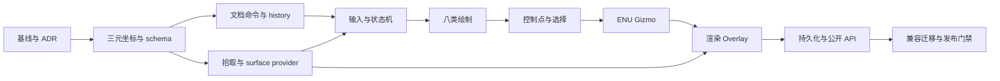

# 实施路线图

> 状态：**Proposed**。本篇只定义后续业务源码实施顺序；本次文档任务不修改业务源码。
> 总入口：[GIS 编辑设计文档集](./README.md)。

## 1. 目标与排序原则

路线必须先建立数据不变量，再接输入，再接可逆编辑，最后公开发布。不能先在 demo 里堆 pointer handler，事后再迁移坐标和历史；那会让每种图形形成不同的临时协议。

实施排序遵循以下依赖：



每阶段必须具有独立测试和可回退边界。下一阶段可以并行开发，但只有上游契约验收后才能合并到发布分支。

## 2. 建议模块布局

```text
src/lib/plot-editor/
├── document/
│   ├── types.ts
│   ├── normalize.ts
│   ├── validate.ts
│   ├── PlotDocument.ts
│   └── migrations.ts
├── commands/
│   ├── types.ts
│   ├── CommandExecutor.ts
│   └── HistoryManager.ts
├── input/
│   ├── PointerInput.ts
│   ├── KeyboardInput.ts
│   ├── CommandRouter.ts
│   └── focus-policy.ts
├── state/
│   ├── PlotEditorMachine.ts
│   ├── selection.ts
│   └── working-copy.ts
├── picking/
│   ├── EditorPicker.ts
│   ├── SurfaceProvider.ts
│   └── height-resolver.ts
├── shapes/
│   ├── registry.ts
│   └── point.ts ... circle.ts
├── transform/
│   ├── enu-frame.ts
│   ├── constraints.ts
│   └── gizmo.ts
├── render/
│   ├── EditorOverlayRenderer.ts
│   ├── LegacyPlotRenderAdapter.ts
│   └── pick-proxy.ts
├── persistence/
│   └── codec.ts
└── index.ts
```

现有 `src/lib/plot` 在迁移期间保持可运行。新模块只能通过公开/适配接口依赖 `plot` 与 `ground`，禁止让 ground primitive 反向 import editor。

## 3. Stage 0：冻结基线与决策记录

### 工作

- 为当前八类 `GroundDecalManager` 创建/query/update/render 行为建立 characterization tests；
- 记录当前 `LonLatPoint` 二元、`clampToGround`/`heightMeters`/`classificationType` 行为；
- 固定 Cesium `HeightReference` 七值与本项目 string/enum 映射；
- 固定 keyboard keymap、pointer/camera 仲裁和 overlay layer 语义；
- 建立 `tests/plot-editor` 独立配置，避免污染当前仅扫描 `tests/ground-material` 的 Vitest 配置。

### 完成门禁

基线测试能在未实现编辑器时通过；所有 Proposed 名称仍不从包入口导出；文档中的锁定决策有对应测试编号。

## 4. Stage 1：Canonical 三元坐标与验证

### 工作

- 新建不可变 `Position3D`、`HeightReference`、八类 geometry 判别联合；
- 实现 `normalizePosition`、经度 unwrap/rewrap、纬度/高度 finite 检查；
- 实现 CLAMP author height 归零、RELATIVE/NONE 语义；
- 实现 legacy `[lon, lat] -> [lon, lat, 0]` codec 和旧高度字段映射；
- 用结构化 diagnostics 替代 silent return。

### 兼容策略

不要立即把 `src/lib/plot/plugins/types.ts` 的 `LonLatPoint` 原地改成三元组，这会同时冲击箭头生成、ground primitives 和 demo。先以新 document schema 为真相，经 `LegacyPlotRenderAdapter` 投影到旧二元接口；待渲染路径支持逐顶点高度后再收敛旧类型。

### 完成门禁

所有进入新 document 的 position 长度恒为 3；贴地 author height 恒为 0；日期变更线和极区 fixture 可往返且没有经度跳变造成的巨大包围盒。

## 5. Stage 2：文档、命令与历史内核

### 工作

- 实现稳定 id、document revision、feature revision、只读 snapshot；
- 实现 add/remove/patch/transform/vertex 命令的全量预验证和原子 apply/revert；
- 实现 transaction begin/commit/rollback、undo/redo 和内存上限；
- 实现 document/selection/history 事件；
- 为拖拽与 held-key 提供 working copy，不接 DOM。

### 完成门禁

纯 Node 单元测试可模拟一整次绘制提交、顶点拖拽、取消、undo/redo；空事务不入栈；批量命令中任一 feature 非法时全部不变。

## 6. Stage 3：拾取与表面高度服务

### 工作

- 抽象 `SurfaceProvider`，区分 terrain、3D Tiles、ellipsoid 和 miss；
- 建立同步 ray pick 与异步高精度 sample 两阶段结果；
- 添加 request generation、AbortSignal、camera/document revision 检查；
- 实现 screen tolerance、pick priority 和专用 Three layer；
- 明确 CLAMP/RELATIVE/NONE 的 author/world height 解析。

### 完成门禁

天空 miss、瓦片加载中、结果乱序、provider dispose、surface 切换均有确定结果；采样高度从不写入 document。

## 7. Stage 4：Pointer、Keyboard、命令路由与状态机

### 工作

- `PointerInput` 以 capture phase 安装 pointerdown/move/up/cancel、wheel 和 lostpointercapture；
- `KeyboardInput` 实现焦点域、IME、editable target、AltGraph、Primary 映射、held keys；
- `CommandRouter` 把两类输入统一为 `EditorIntent`；
- `CameraControlAdapter` 提供可嵌套、幂等的 navigation lease；
- `PlotEditorMachine` 实现 idle/drawing/selecting/editing/transforming/textEditing 和 suspended；
- blur、visibilitychange、dispose 统一走 cancellation/cleanup。

### 完成门禁

不连接任何真实 shape renderer 也能用 reducer 测试完整状态转移。Space+拖拽只移动相机；普通拖拽只编辑；Escape 总能回到稳定状态并恢复 controls。

## 8. Stage 5：八类绘制工具

按复杂度分两批：

1. point、line、polygon、text；
2. rectangle、circle、sector、arrow。

每个 shape adapter 提供统一接口：`begin`、`append`、`preview`、`canCommit`、`commit`、`cancel`、`getHandles`。图形专属参数只存在 geometry/style 中，不在状态机增加八套分支。箭头只编辑 GIS 控制点并调用现有 arrow SDK 生成 footprint；生成顶点不是持久控制点。

### 完成门禁

每类都能使用鼠标完成，也能使用 Enter/Escape/Backspace 完成同样的提交、取消、删最后一点；任一未达最小拓扑的草稿无法进入 document。

## 9. Stage 6：控制点、选择与拓扑编辑

### 工作

- 为八类实现稳定 handle id、role、cursor、constraint、position；
- 实现 vertex/midpoint/center/radius/startAngle/endAngle/rotation 等行为；
- 实现单选、追加/切换选择、框选、全选、删除和 selection reconciliation；
- 实现屏幕恒定手柄、pick proxy 与遮挡反馈；
- 将一次 pointer drag 合并为一条 history。

### 完成门禁

控制点数量与角色满足 [编辑控制点契约](./10-shape-editing-handles.md)；插入/删除顶点保持最小拓扑；删除选中对象后状态机无悬空 handle。

## 10. Stage 7：ENU 组变换与 Gizmo

### 工作

- 以稳定 pivot 构造 WGS84 ENU frame；
- 实现 G/R/S 模态、X/Y/Z 约束、方向键/PageUp/PageDown 微调；
- 多选使用同一个 working transaction；
- 实现日期变更线 unwrap、极区 frame fallback 和经度 rewrap；
- 贴地选择禁用 Up/pitch/roll，并在 UI 与命令结果中明确拒绝原因。

### 完成门禁

鼠标 Gizmo 与键盘模态产生相同 transform command；多选变换 undo 一次整体恢复；跨日期变更线的小平移不会绕地球一周。

## 11. Stage 8：渲染 Overlay 与 Ground 集成

### 工作

- 建立 committed/draft/selection/handle/gizmo 固定 roots；
- 实现 canonical `RenderFeature` 投影和旧 plot adapter；
- 使用 revision/dirty flags 合并每帧更新；
- 隔离相机 raycast 与 editor pick layers；
- 接入 packed depth、surface pending、按需 requestRender；
- 完成 GPU 资源所有权、构建失败原子替换和 context restore。

### 完成门禁

八类在 Ground 与 Plain/RTE 可表达路径上渲染一致；草稿取消不重建 committed；dispose 资源回基线；terrain/3D Tiles 始终只读。

## 12. Stage 9：持久化、公共 API 与 Demo

### 工作

- 实现 versioned JSON codec、原子 import/export 和 legacy migration diagnostics；
- 实现 `createPlotEditor` 与稳定事件协议；
- 新增实际编辑 demo，首屏就是可用编辑器，不是功能介绍页；
- 增加键盘 focus、text editing、错误和 surface pending 的可见状态；
- 更新 `vite.lib.config.ts`、`package.json.exports`、类型声明和 public smoke tests。

### 完成门禁

只有在 API/类型/包导入测试通过后才发布 `./plot-editor`。demo 不得 import 私有路径，不得用按钮绕开本应由键盘/状态机处理的路径。

## 13. Stage 10：兼容迁移与清理

### 工作

- 将现有 `plot-demo.ts` 与 `draw-tool.ts` 迁到新 API，删除重复 pointer listener；
- 统计业务对 `GroundDecalManager` 二元 API 的使用，提供一个版本周期 deprecation；
- 当 Ground/Plain primitive 完整支持目标高度契约后，移除只能表达单一 `heightMeters` 的临时适配；
- 删除不再使用的自增 id 与 silent mutation 通道；
- 完成 changelog、迁移指南和版本策略。

旧 API 的删除属于单独 breaking release，不与首次编辑器发布混在同一提交。

## 14. 并行工作包

契约冻结后可按以下所有权并行，减少同文件冲突：

| 工作包 | 主要目录 | 依赖 |
| --- | --- | --- |
| A：document/history/codec | `document/`、`commands/`、`persistence/` | Stage 1 |
| B：pointer/keyboard/state | `input/`、`state/` | intent 与 transaction interface |
| C：picking/height | `picking/` | coordinate schema |
| D：shape/handles/transform | `shapes/`、`transform/` | A、B、C 的接口 |
| E：render/host integration | `render/`、demo | RenderFeature 与 state snapshot |
| F：test fixtures/tooling | `tests/plot-editor/` | 每阶段同步推进 |

公共 `index.ts`、package exports 和 shared type 文件指定单一 owner，避免多个工作包同时扩大 API。

## 15. Feature Flag 与回退

迁移期建议由宿主显式选择 `legacyPlot` 或 `plotEditorV1`，不要根据数据形状自动切换运行时。回退策略：

- 新 document 始终可导出 versioned JSON；
- legacy adapter 只在其能无损表达时渲染，不能表达时报告 capability error；
- 新 editor 失败可卸载 Overlay 并恢复旧 demo/renderer，但不可把三元数据截断成二维覆盖原文件；
- 每阶段提交保持旧 Ground tests 通过；出现回归可以按模块回退，不需要回退 schema 文档。

## 16. 风险登记

| 风险 | 影响 | 缓解与门禁 |
| --- | --- | --- |
| 旧二元 API 扩散 | 高度丢失 | 新 document 先行，单向 legacy adapter，禁止反向写回 |
| GlobeControls 与 editor 抢事件 | 相机/图形同时移动 | capture 阶段仲裁、navigation lease、cancel/blur 恢复测试 |
| 异步采样乱序 | 图形跳回旧表面 | generation + revision + AbortSignal |
| 日期变更线/极区局部平面失效 | 变换飞跃 | unwrap、分段、ENU fallback 和专项 fixture |
| 拖拽频繁重建 GPU | 卡顿与泄漏 | working copy、dirty flags、每帧合并、资源计数测试 |
| history 存完整快照 | 内存膨胀 | reversible patch、结构共享、条目/字节双上限 |
| 过早公开内部类型 | 难以演进 | 最后阶段才增加 package exports 与 API extractor/smoke tests |
| 把 3D Tiles 当编辑对象 | 范围失控 | SurfaceProvider 只读接口，模型编辑类型永不进入 registry |

## 17. 全局完成定义

- [ ] 15 篇设计中的锁定不变量均有自动化测试或明确人工验收项。
- [ ] 八类图形完整支持绘制、选择、控制点编辑、键盘命令、提交、取消和历史。
- [ ] canonical 坐标全部为 `[longitude, latitude, height]`；贴地 author height 为 0。
- [ ] 七值高度参考被显式保存、验证、渲染和迁移。
- [ ] 鼠标与键盘统一进入 CommandRouter/EditorIntent/状态机，没有旁路业务修改。
- [ ] 单选、多选、ENU Gizmo 与贴地轴限制符合契约。
- [ ] terrain/3D Tiles 只作为表面，Model/glTF 拓扑编辑不在代码或 API 中。
- [ ] undo/redo、导入导出、资源释放、日期变更线和极区门禁通过。
- [ ] 旧 Ground/Material 单元、集成、视觉和包测试保持通过。
- [ ] `./plot-editor` 仅在实现和包 smoke tests 完成后对外发布。

## 18. 关联文档

- 架构依赖：[目标架构](./03-target-architecture.md)
- 输入实施细节：[鼠标与相机](./05-pointer-input-and-camera.md)、[键盘命令](./06-keyboard-command-keymap.md)
- 图形与控制点：[绘制契约](./09-shape-drawing-contracts.md)、[编辑控制点](./10-shape-editing-handles.md)
- API 与迁移：[公共 API、历史与持久化](./13-public-api-history-persistence.md)
- 阶段门禁的测试定义：[测试与验收](./15-test-and-acceptance.md)
