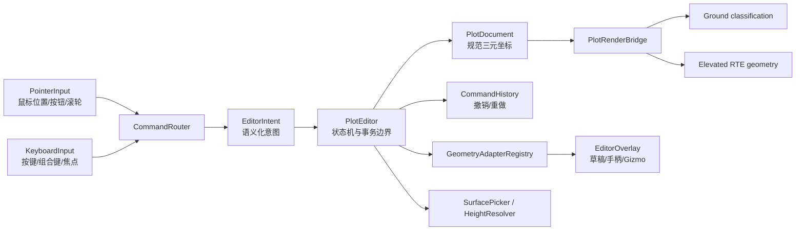

# GIS 图形编辑交互框架：设计文档集

> 状态：**Proposed Design，尚未实现**
> 适用项目：`cesium-to-three` `0.1.9`，分支 `edit-shape`
> 项目源码快照：`1e0cd69bd628f23f49b9cb1f749b1118601e3482`
> Cesium 参考快照：`D:\my\explore\cesium`，CesiumJS `1.143.0`，`@cesium/engine 26.1.0`，提交 `effe290c08dc340a7a6bd4435367a7d092c6b2b9`
> 交互基线：桌面端**鼠标 + 键盘**；地形与 3D Tiles 仅作为拾取、贴附和遮挡表面

## 目标

本文档集为 `cesium-to-three` 设计一套可实施、可测试、可扩展的 GIS 图形编辑框架。它把现有八类标绘的纯数据能力、贴地 classification 渲染能力和桌面端输入组织为一个完整编辑闭环：

```text
创建工具 -> 鼠标采点/拖拽 -> 键盘确认/取消/微调
        -> 草稿预览 -> 文档事务 -> 渲染同步
        -> 选择/控制点编辑 -> 撤销/重做 -> 序列化
```

首期编辑对象是当前项目真实存在的八类 GIS 图形：

| 类型 | 当前数据类别 | 首期编辑语义 |
| --- | --- | --- |
| 点 | `point` | 锚点、尺寸；图片点另含宽高与旋转 |
| 线 | `line` | 逐点绘制、顶点增删改、整体平移 |
| 多边形 | `polygon` | 外环绘制、顶点编辑、闭合与合法性校验 |
| 矩形 | `rectangle` | 两点构造或四角控制，整体移动与尺寸调整 |
| 扇形 | `sector` | 圆心、半径、起始角和张角 |
| 箭头 | `arrow` | 只编辑原始控制点和体型参数，不编辑派生轮廓 |
| 文本 | `text` | 锚点、内容、布局、旋转和框参数 |
| 圆 | `circle` | 圆心与半径 |

框架通过图形适配器保留扩展能力，可在后续加入 `ellipse`、`corridor`、`wall`、`polylineVolume`、`plane`、`box`、`cylinder`、`ellipsoid` 等 GIS 参数化 Graphics；这些扩展不改变输入、命令、文档和历史层的公共契约。

## 范围

本设计覆盖：

- 桌面端鼠标移动、单击、双击、拖拽、右键、滚轮与键盘命令的统一仲裁；
- `PointerInput` 与独立 `KeyboardInput`，以及 canvas 焦点、文本输入、组合键、失焦和销毁处理；
- 绘制、悬停、单选、多选、控制点编辑、参数手柄、整体变换、提交和取消；
- 与 Cesium `HeightReference` 对齐的绝对高、贴地、相对地面、贴地形和贴 3D Tiles 语义；
- 规范坐标 `[longitude, latitude, height]`，其中贴附坐标的作者高度固定为 `0`；
- 对旧 `[longitude, latitude]` 输入的兼容归一化，不把二维输入直接留在内部状态；
- terrain、3D Tiles 与 WGS84 椭球面的表面拾取、高度解析和失败状态；
- 贴附 classification 图元、非贴附 RTE 图元和编辑 overlay 的分层同步；
- 文档事务、选择状态、命令历史、撤销/重做、导入导出和资源释放；
- 日期变更线、经度环绕、极区和 ECEF 大坐标精度约束；
- 公共 SDK 入口与可运行 demo 的实施边界和自动验收标准。

## 非目标

以下内容明确不属于本设计：

- **不编辑 glTF/GLB 模型网格、顶点、骨骼、材质、节点拓扑或 3D Tiles 内容。**
- `ModelGraphics`、`Cesium3DTilesetGraphics` 和当前 demo 中的 `Untitle.glb` 不是编辑对象；它们可以被显示、拾取为表面或用于遮挡验证。
- 不把 Cesium `Property`/`CallbackProperty`/时间区间系统整体移植到本项目；草稿动态更新由编辑器自己的 transient state 驱动。
- 首期交互定义和验收以桌面鼠标 + 键盘为准；底层仍采用 Pointer Events 统一鼠标、触摸和笔的事件形状，并保留 pointer capture/cancel 语义，触摸/笔的专属手势不改变桌面命令契约。
- 不把普通相机漫游键位纳入编辑命令；相机仍由宿主 `GlobeControls` 管理，编辑器只在明确的编辑拖拽期间申请临时导航锁。
- 不在输入层直接修改 `GroundDecalManager`，也不让渲染图元成为业务数据真相。
- 不把地形采样出来的运行时表面高度写回贴附对象的作者坐标；贴附作者高度始终为 `0`。
- 不承诺首版与 CZML、GeoJSON 或任意第三方编辑器格式一一无损互转；首版以版本化内部 JSON 为准。

## 核心数据流



关键原则是：DOM 输入只产生标准化信号，`CommandRouter` 只决定命令优先级，`PlotEditor` 才能改变编辑状态；领域文档不知道 DOM、Three.js、GPU 深度或 `GlobeControls`。

## 锁定决策

| 主题 | 决策 | 详细文档 |
| --- | --- | --- |
| 编辑边界 | 只编辑 GIS 图形及其控制参数；排除模型网格、模型节点拓扑与 3D Tiles 内容 | [01](./01-cesium-source-reference.md)、[02](./02-current-project-audit.md) |
| 主交互 | 首期以鼠标 + 键盘为完整交互基线；键盘不是鼠标修饰符的附属品 | [05](./05-pointer-input-and-camera.md)、[06](./06-keyboard-command-keymap.md) |
| 输入分层 | `PointerInput` 与 `KeyboardInput` 独立归一化，经 `CommandRouter` 产生 `EditorIntent` | [03](./03-target-architecture.md) |
| 数据真相 | `PlotDocument` 是唯一作者数据真相，渲染图元、草稿和手柄都是派生状态 | [03](./03-target-architecture.md)、[13](./13-public-api-history-persistence.md) |
| 坐标 | 内部所有位置统一为 `[longitude, latitude, height]`，单位分别为度、度、米 | [04](./04-coordinate-height-schema.md) |
| 二维兼容 | 旧 `[lon, lat]` 在边界归一化为 `[lon, lat, 0]`，再按旧字段迁移为显式高度参考；内部不保留二元组 | [04](./04-coordinate-height-schema.md) |
| 贴附高度 | `CLAMP_*` 状态的作者高度必须为 `0`；表面解析高度属于运行时派生缓存 | [04](./04-coordinate-height-schema.md)、[08](./08-picking-surface-height.md) |
| 高度解锁 | 贴附对象只允许地表平移和航向旋转；先显式切到绝对/相对高度后，才启用 Up、俯仰和横滚 | [11](./11-selection-transform-gizmo.md) |
| 选择 | 支持单选、组合键多选和组变换；选择状态不写入持久化图形 JSON | [07](./07-editor-state-machine.md)、[11](./11-selection-transform-gizmo.md) |
| 拾取 | classification mesh 不依赖普通 Three `Raycaster`；采用图形地理命中和 editor pick proxy | [08](./08-picking-surface-height.md)、[12](./12-rendering-overlay-integration.md) |
| 绘制提交 | 绘制过程使用 transient draft/overlay；完成时一次性写入文档，取消不留下半成品 | [07](./07-editor-state-machine.md)、[09](./09-shape-drawing-contracts.md) |
| 历史粒度 | 一次连续拖拽只生成一条历史记录；异步表面刷新不进入撤销栈 | [13](./13-public-api-history-persistence.md) |
| 全球健壮性 | 几何计算使用局部 ENU/ECEF 与连续展开经度，提交时再规范化经度 | [04](./04-coordinate-height-schema.md)、[08](./08-picking-surface-height.md) |
| 生命周期 | 失焦、`pointercancel`、异常、取消和 `dispose()` 都必须恢复相机控制并释放监听/overlay/异步任务 | [05](./05-pointer-input-and-camera.md)、[12](./12-rendering-overlay-integration.md) |

## 文档地图

建议按编号阅读。每篇只在自己的职责内定义事实或契约，其余文档通过相对链接引用，避免同一规则出现多个互相漂移的版本。

1. [Cesium 源码依据与采用边界](./01-cesium-source-reference.md)
   核验 Cesium 的输入聚合、Entity/Graphics、高度参考、拾取和 terrain 绘制示例；证明 Cesium 没有通用 GIS 编辑器，并排除 `ModelGraphics`。
2. [当前项目审计](./02-current-project-audit.md)
   还原八类 plot 数据、`GroundDecalManager`、`PlotPrimitiveBridge`、普通高度渲染、draw-tool、深度通道和 npm 出口的真实现状与缺口。
3. [目标架构](./03-target-architecture.md)
   定义输入、命令、EditorIntent、编辑状态机、领域文档、几何适配器、拾取端口、渲染同步和 overlay 的层次及依赖方向。
4. [坐标与高度数据契约](./04-coordinate-height-schema.md)
   定义三元坐标、七种高度参考、二维兼容、规范化、序列化、日期变更线和旧字段迁移规则。
5. [鼠标输入与相机仲裁](./05-pointer-input-and-camera.md)
   定义 Pointer Events、点击/拖拽阈值、按钮/滚轮、pointer capture、canvas 焦点及 `GlobeControls` 锁定和恢复。
6. [键盘命令与键位表](./06-keyboard-command-keymap.md)
   定义独立 `KeyboardInput`、平台组合键、焦点域、文本输入/IME、确认、取消、删除、微调、撤销重做和冲突规则。
7. [编辑器状态机](./07-editor-state-machine.md)
   定义 idle、drawing、selected、dragging、transforming 等状态，事件转移、草稿、事务、异常和销毁路径。
8. [拾取、表面与高度解析](./08-picking-surface-height.md)
   定义 terrain/3D Tiles/ellipsoid 命中顺序、表面来源、异步高度、pending/fallback 和全球边界处理。
9. [八类图形绘制契约](./09-shape-drawing-contracts.md)
   逐类定义采点步骤、鼠标预览、键盘完成/回退/取消、最小点数、约束与提交结构。
10. [八类图形编辑手柄](./10-shape-editing-handles.md)
    定义顶点、中点、中心、半径、角度、尺寸、旋转和箭头控制点手柄及其命中与校验。
11. [选择、组变换与三轴 Gizmo](./11-selection-transform-gizmo.md)
    定义单选/多选、组 pivot、表面平移、Up 轴、旋转、贴附锁定和键盘微调。
12. [渲染与编辑 Overlay 集成](./12-rendering-overlay-integration.md)
    定义 classification 与 elevated RTE 分流、草稿/手柄/pick proxy、render order、深度和资源生命周期。
13. [公共 API、历史与持久化](./13-public-api-history-persistence.md)
    定义 `PlotEditor`/`PlotDocument`/适配器接口、事件、错误、事务、撤销重做和版本化 JSON。
14. [实施路线图](./14-implementation-roadmap.md)
    按依赖拆分可独立测试和回退的实施阶段，并说明现有兼容 facade 与包出口迁移顺序。
15. [测试与验收规范](./15-test-and-acceptance.md)
    给出单元、鼠标键盘交互、浏览器、渲染、全球坐标、性能、资源和包出口的验收矩阵。

## 推荐阅读路径

### 架构实现者

按 `01 -> 02 -> 03 -> 04 -> 13 -> 14 -> 15` 阅读。先固定可借鉴的 Cesium 机制和当前项目事实，再实现公共领域契约，最后进入交付与测试。

### 交互实现者

按 `03 -> 05 -> 06 -> 07 -> 09 -> 10 -> 11 -> 15` 阅读。鼠标与键盘必须共同接入 `CommandRouter`，不得分别绕过状态机修改文档。

### 拾取与渲染实现者

按 `02 -> 03 -> 04 -> 08 -> 12 -> 15` 阅读。需要特别理解现有 classification 图元为何不能直接作为普通 Three raycast 目标，以及贴附作者高度与运行时表面高度为何必须分离。

### 图形适配器实现者

按 `04 -> 07 -> 09 -> 10 -> 11 -> 13` 阅读。每类图形只能通过统一 adapter 契约提供绘制步骤、控制点、命中、约束、校验和序列化，不能在 `PlotEditor` 中继续扩展大型 `switch`。

## 术语

| 术语 | 本文含义 |
| --- | --- |
| GIS 图形 | 由地理坐标、参数和样式定义的点、线、面、文本及参数化几何，不包括 glTF 网格 |
| 作者坐标 | 持久化在 `PlotDocument` 中、由用户编辑的 `[lon, lat, height]` |
| 解析位置 | 根据 `heightReference`、terrain/tiles 表面和作者高度计算出的运行时世界位置 |
| 贴附 | `CLAMP_TO_GROUND`、`CLAMP_TO_TERRAIN` 或 `CLAMP_TO_3D_TILE`；作者高度固定为 `0` |
| 相对高度 | `RELATIVE_*` 模式中相对目标表面的米制偏移 |
| Entity | 带稳定 ID、顺序、可见性、元数据和一个 Graphics payload 的领域对象；借鉴 Cesium 名称但不移植其完整 Property 系统 |
| Graphics | 某一 GIS 图形的判别联合数据，如 point、line、polygon 或 circle |
| PlotDocument | 规范 Entity 集合和批量变更事件的唯一作者数据容器 |
| Draft | 绘制或编辑提交前的临时几何，只存在于编辑器和 overlay，不进入持久化文档 |
| EditorIntent | 与具体 DOM 事件解耦的语义动作，例如 `commitDrawing`、`nudgeSelection`、`beginHandleDrag` |
| CommandRouter | 根据状态、焦点、键位、鼠标按钮和命中结果把输入路由为 EditorIntent 的组件 |
| Command | 对文档执行的可撤销事务，与输入命令/键位不是同一概念 |
| Handle | 顶点、中点、中心、半径、角度或参数控制点等编辑 overlay 元素 |
| Gizmo | 对一个或多个已选对象执行平移/旋转/尺寸变换的三轴控制器 |
| SurfacePicker | 将屏幕位置解析为 terrain、3D Tiles 或椭球面上的地理位置和法向的端口 |
| HeightResolver | 按 HeightReference 将作者坐标解析为运行时世界坐标的服务 |
| Pick proxy | 独立、可拾取但不作为业务数据的编辑命中代理，用于 classification 图元和手柄 |
| NavigationLock | 拖拽期间临时停用宿主相机交互，并保证所有退出路径恢复原状态的租约 |
| Current | 可在指定项目源码快照中直接验证的现状 |
| Proposed | 本文档锁定、但尚未在源码中实现的目标契约 |

## Current / Proposed 标识规则

文档中统一使用以下标识：

- **Current**：当前提交中已经存在，必须给出仓库相对路径、外部参考绝对路径或可搜索的符号名。
- **Cesium Source**：可在固定 Cesium 快照中验证的事实，不代表当前项目已经实现。
- **Proposed API**：计划新增或替换的公共类型、类、函数、事件和错误。
- **Proposed Behavior**：实现后必须满足的交互或运行时行为。
- **Invariant**：迁移和实现期间不得破坏的语义。
- **Implementation sketch**：用于锁定依赖和算法的伪代码，不得描述成当前可运行实现。

未明确标记为 **Current** 的接口都不得被当作当前 npm 包能力。示例中的 `PlotEditor`、`PlotDocument`、`KeyboardInput` 等名称均为 Proposed，直到路线图相应阶段落地并通过包出口测试。

## 全局不变量

1. 任何持久化位置进入领域层后都是三元组，且数值有限、纬度合法。
2. 贴附模式作者高度恒为 `0`；表面采样值不得污染作者数据或撤销历史。
3. 鼠标和键盘都只能通过 `CommandRouter -> EditorIntent -> PlotEditor` 改变编辑状态。
4. 连续指针移动可以逐帧预览，但文档只在事务提交点发生可观察变更。
5. 模型和 3D Tiles 永远不是可编辑 Entity；命中它们只能产生表面点或“未选择”结果。
6. 选择、hover、草稿、手柄和异步表面缓存不进入持久化 JSON。
7. 编辑器不拥有宿主 scene、camera、controls、terrain 或 tileset；只持有明确借用的端口/租约。
8. 所有输入监听、pointer capture、导航锁、异步请求和 GPU overlay 都有幂等释放路径。
9. 日期变更线附近的移动和几何计算不得直接用未展开的经度相减。
10. 旧 API 兼容必须发生在边界 adapter，不得把二元坐标和旧高度字段继续扩散到新核心。

## 失败路径总则

| 失败 | 必须行为 | 禁止行为 |
| --- | --- | --- |
| 点击天空或拾取无结果 | 保持当前状态并发出可诊断的 `pickMiss`；绘制不追加点 | 生成 `[0,0,0]` 或沿用上一次命中 |
| 特定表面未加载 | 保持 pending 或返回明确 unavailable；由工具决定是否允许等待/取消 | 对 `CLAMP_TO_3D_TILE` 静默改贴 terrain |
| 图形校验失败 | 保留 draft 与可修正控制点，返回结构化错误 | 提交非法半成品或清空用户草稿 |
| 键位来自文本输入/IME | 交给输入控件，不触发画布命令 | Delete 删除图形、Space 驱动相机或 Enter 提交草稿 |
| 拖拽中 `pointercancel`/失焦 | 回滚当前预览事务、释放 capture、恢复相机 | 留下半提交数据或永久禁用 controls |
| 异步高度结果过期 | 通过 request/revision token 丢弃 | 覆盖更新后的实体坐标 |
| 渲染同步失败 | 保留文档真相，报告实体 ID/adapter/阶段，并清理候选资源 | 反向篡改领域文档以适配坏图元 |
| 未支持的 `model`/`tileset` 输入 | 返回明确 `UNSUPPORTED_GRAPHICS_KIND` | 创建可选中的伪 GIS 图形 |

## 文档集验收

- [ ] README 的 15 个相对链接都指向实际文档，文件名与各篇交叉链接一致。
- [ ] Cesium 源码结论能在固定路径和提交中复核，未声称 Cesium 自带通用 GIS 编辑器。
- [ ] Current 与 Proposed API 清楚分离，当前八类数据和构建出口描述与源码一致。
- [ ] 鼠标和键盘都有完整输入契约、焦点规则、状态转移和自动化测试方案。
- [ ] 所有图形的内部位置均为三元组，二维兼容和贴附高度 `0` 规则无冲突。
- [ ] 文档明确排除模型编辑，同时允许 terrain/3D Tiles 作为拾取和贴附表面。
- [ ] 架构依赖从 DOM/Three 适配器指向核心端口，核心领域层不反向依赖浏览器和渲染器。
- [ ] 每种取消、失焦、异常和销毁路径都描述事务回滚、相机恢复与资源释放。
- [ ] 实施路线和测试规范能让实现者无需重新决定公共契约即可编码。
