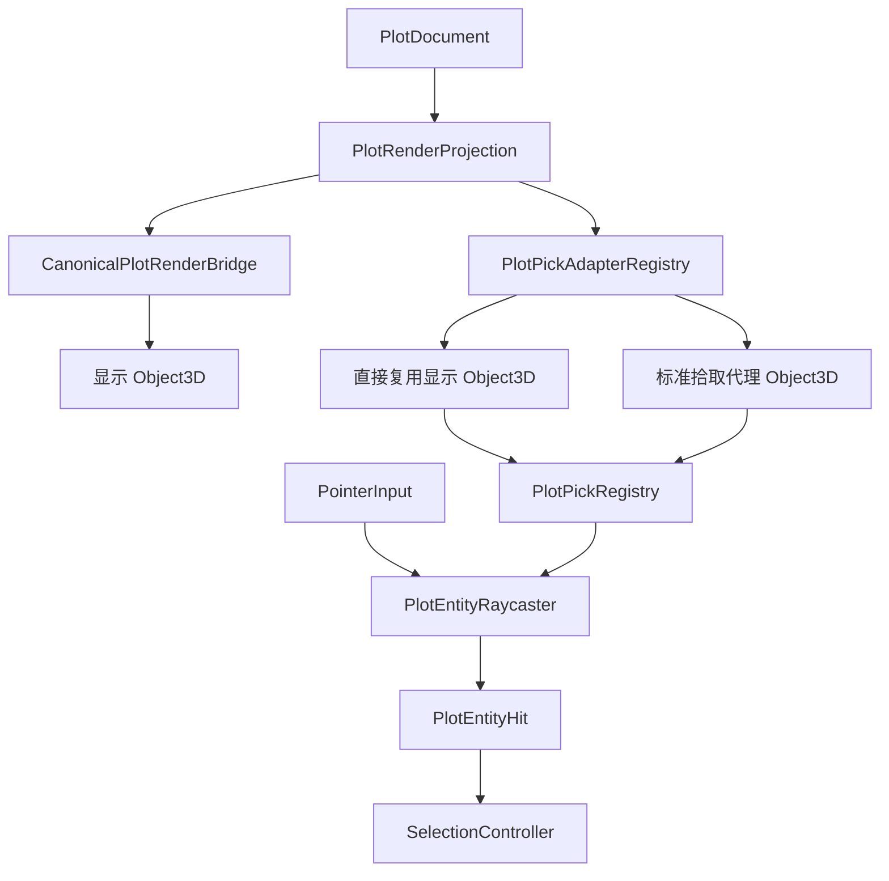
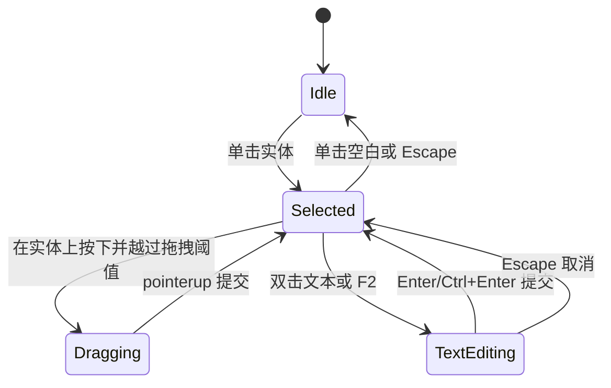

# 目标架构

## 设计原则

1. **复用 Object3D**：已有对象能正确 raycast 时，登记引用而不是重建。
2. **适配几何，不适配射线**：特殊渲染路径只补标准拾取几何，不实现射线与圆、面、线的数学求交。
3. **显示与拾取同源**：两者都由同一个 `RenderFeature`/resolved geometry 构建，避免形状漂移。
4. **一次指针事件只生成一次实体命中快照**：选择、拖拽和双击共享结果，不能各自重新判定。
5. **交互分层**：Overlay UI 优先，实体射线其次，表面拾取最后。

## 模块划分



### `PlotPickAdapterRegistry`

按图形类别选择拾取对象构建器。输入是 canonical feature、resolved geometry、显示 entry（如存在）和局部坐标帧，输出一个或多个可登记的 `Object3D`。

适配器先检查显示 entry 是否满足直接拾取契约；满足则返回其对象引用，否则创建代理。

### `PlotPickRegistry`

维护 `featureId -> PlotPickEntry` 和一份扁平顶层 target 列表。职责：

- 登记/替换/删除 feature 的拾取对象；
- 把 feature 元数据写入根拾取对象；
- 提供 `Object3D[]` 给 `Raycaster.intersectObjects()`；
- 从任意命中子节点向祖先解析 `PlotPickMetadata`；
- 统一释放只属于拾取层的 geometry/material。

### `PlotEntityRaycaster`

只负责原生 Three 射线调用与结果标准化：

```ts
raycaster.setFromCamera( ndc, camera );
raycaster.layers.set( EditorOverlayLayer.PLOT_PICK );
const intersections = raycaster.intersectObjects( registry.targets, true );
```

它不读取图形经纬度，不计算点到线距离，不实现 point-in-polygon。

### `SelectionController`

消费 `PlotEntityHit`，处理 replace/add/toggle selection、空白清选和拖拽候选。它不知道代理几何类型，也不能直接访问 `Raycaster`。

## 拾取对象组织

每个 feature 对应一个逻辑 entry：

```text
PlotPickEntry(featureId)
├─ source: "visual" | "proxy"
├─ targets: Object3D[]
├─ metadata: PlotPickMetadata
├─ geometryRevision
└─ disposeOwnedResources()
```

- `source=visual`：`targets` 引用显示树里的可拾取对象；registry 不拥有其资源。
- `source=proxy`：`targets` 来自 `plotEntityPickRoot`；registry 拥有并释放代理资源。
- 同一 feature 可登记多个对象，例如 polygon 的面与轮廓，但最终标准化为一个实体命中。

`plotEntityPickRoot` 可挂在编辑器 scene 下，全部后代只启用 `PLOT_PICK`。渲染相机不启用该层，Raycaster 只启用该层。直接复用的显示对象在保留 `PLOT_CONTENT` 的同时额外 `layers.enable(PLOT_PICK)`。

## 事件优先级

一次 pointer 事件按固定顺序仲裁：

1. 活跃文本输入/IME 消费键盘和文本指针行为；
2. 控制点、Gizmo、旋转环等 overlay UI；
3. `PlotEntityRaycaster` 的实体交点；
4. 已激活创建工具的表面采点；
5. 相机导航或空白区行为。

这保证“单击已有实体”不会被误解释为“创建新实体”。只有明确激活创建工具且前三级均未消费事件时，才允许创建采点。

## 选择与文本编辑状态



单击文本仅选择并显示高亮；不会创建文本，也不会立即生成 DOM 编辑框。双击判定必须基于两次命中同一 `featureId`。

## 明确边界

- 实体拾取：Three `Raycaster`。
- 控制点/Gizmo：屏幕空间 UI hit test，可在后续独立迁移为 Raycaster，但不是本次前置条件。
- 框选：投影包围范围与区域关系，不是射线。
- 地表落点：terrain/Tiles/ellipsoid surface picker，不是标绘实体 Raycaster。
- 最终可见像素遮挡：首版采用标绘 target 中最近交点；是否再与地形深度联合裁决属于独立增强项。

## 非目标

- 不对 classification shadow volume 本体强行补 `raycast()`；
- 不给每种图形编写自定义 `Object3D.raycast` 数学函数；
- 不使用 GPU color-picking 替代 Raycaster；
- 不让拾取代理成为序列化或业务数据来源。

