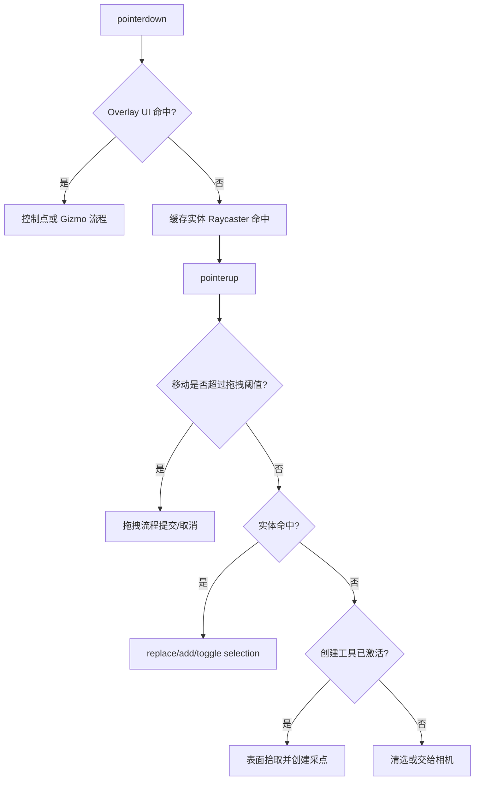

# Raycaster 选择与编辑流程

## 坐标转换

`PointerInput` 输出相对 canvas 的 CSS 坐标。一次事件只进行一次 NDC 转换：

```ts
const rect = canvas.getBoundingClientRect();
const ndc = {
	x: ( ( clientX - rect.left ) / rect.width ) * 2 - 1,
	y: - ( ( clientY - rect.top ) / rect.height ) * 2 + 1,
};
```

不能使用 drawing-buffer 尺寸直接除 CSS 坐标；`devicePixelRatio` 已由 bounding rect 与 renderer viewport 的职责分离处理。canvas 尺寸为零或指针在有效 viewport 外时返回空命中。

## 射线 API

建议接口：

```ts
export interface PlotEntityHit {
	readonly featureId: PlotFeatureId;
	readonly point: Vector3;
	readonly distance: number;
	readonly object: Object3D;
	readonly faceIndex?: number;
	readonly metadata: PlotPickMetadata;
}

export interface PlotEntityRaycaster {
	hitTest( ndc: Readonly<Vector2>, camera: Camera ): PlotEntityHit | null;
	hitTestAll( ndc: Readonly<Vector2>, camera: Camera ): readonly PlotEntityHit[];
}
```

内部固定步骤：

1. `raycaster.setFromCamera(ndc, camera)`；
2. `raycaster.layers.set(PLOT_PICK)`；
3. 配置 `near/far` 和标准 Line/Points 参数；
4. `intersectObjects(registry.targets, true)`；
5. 从命中对象向上解析 metadata；
6. 过滤已删除、隐藏、锁定或临时禁选的 feature；
7. 对同一 feature 的多个交点去重并稳定排序；
8. 返回不可变命中快照。

## 单击流程



关键约束：创建分支必须位于实体选择之后。即使当前工具是文本创建工具，单击已有文本也先选中已有文本；工具若要强制连续创建，必须定义明确修饰键或 UI 模式，不能因实体命中失败静默创建。

## 高亮反馈

选择状态改变后立即产生明确反馈：

- overlay 绘制与对象实际变换一致的选择轮廓/包围框；
- 文本使用旋转后的四角轮廓，不能显示轴对齐假框；
- 选择轮廓属于反馈层，不承担命中；
- 高亮显示不应替换业务材质，也不改变 pick metadata；
- 一次 render request 需覆盖选择框、控制点和 Gizmo 的同步更新。

## 拖拽移动

实体移动不能依赖“已经出现文本编辑框”才能开始。流程：

1. `pointerdown` 命中实体，记录 `featureId`、初始交点、原始 feature snapshot；
2. 超过拖拽阈值后进入 `Dragging`，申请 pointer capture 与相机导航锁；
3. 后续 move 使用表面拾取/约束平面计算目标位置，不重复用屏幕像素命中实体；
4. transient transaction 更新文档草稿与显示/拾取对象；
5. `pointerup` 提交一条历史命令；`pointercancel`/`Escape` 回滚；
6. 释放 pointer capture 与导航锁。

若按下对象不是当前 selection，先把它设为主选择再开始拖拽。

## 双击与 `F2` 文本编辑

双击事件必须满足：

- 两次点击都由 Raycaster 命中同一个文本 `featureId`；
- 中间没有发生拖拽、创建提交或选择切换；
- overlay 控制点没有消费事件；
- 当前不处于 IME composition 冲突状态。

满足后调用文本编辑入口。`F2` 则要求当前恰有一个可编辑文本为主选择。

文本编辑生命周期：

- begin：保存原值、定位输入框、聚焦并选择文本；
- input/composition：只更新 transient preview；
- commit：生成一条文档命令并关闭输入框；
- cancel：恢复原值并关闭输入框；
- dispose/feature deleted：无条件清理 DOM、监听器和状态。

## 空白、隐藏与锁定

- 隐藏 feature 不登记目标或在求交结果标准化时剔除；首选不登记，减少工作量；
- 锁定 feature 可被选中但不能拖动，或完全不可选，必须由产品选项明确；默认“可选但不可编辑”；
- 单击空白默认清除选择；按 Ctrl/Shift 的空白点击不创建虚假选择；
- 创建工具激活时，空白才进入 surface picker。

## 与相机控制的冲突

- Overlay/实体拖拽开始后临时禁止相机对应按钮导航；
- 未超过拖拽阈值的单击不应造成相机跳动；
- 未命中且未激活工具的事件可以交回宿主控制器；
- 编辑器 dispose 或 window blur 必须释放所有导航锁。

