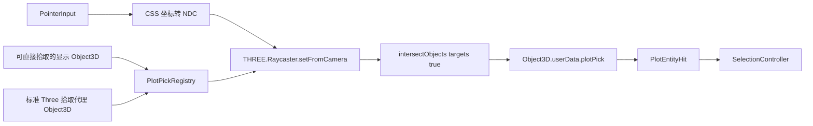

# 标绘编辑器 Three.js Raycaster 拾取设计

> 状态：Implemented，已完成实现与验收
> 日期：2026-08-12  
> 实现提交：`9f05ec9` 起的一组小步提交（当前分支 `edit-shape`）
> 适用范围：`src/lib/plot-editor` 与 `src/lib/plot` 的标绘实体选择  
> 核心决策：实体拾取统一使用 `THREE.Raycaster` 与 `Object3D.raycast()`

## 要解决的问题

迁移前的实体选择依赖屏幕投影、CSS 像素距离和二维包围形状。它会把“鼠标落在对象的屏幕包围区域”误认为“射线击中了对象”，并造成以下问题：

- 单击已有文本时落入创建流程，无法稳定选中、移动；
- 旋转文本的高亮范围与真实朝向不一致；
- 小圆、图片点等对象因屏幕足迹规则缺失而无法选中；
- 遮挡关系、前后深度和相机透视不能由真实几何决定；
- 每新增一种图形，都需要重新实现一套二维命中算法。

这些问题现已由 `PlotPickRegistry`、标准代理适配器与
`PlotEntityRaycaster` 统一解决。单点实体选择不再存在 CSS 像素 fallback；
二维投影仅保留给框选等明确的屏幕空间交互。

## 已锁定的设计决策

1. 标绘实体必须以 `Object3D` 作为拾取载体，命中计算只使用 Three.js 原生 `Raycaster`。
2. 指针坐标只负责换算为 NDC，随后调用 `raycaster.setFromCamera(ndc, camera)`。
3. 能被 Three.js 正确 `raycast()` 的现有显示对象直接登记为拾取对象，不复制几何。
4. classification shadow-volume 和 RTE 自定义属性对象不能直接用于标准射线命中；为它们创建标准 Three 几何的拾取代理 `Object3D`。
5. 拾取代理不是自研射线算法。代理只提供 `Mesh`、`Line`、`Points` 等标准对象，交点仍由其原生 `raycast()` 计算。
6. 实体选择不再使用 CSS 像素距离、投影后的二维多边形或颜色像素读取。
7. 控制点、变换 Gizmo 和框选保留屏幕空间交互语义，不与实体拾取混为一套规则。
8. 单击只选择；双击或 `F2` 才进入文本编辑；创建只能由已激活的创建工具触发。

## 总体结构

`PlotPickRegistry` 保存每个 feature 的拾取对象引用。对象可以是显示树中的现有对象，也可以是专用代理树中的对象。`Raycaster` 面向登记的 `Object3D[]` 执行递归求交，不遍历无关场景对象。

## 文档地图

| 文档 | 内容 |
| --- | --- |
| [01-current-object3d-audit.md](./01-current-object3d-audit.md) | 当前 Object3D、渲染路径与失败原因审计 |
| [02-target-architecture.md](./02-target-architecture.md) | 目标架构、模块职责和交互边界 |
| [03-pick-object-contract.md](./03-pick-object-contract.md) | 拾取对象、元数据、图层及各图形代理契约 |
| [04-raycaster-selection-flow.md](./04-raycaster-selection-flow.md) | 单击、双击、拖拽与命中排序流程 |
| [05-lifecycle-and-performance.md](./05-lifecycle-and-performance.md) | 同步、资源释放、缓存和性能预算 |
| [06-migration-roadmap.md](./06-migration-roadmap.md) | 从 `FeatureHitTester` 迁移的实施阶段 |
| [07-test-and-acceptance.md](./07-test-and-acceptance.md) | 单元、集成和人工验收标准 |

建议阅读顺序：审计 → 架构 → 对象契约 → 交互流程 → 生命周期 → 迁移 → 验收。

## 术语

- **显示对象**：参与正常渲染的 `Object3D`。
- **拾取对象**：登记给 `Raycaster` 的 `Object3D`，可能与显示对象相同。
- **拾取代理**：只用于射线求交的标准 Three 对象，不参与可见渲染。
- **实体命中**：`Raycaster` 对标绘主体返回的交点。
- **Overlay 命中**：控制点、轴、旋转环等 UI 标记的屏幕空间命中。
- **表面拾取**：地形、3D Tiles、椭球面的落点计算；它与标绘实体选择是不同职责。

## 真相来源

- 业务真相仍是 `PlotDocument`/`PlotFeature`，不是 `Object3D`。
- 可见结果由 `CanonicalPlotRenderBridge` 同步。
- 可选中结果由 `PlotPickRegistry` 同步。
- 选择状态由编辑器选择控制器维护，不能写进材质颜色或从场景反推。

## 实现与验收结果

- point、image point、line、polygon、rectangle、circle、sector、arrow、text
  均登记标准 Three `Object3D` 代理，并由原生 `raycast()` 求交；
- `PLOT_PICK` 固定使用 layer 28，渲染相机租约明确排除该层；
- classification/RTE 显示对象保持显示职责，pick 代理使用局部 ECEF
  Float32 顶点；贴地表面仅对代理沿 WGS84 法向抬高 0.02m；
- 同一 DOM 事件的 claim/dispatch 复用单次命中快照；overlay、实体、创建表面
  按固定优先级仲裁；
- 全量 plot-editor 单元测试 59 个文件、496 个用例通过，类型检查和库构建通过；
- 1,000 个标准 Mesh 的 300 次 pointermove Raycaster 采样 P95 小于 4ms；
  1,000 个静态 feature 连续同步 300 次零重建，单 feature revision 只替换一项；
- Playwright 已通过八类代理 DOM 命中、小圆边缘选择、文本单击/拖动、双击编辑、
  Escape/保存/外部确认及重复清理回归。
